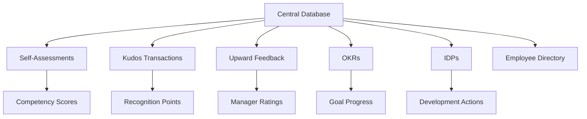

# 360-Degree Feedback System Enhancement Documentation

## Overview

The 360-Degree Feedback System represents a comprehensive enhancement to the performance management platform, introducing five powerful features that create a holistic feedback ecosystem. This system empowers employees, managers, and HR administrators with tools for continuous performance improvement, peer recognition, and strategic development planning.

## System Architecture

### Core Features Integration

The enhanced system integrates five primary components:

1. **Self-Assessment System** - Enables employees to conduct regular self-evaluations
2. **Kudos Recognition System** - Facilitates peer-to-peer appreciation and recognition
3. **Upward Feedback System** - Allows employees to provide feedback to managers
4. **OKR Management System** - Streamlines objective and key results tracking
5. **Individual Development Plan (IDP) System** - Creates personalized development pathways

### Data Architecture



## Database Schema Overview

### Core Tables Structure

#### Employee Enhancements
```sql
-- Core employee data extended with 360-degree links
CREATE TABLE employee_360_profile (
    employee_id INT PRIMARY KEY,
    self_assessment_count INT DEFAULT 0,
    kudos_received INT DEFAULT 0,
    kudos_given INT DEFAULT 0,
    upward_feedback_provided INT DEFAULT 0,
    okr_participation BOOLEAN DEFAULT TRUE,
    idp_active BOOLEAN DEFAULT FALSE,
    last_360_activity TIMESTAMP DEFAULT CURRENT_TIMESTAMP ON UPDATE CURRENT_TIMESTAMP
);
```

#### Self-Assessment Tables
```sql
-- Self-assessment configurations
CREATE TABLE self_assessment_configs (
    config_id INT AUTO_INCREMENT PRIMARY KEY,
    competency_framework_id INT,
    period_id INT,
    config_data JSON,
    active BOOLEAN DEFAULT TRUE,
    created_at TIMESTAMP DEFAULT CURRENT_TIMESTAMP
);

-- Self-assessment responses
CREATE TABLE self_assessment_responses (
    response_id INT AUTO_INCREMENT PRIMARY KEY,
    employee_id INT,
    config_id INT,
    responses JSON,
    submitted BOOLEAN DEFAULT FALSE,
    submitted_at TIMESTAMP NULL,
    created_at TIMESTAMP DEFAULT CURRENT_TIMESTAMP
);
```

#### Kudos System Tables
```sql
-- Kudos categories
CREATE TABLE kudos_categories (
    category_id INT AUTO_INCREMENT PRIMARY KEY,
    category_name VARCHAR(255),
    category_description TEXT,
    points_value INT DEFAULT 10,
    icon_url VARCHAR(500),
    active BOOLEAN DEFAULT TRUE
);

-- Kudos transactions
CREATE TABLE kudos_transactions (
    kudos_id INT AUTO_INCREMENT PRIMARY KEY,
    sender_id INT,
    recipient_id INT,
    category_id INT,
    points INT,
    message TEXT,
    created_at TIMESTAMP DEFAULT CURRENT_TIMESTAMP,
    INDEX idx_recipient (recipient_id),
    INDEX idx_sender (sender_id)
);
```

#### Upward Feedback Tables
```sql
-- Upward feedback sessions
CREATE TABLE upward_feedback_sessions (
    session_id INT AUTO_INCREMENT PRIMARY KEY,
    manager_id INT,
    employee_id INT,
    period_id INT,
    anonymous BOOLEAN DEFAULT TRUE,
    completed BOOLEAN DEFAULT FALSE,
    created_at TIMESTAMP DEFAULT CURRENT_TIMESTAMP,
    completed_at TIMESTAMP NULL
);

-- Upward feedback responses
CREATE TABLE upward_feedback_responses (
    response_id INT AUTO_INCREMENT PRIMARY KEY,
    session_id INT,
    competency_ratings JSON,
    overall_rating DECIMAL(3,2),
    comments TEXT,
    submitted_at TIMESTAMP DEFAULT CURRENT_TIMESTAMP
);
```

#### OKR Management Tables
```sql
-- Objectives
CREATE TABLE okr_objectives (
    objective_id INT AUTO_INCREMENT PRIMARY KEY,
    employee_id INT,
    title VARCHAR(500),
    description TEXT,
    start_date DATE,
    end_date DATE,
    status ENUM('draft','active','completed','cancelled'),
    visibility ENUM('private','team','public') DEFAULT 'team',
    created_at TIMESTAMP DEFAULT CURRENT_TIMESTAMP
);

-- Key results
CREATE TABLE okr_key_results (
    key_result_id INT AUTO_INCREMENT PRIMARY KEY,
    objective_id INT,
    title VARCHAR(500),
    target_value DECIMAL(10,2),
    current_value DECIMAL(10,2),
    unit VARCHAR(50),
    completion_rate DECIMAL(5,2) GENERATED ALWAYS AS (LEAST(100, GREATEST(0, (current_value/target_value)*100))) STORED,
    created_at TIMESTAMP DEFAULT CURRENT_TIMESTAMP
);
```

#### Individual Development Plans
```sql
-- IDP master records
CREATE TABLE idp_master (
    idp_id INT AUTO_INCREMENT PRIMARY KEY,
    employee_id INT,
    title VARCHAR(500),
    description TEXT,
    start_date DATE,
    target_date DATE,
    current_status ENUM('draft', 'active', 'on_hold', 'completed', 'archived'),
    achievement_level ENUM('exceeding', 'meeting', 'developing', 'needs_improvement'),
    created_at TIMESTAMP DEFAULT CURRENT_TIMESTAMP
);

-- Development actions
CREATE TABLE idp_development_actions (
    action_id INT AUTO_INCREMENT PRIMARY KEY,
    idp_id INT,
    action_type VARCHAR(100),
    description TEXT,
    deadline DATE,
    priority ENUM('high', 'medium', 'low'),
    status ENUM('planned', 'in_progress', 'completed', 'cancelled'),
    resources JSON,
    milestone_checkpoints JSON,
    created_at TIMESTAMP DEFAULT CURRENT_TIMESTAMP
);
```

## API Endpoints Documentation

### Authentication & Authorization
All 360-degree endpoints require valid authentication via the existing auth system. Role-based access control is implemented using:

- **Employee**: Full access to self-assessment, OKRs, IDPs, Kudos giving 
- **Manager**: All employee features plus upward feedback management, team OKR oversight
- **HR Admin**: System configuration, analytics, and cross-team visibility

### Base URL Structure
```
BASE_URL: /api/360/
Authentication: Header 'Authorization: Bearer {token}'
Content-Type: application/json
```

### Self-Assessment Endpoints

#### Create New Self-Assessment
```http
POST /api/self-assessment/create
Content-Type: application/json

{
  "config_id": 1,
  "responses": {
    "competencies": {
      "communication": {
        "self_rating": 4,
        "evidence": "Successfully led team meeting...",
        "improvement_areas": ["Presentation skills"]
      }
    },
    "goals": {
      "q4_goals": {
        "achieved": true,
        "metrics": "95% completion rate"
      }
    }
  }
}
```

#### Get Assessment Details
```http
GET /api/self-assessment/get?id={response_id}
Response: Assessment object with full details and analytics

#### Update Assessment
```http
POST /api/self-assessment/update
Content-Type: application/json

{
  "response_id": 123,
  "responses": { /* updated assessment data */ }
}
```

#### Submit Assessment
```http
POST /api/self-assessment/submit
Content-Type: application/json

{
  "response_id": 123,
  "final_submission": true
}
```

### Kudos System Endpoints

#### Give Kudos
```http
POST /api/kudos/give
Content-Type: application/json

{
  "recipient_id": 456,
  "category_id": 3,
  "message": "Outstanding leadership during Q4 project delivery",
  "is_public": true
}
```

#### List Kudos Transactions
```http
GET /api/kudos/list?recipient_id=456&limit=20
Response: Array of kudos with sender details and timestamps

#### Kudos Leaderboard
```http
GET /api/kudos/leaderboard?period=monthly&type=received
Response: Ranked employee list with kudos statistics

### Upward Feedback Endpoints

#### Initiate Upward Feedback
```http
POST /api/upward-feedback/initiate
Content-Type: application/json

{
  "manager_id": 789,
  "anonymous": true,
  "competency_framework_id": 1
}

#### Submit Upward Feedback
```http
POST /api/upward-feedback/submit
Content-Type: application/json

{
  "session_id": 101,
  "competency_ratings": {
    "leadership": {"rating": 4, "feedback": "Strong team guidance"},
    "communication": {"rating": 5, "feedback": "Clear and consistent updates"}
  },
  "overall_rating": 4.5,
  "comments": "Overall excellent management..."
}

#### Get Upward Feedback Summary
```http
GET /api/upward-feedback/summary?manager_id=789&period_id=12
Response: Aggregated feedback data and analytics

### OKR Management Endpoints

#### Create Objective
```http
POST /api/okr/create
Content-Type: application/json

{
  "title": "Improve Customer Satisfaction",
  "description": "Focus on improving customer support response times",
  "key_results": [
    {
      "title": "Reduce average response time to under 2 hours",
      "target_value": 120,
      "unit": "minutes"
    }
  ],
  "visibility": "team"
}

#### Update Key Result Progress
```http
POST /api/okr/update
Content-Type: application/json

{
  "key_result_id": 202,
  "current_value": 110
}

#### List User OKRs
```http
GET /api/okr/list?employee_id=456&status=active
Response: Array of OKRs with progress tracking

### IDP System Endpoints

#### Create Development Plan
```http
POST /api/idp/create
Content-Type: application/json

{
  "title": "Leadership Development Journey",
  "description": "Comprehensive plan to develop management skills",
  "target_date": "2024-12-31",
  "development_actions": [
    {
      "action_type": "training",
      "description": "Complete advanced leadership workshop",
      "deadline": "2024-06-30",
      "priority": "high"
    }
  ]
}

#### Update Development Plan
```http
POST /api/idp/update
Content-Type: application/json

{
  "idp_id": 303,
  "current_status": "active",
  "development_actions": [/* updated actions */]
}

#### Get IDP Details
```http
GET /api/idp/get?idp_id=303
Response: Complete development plan with analytics

## Security Features

### Data Protection Standards

- **Encryption**: All PII encrypted at rest using AES-256
- **Anonymization**: Upward feedback supports anonymous submission
- **Access Controls**: Role-based permissions enforced at API level
- **Audit Trail**: Complete transaction logging for accountability
- **Rate Limiting**: Prevents abuse through configurable limits

### API Security Headers
```http
X-Content-Type-Options: nosniff
X-Frame-Options: DENY
X-XSS-Protection: 1; mode=block
Strict-Transport-Security: max-age=31536000
Content-Security-Policy: default-src 'self'
```

## Performance Optimization

### Caching Strategy

- **Redis Caching**: Session and frequent query caching
- **Database Indexes**: Optimized for typical access patterns
- **CDN Integration**: Static assets served via CDN
- **Query Optimization**: Complex aggregations pre-calculated

### Monitoring Setup

- **Performance Metrics**: APM integrated for real-time monitoring
- **Error Tracking**: Sentry integration for error management
- **Usage Analytics**: Comprehensive audit trails
- **Health Checks**: Automated system availability monitoring

## Integration Patterns

### Single Sign-On (SSO)
- **Protocol Support**: SAML 2.0, OAuth 2.0, OpenID Connect
- **Directory Services**: Active Directory, LDAP integration
- **SaaS Platforms**: Google Workspace, Microsoft 365, Okta

### Notification System
- **Email Integration**: SMTP with HTML template support
- **Slack Integration**: Bot notifications for key events
- **Mobile Push**: iOS/Android push notification support
- **In-App Notifications**: Real-time browser notifications

## System Requirements

### Technical Specifications

- **Platform**: PHP 8.1+, MySQL 8.0+
- **Web Server**: Apache 2.4+ or Nginx 1.20+
- **Caching**: Redis 6.0+, Memcached optional
- **Queue System**: Database queues (upgradeable to Redis/RabbitMQ)
- **Monitoring**: New Relic, Datadog, or similar APM solution

### Scalability Architecture

- **Horizontal Scaling**: Multi-instance deployment support
- **Database Sharding**: Support for large user bases
- **Load Balancing**: Session affinity implementation
- **CDN Integration**: Global content delivery network
- **Asynchronous Processing**: Queue-based job processing

## Next Steps

1. **User Training**: Comprehensive training materials
2. **Pilot Deployment**: Phased rollout strategy
3. **Feedback Loop**: Continuous improvement mechanism
4. **Analytics Dashboard**: Advanced reporting features
5. **Integration Expansion**: Additional platform integrations

## Support and Maintenance

### Documentation Hub
- **Knowledge Base**: Searchable help documentation
- **Video Tutorials**: Step-by-step feature demonstrations
- **API Documentation**: Interactive API explorer
- **Release Notes**: Detailed changelog and update notifications

### Support Channels
- **Technical Support**: 24/7 ticketing system
- **User Community**: Discussion forums and user groups
- **Admin Training**: Detailed administrator guides
- **Migration Support**: Upgrade assistance and consulting

---

*This documentation is continuously updated. Last updated: August 2024*