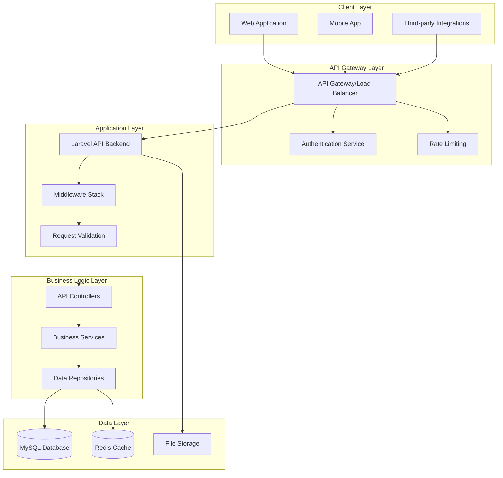

# API Migration Plan - Employee Evaluation System

## Executive Summary

This document outlines a comprehensive migration strategy to transform the current PHP web application into a modern API-based backend architecture. The migration will leverage Laravel as the primary framework, implement JWT authentication, and follow a phased approach to minimize disruption while modernizing the system architecture.

## Table of Contents

1. [Current State Analysis](#current-state-analysis)
2. [Target API Architecture](#target-api-architecture)
3. [API Design Strategy](#api-design-strategy)
4. [Endpoint Mapping](#endpoint-mapping)
5. [Migration Strategy](#migration-strategy)
6. [Technical Implementation Plan](#technical-implementation-plan)
7. [Security Considerations](#security-considerations)
8. [Development and Deployment](#development-and-deployment)
9. [Frontend Separation Strategy](#frontend-separation-strategy)
10. [Timeline and Milestones](#timeline-and-milestones)

---

## Current State Analysis

### Current Architecture Overview

The existing system is a monolithic PHP web application with the following characteristics:

#### **Strengths:**
- **Comprehensive Database Schema**: Well-designed normalized database with 25+ tables
- **Job Template System**: Innovative template-based evaluation framework
- **Role-Based Access Control**: Three-tier user system (HR Admin, Manager, Employee)
- **Docker Environment**: Containerized development setup
- **Audit Logging**: Complete activity tracking system
- **Security Features**: CSRF protection, password hashing, session management

#### **Current Technology Stack:**
- **Backend**: PHP 8.2+ with custom MVC architecture
- **Database**: MySQL 8.0 with comprehensive schema
- **Frontend**: Server-side rendered PHP with Bootstrap 5.3
- **Infrastructure**: Docker Compose with Apache/MySQL
- **Authentication**: Session-based with role permissions

#### **Architectural Limitations:**
- **Tight Coupling**: Presentation and business logic are intertwined
- **Monolithic Structure**: Single codebase handling all concerns
- **Limited Scalability**: Session-based authentication limits horizontal scaling
- **Frontend Constraints**: Server-side rendering limits modern UI capabilities
- **API Absence**: No programmatic access for integrations

### Current File Structure Analysis

```
performance_evaluation_system/
├── classes/                    # Business Logic (Reusable)
│   ├── User.php               # User management and authentication
│   ├── Employee.php           # Employee CRUD and hierarchy
│   ├── Evaluation.php         # Complex evaluation logic
│   ├── EvaluationPeriod.php   # Period management
│   ├── JobTemplate.php        # Template-based evaluation system
│   ├── CompanyKPI.php         # KPI management
│   ├── Competency.php         # Competency framework
│   └── CompanyValues.php      # Company values system
├── config/                    # Configuration (Adaptable)
│   ├── database.php          # Database connection
│   └── config.php            # Application settings
├── public/                    # Web Interface (To be replaced)
│   ├── dashboard.php         # Role-based dashboards
│   ├── evaluation/           # Evaluation management
│   ├── employees/            # Employee management
│   └── admin/                # Administrative functions
├── includes/                  # Utilities (Reusable)
│   └── auth.php              # Authentication helpers
└── templates/                 # UI Templates (To be replaced)
    ├── header.php
    └── footer.php
```

### Database Schema Strengths

The current database schema is exceptionally well-designed for API migration:

- **Normalized Structure**: Proper relationships and foreign keys
- **Flexible Job Templates**: Dynamic evaluation criteria system
- **Comprehensive Audit Trail**: Full activity logging
- **Scalable Design**: Supports complex organizational hierarchies
- **Performance Optimized**: Proper indexing and query patterns

---

## Target API Architecture

### High-Level Architecture Vision



### Core Architectural Principles

1. **API-First Design**: All functionality exposed through RESTful APIs
2. **Stateless Architecture**: JWT-based authentication for scalability
3. **Microservices Ready**: Modular design allowing future service separation
4. **Event-Driven**: Laravel Events for decoupled business logic
5. **SOLID Principles**: Maintainable and testable codebase
6. **Security by Design**: Comprehensive security at every layer

---

## API Design Strategy

### RESTful API Standards

#### **Resource Naming Conventions**
- **Collections**: Plural nouns (`/api/v1/employees`, `/api/v1/evaluations`)
- **Resources**: Singular identifiers (`/api/v1/employees/{id}`)
- **Nested Resources**: Logical hierarchy (`/api/v1/employees/{id}/evaluations`)
- **Actions**: Verb-based endpoints (`/api/v1/evaluations/{id}/submit`)

#### **HTTP Methods Usage**
- **GET**: Retrieve resources (idempotent)
- **POST**: Create new resources
- **PUT**: Update entire resources (idempotent)
- **PATCH**: Partial resource updates
- **DELETE**: Remove resources (idempotent)

#### **Response Format Standardization**

```json
{
  "success": true,
  "data": {
    // Resource data or collection
  },
  "message": "Operation completed successfully",
  "meta": {
    "timestamp": "2025-06-27T15:00:00Z",
    "version": "1.0",
    "request_id": "uuid-here"
  },
  "pagination": {  // For collections only
    "current_page": 1,
    "per_page": 20,
    "total": 150,
    "last_page": 8,
    "has_more": true
  }
}
```

#### **Error Response Format**

```json
{
  "success": false,
  "error": {
    "code": "VALIDATION_ERROR",
    "message": "The given data was invalid",
    "details": {
      "email": ["The email field is required"],
      "password": ["The password must be at least 8 characters"]
    }
  },
  "meta": {
    "timestamp": "2025-06-27T15:00:00Z",
    "version": "1.0",
    "request_id": "uuid-here"
  }
}
```

### Authentication Strategy

#### **JWT Implementation**
- **Access Tokens**: Short-lived (15 minutes) for API access
- **Refresh Tokens**: Long-lived (7 days) for token renewal
- **Token Structure**: Standard JWT with custom claims
- **Revocation**: Redis-based token blacklisting

#### **JWT Payload Structure**

```json
{
  "iss": "performance-evaluation-api",
  "sub": "user-id",
  "aud": "performance-evaluation-client",
  "exp": 1640995200,
  "iat": 1640991600,
  "jti": "unique-token-id",
  "user": {
    "id": 123,
    "username": "john.doe",
    "role": "manager",
    "employee_id": 456,
    "permissions": ["view_team", "create_evaluation"]
  }
}
```

### API Versioning Strategy

#### **URL Versioning**
- **Current Version**: `/api/v1/`
- **Future Versions**: `/api/v2/`, `/api/v3/`
- **Deprecation Policy**: 12-month support for previous versions
- **Version Headers**: `Accept: application/vnd.api+json;version=1`

---

## Endpoint Mapping

### Authentication Endpoints

| Method | Endpoint | Description | Current Equivalent |
|--------|----------|-------------|-------------------|
| POST | `/api/v1/auth/login` | User authentication | `login.php` |
| POST | `/api/v1/auth/refresh` | Token refresh | New functionality |
| POST | `/api/v1/auth/logout` | User logout | `logout.php` |
| POST | `/api/v1/auth/forgot-password` | Password reset request | New functionality |
| POST | `/api/v1/auth/reset-password` | Password reset | New functionality |
| GET | `/api/v1/auth/me` | Current user info | Session data |

### User Management Endpoints

| Method | Endpoint | Description | Current Equivalent |
|--------|----------|-------------|-------------------|
| GET | `/api/v1/users` | List users (paginated) | User class methods |
| POST | `/api/v1/users` | Create new user | `User::createUser()` |
| GET | `/api/v1/users/{id}` | Get user details | `User::getUserById()` |
| PUT | `/api/v1/users/{id}` | Update user | `User::updateUser()` |
| DELETE | `/api/v1/users/{id}` | Deactivate user | Soft delete |
| PATCH | `/api/v1/users/{id}/password` | Change password | `User::changePassword()` |

### Employee Management Endpoints

| Method | Endpoint | Description | Current Equivalent |
|--------|----------|-------------|-------------------|
| GET | `/api/v1/employees` | List employees | `employees/list.php` |
| POST | `/api/v1/employees` | Create employee | `employees/create.php` |
| GET | `/api/v1/employees/{id}` | Get employee details | `employees/view.php` |
| PUT | `/api/v1/employees/{id}` | Update employee | `employees/edit.php` |
| DELETE | `/api/v1/employees/{id}` | Deactivate employee | Soft delete |
| GET | `/api/v1/employees/{id}/hierarchy` | Employee hierarchy | `employees/hierarchy.php` |
| GET | `/api/v1/employees/{id}/team` | Team members | Manager's team |
| GET | `/api/v1/employees/{id}/evaluations` | Employee evaluations | Filtered evaluations |

### Evaluation Management Endpoints

| Method | Endpoint | Description | Current Equivalent |
|--------|----------|-------------|-------------------|
| GET | `/api/v1/evaluations` | List evaluations | `evaluation/list.php` |
| POST | `/api/v1/evaluations` | Create evaluation | `evaluation/create.php` |
| GET | `/api/v1/evaluations/{id}` | Get evaluation details | `evaluation/view.php` |
| PUT | `/api/v1/evaluations/{id}` | Update evaluation | `evaluation/edit.php` |
| DELETE | `/api/v1/evaluations/{id}` | Delete evaluation | Delete functionality |
| POST | `/api/v1/evaluations/{id}/submit` | Submit for review | Status change |
| POST | `/api/v1/evaluations/{id}/approve` | Approve evaluation | Status change |
| POST | `/api/v1/evaluations/{id}/reject` | Reject evaluation | Status change |
| GET | `/api/v1/evaluations/{id}/pdf` | Generate PDF report | New functionality |

### Evaluation Components Endpoints

| Method | Endpoint | Description | Current Equivalent |
|--------|----------|-------------|-------------------|
| PUT | `/api/v1/evaluations/{id}/kpis/{kpiId}` | Update KPI result | `Evaluation::updateKPIResult()` |
| PUT | `/api/v1/evaluations/{id}/competencies/{compId}` | Update competency | `Evaluation::updateCompetencyResult()` |
| PUT | `/api/v1/evaluations/{id}/responsibilities/{respId}` | Update responsibility | `Evaluation::updateResponsibilityResult()` |
| PUT | `/api/v1/evaluations/{id}/values/{valueId}` | Update value result | `Evaluation::updateValueResult()` |
| GET | `/api/v1/evaluations/{id}/score` | Calculate score | `Evaluation::calculateTemplateBasedScore()` |

### Job Template Management Endpoints

| Method | Endpoint | Description | Current Equivalent |
|--------|----------|-------------|-------------------|
| GET | `/api/v1/job-templates` | List job templates | `admin/job_templates.php` |
| POST | `/api/v1/job-templates` | Create job template | Template creation |
| GET | `/api/v1/job-templates/{id}` | Get template details | Template view |
| PUT | `/api/v1/job-templates/{id}` | Update template | Template edit |
| DELETE | `/api/v1/job-templates/{id}` | Delete template | Template deletion |
| POST | `/api/v1/job-templates/{id}/kpis` | Add KPI to template | KPI assignment |
| DELETE | `/api/v1/job-templates/{id}/kpis/{kpiId}` | Remove KPI | KPI removal |
| POST | `/api/v1/job-templates/{id}/competencies` | Add competency | Competency assignment |
| DELETE | `/api/v1/job-templates/{id}/competencies/{compId}` | Remove competency | Competency removal |

### Performance Metrics Endpoints

| Method | Endpoint | Description | Current Equivalent |
|--------|----------|-------------|-------------------|
| GET | `/api/v1/kpis` | List KPIs | `admin/kpis.php` |
| POST | `/api/v1/kpis` | Create KPI | KPI creation |
| GET | `/api/v1/kpis/{id}` | Get KPI details | KPI view |
| PUT | `/api/v1/kpis/{id}` | Update KPI | KPI edit |
| DELETE | `/api/v1/kpis/{id}` | Delete KPI | KPI deletion |
| GET | `/api/v1/competencies` | List competencies | `admin/competencies.php` |
| POST | `/api/v1/competencies` | Create competency | Competency creation |
| GET | `/api/v1/competencies/{id}` | Get competency | Competency view |
| PUT | `/api/v1/competencies/{id}` | Update competency | Competency edit |
| DELETE | `/api/v1/competencies/{id}` | Delete competency | Competency deletion |
| GET | `/api/v1/company-values` | List company values | `admin/values.php` |
| POST | `/api/v1/company-values` | Create value | Value creation |

### Evaluation Periods Endpoints

| Method | Endpoint | Description | Current Equivalent |
|--------|----------|-------------|-------------------|
| GET | `/api/v1/evaluation-periods` | List periods | `admin/periods.php` |
| POST | `/api/v1/evaluation-periods` | Create period | Period creation |
| GET | `/api/v1/evaluation-periods/{id}` | Get period details | Period view |
| PUT | `/api/v1/evaluation-periods/{id}` | Update period | Period edit |
| DELETE | `/api/v1/evaluation-periods/{id}` | Delete period | Period deletion |
| GET | `/api/v1/evaluation-periods/active` | Get active periods | Active periods filter |

### Reporting and Analytics Endpoints

| Method | Endpoint | Description | Current Equivalent |
|--------|----------|-------------|-------------------|
| GET | `/api/v1/reports/dashboard` | Dashboard statistics | Dashboard data |
| GET | `/api/v1/reports/evaluations` | Evaluation reports | Report generation |
| GET | `/api/v1/reports/employees` | Employee reports | Employee statistics |
| GET | `/api/v1/reports/performance-trends` | Performance analytics | New functionality |
| GET | `/api/v1/reports/department/{dept}` | Department reports | Filtered reports |
| POST | `/api/v1/reports/custom` | Custom report generation | New functionality |

---

## Migration Strategy

### Phase-by-Phase Migration Approach

#### **Phase 1: Foundation Setup (Weeks 1-4)**

**Objectives:**
- Set up Laravel API project structure
- Migrate database schema and seeders
- Implement core authentication system
- Create basic API infrastructure

**Deliverables:**
- Laravel 10.x project with proper structure
- Database migrations for all existing tables
- JWT authentication implementation
- Basic API middleware and error handling
- Docker environment for API development

**Migration Steps:**
1. **Laravel Project Initialization**
   ```bash
   composer create-project laravel/laravel evaluation-api
   cd evaluation-api
   composer require tymon/jwt-auth
   composer require spatie/laravel-permission
   ```

2. **Database Migration Creation**
   ```php
   // Convert existing schema to Laravel migrations
   php artisan make:migration create_users_table
   php artisan make:migration create_employees_table
   php artisan make:migration create_evaluations_table
   // ... all other tables
   ```

3. **Model Creation with Relationships**
   ```php
   php artisan make:model User
   php artisan make:model Employee
   php artisan make:model Evaluation
   // ... with proper relationships
   ```

#### **Phase 2: Core API Development (Weeks 5-8)**

**Objectives:**
- Implement authentication and user management APIs
- Create employee management endpoints
- Develop basic evaluation CRUD operations
- Implement role-based access control

**Deliverables:**
- Complete authentication API with JWT
- User and employee management endpoints
- Basic evaluation management APIs
- Comprehensive API documentation
- Unit tests for core functionality

**Key Implementation:**
```php
// Example: User API Controller
class UserController extends Controller
{
    public function index(Request $request)
    {
        $users = User::with('employee')
            ->when($request->search, function ($query, $search) {
                $query->where('username', 'like', "%{$search}%")
                      ->orWhere('email', 'like', "%{$search}%");
            })
            ->paginate($request->per_page ?? 20);

        return new UserCollection($users);
    }

    public function store(StoreUserRequest $request)
    {
        $user = User::create($request->validated());
        return new UserResource($user);
    }
}
```

#### **Phase 3: Advanced Features (Weeks 9-12)**

**Objectives:**
- Implement job template system APIs
- Create evaluation component management
- Develop reporting and analytics endpoints
- Add file upload and PDF generation

**Deliverables:**
- Complete job template management APIs
- Evaluation component endpoints (KPIs, competencies, etc.)
- Reporting and analytics APIs
- File handling and PDF generation
- Performance optimization

#### **Phase 4: Integration and Testing (Weeks 13-16)**

**Objectives:**
- Create API client for existing frontend
- Implement gradual migration strategy
- Comprehensive testing and optimization
- Documentation and deployment preparation

**Deliverables:**
- API client library for frontend integration
- Hybrid system supporting both old and new APIs
- Complete test suite (unit, integration, API tests)
- Performance benchmarks and optimization
- Deployment scripts and CI/CD pipeline

### Backward Compatibility Strategy

#### **Hybrid Approach Implementation**

1. **API Wrapper for Existing Classes**
   ```php
   // Create API-compatible wrappers for existing classes
   class LegacyUserAdapter
   {
       private $userClass;
       
       public function __construct()
       {
           $this->userClass = new \User();
       }
       
       public function createUser(array $data): array
       {
           $userId = $this->userClass->createUser($data);
           return $this->formatApiResponse($userId);
       }
   }
   ```

2. **Gradual Endpoint Migration**
   - Start with read-only endpoints (GET operations)
   - Migrate write operations (POST, PUT, DELETE) gradually
   - Maintain existing web interface during transition

3. **Feature Flags for Migration Control**
   ```php
   // Use Laravel feature flags
   if (Feature::active('use-api-for-users')) {
       // Use new API endpoints
   } else {
       // Use legacy classes
   }
   ```

### Data Migration Strategy

#### **Database Schema Compatibility**
- **No Breaking Changes**: Existing schema remains intact
- **Additive Migrations**: New columns/tables for API features
- **Data Integrity**: Maintain all existing relationships
- **Performance**: Add indexes for API query patterns

#### **Migration Scripts**
```php
// Example migration for API tokens
Schema::create('personal_access_tokens', function (Blueprint $table) {
    $table->id();
    $table->morphs('tokenable');
    $table->string('name');
    $table->string('token', 64)->unique();
    $table->text('abilities')->nullable();
    $table->timestamp('last_used_at')->nullable();
    $table->timestamps();
});
```

---

## Technical Implementation Plan

### Laravel Framework Selection Rationale

#### **Why Laravel 10.x?**

1. **Mature Ecosystem**: Extensive package ecosystem and community support
2. **Built-in Features**: Authentication, authorization, caching, queues
3. **API Development**: Laravel Sanctum/Passport for API authentication
4. **Database Management**: Eloquent ORM with migration system
5. **Testing Framework**: Comprehensive testing tools built-in
6. **Performance**: Optimized for modern PHP applications
7. **Documentation**: Excellent documentation and learning resources

### Project Structure

```
evaluation-api/
├── app/
│   ├── Http/
│   │   ├── Controllers/
│   │   │   ├── Api/
│   │   │   │   ├── V1/
│   │   │   │   │   ├── AuthController.php
│   │   │   │   │   ├── UserController.php
│   │   │   │   │   ├── EmployeeController.php
│   │   │   │   │   ├── EvaluationController.php
│   │   │   │   │   ├── JobTemplateController.php
│   │   │   │   │   └── ReportController.php
│   │   │   │   └── V2/  # Future versions
│   │   ├── Middleware/
│   │   │   ├── JwtMiddleware.php
│   │   │   ├── RoleMiddleware.php
│   │   │   └── ApiVersionMiddleware.php
│   │   ├── Requests/
│   │   │   ├── StoreUserRequest.php
│   │   │   ├── UpdateEmployeeRequest.php
│   │   │   └── CreateEvaluationRequest.php
│   │   └── Resources/
│   │       ├── UserResource.php
│   │       ├── EmployeeResource.php
│   │       └── EvaluationResource.php
│   ├── Models/
│   │   ├── User.php
│   │   ├── Employee.php
│   │   ├── Evaluation.php
│   │   ├── JobTemplate.php
│   │   └── CompanyKPI.php
│   ├── Services/
│   │   ├── AuthService.php
│   │   ├── EvaluationService.php
│   │   ├── ReportService.php
│   │   └── NotificationService.php
│   ├── Repositories/
│   │   ├── UserRepository.php
│   │   ├── EmployeeRepository.php
│   │   └── EvaluationRepository.php
│   └── Events/
│       ├── EvaluationCreated.php
│       ├── EvaluationSubmitted.php
│       └── UserRegistered.php
├── database/
│   ├── migrations/
│   ├── seeders/
│   └── factories/
├── routes/
│   ├── api.php
│   └── web.php
├── tests/
│   ├── Feature/
│   │   ├── AuthTest.php
│   │   ├── UserManagementTest.php
│   │   └── EvaluationTest.php
│   └── Unit/
│       ├── UserServiceTest.php
│       └── EvaluationServiceTest.php
└── config/
    ├── jwt.php
    ├── cors.php
    └── api.php
```

### Core Implementation Components

#### **1. Authentication Service**

```php
<?php

namespace App\Services;

use App\Models\User;
use Illuminate\Support\Facades\Hash;
use Tymon\JWTAuth\Facades\JWTAuth;
use App\Exceptions\AuthenticationException;

class AuthService
{
    public function login(string $username, string $password): array
    {
        $user = User::where('username', $username)
                   ->where('is_active', true)
                   ->first();

        if (!$user || !Hash::check($password, $user->password_hash)) {
            throw new AuthenticationException('Invalid credentials');
        }

        $token = JWTAuth::fromUser($user);
        $refreshToken = $this->generateRefreshToken($user);

        return [
            'access_token' => $token,
            'refresh_token' => $refreshToken,
            'token_type' => 'bearer',
            'expires_in' => config('jwt.ttl') * 60,
            'user' => $user->load('employee')
        ];
    }

    public function refreshToken(string $refreshToken): array
    {
        // Implement refresh token logic
        $user = $this->validateRefreshToken($refreshToken);
        $newToken = JWTAuth::fromUser($user);
        
        return [
            'access_token' => $newToken,
            'token_type' => 'bearer',
            'expires_in' => config('jwt.ttl') * 60
        ];
    }

    private function generateRefreshToken(User $user): string
    {
        return $user->createToken('refresh-token')->plainTextToken;
    }
}
```

#### **2. Evaluation Service**

```php
<?php

namespace App\Services;

use App\Models\Evaluation;
use App\Models\Employee;
use App\Models\JobTemplate;
use App\Events\EvaluationCreated;
use Illuminate\Support\Facades\DB;

class EvaluationService
{
    public function createEvaluation(array $data): Evaluation
    {
        return DB::transaction(function () use ($data) {
            $employee = Employee::findOrFail($data['employee_id']);
            
            // Validate workflow prerequisites
            $this->validateEvaluationWorkflow($employee);
            
            $evaluation = Evaluation::create([
                'employee_id' => $data['employee_id'],
                'evaluator_id' => $data['evaluator_id'],
                'manager_id' => $employee->manager_id,
                'period_id' => $data['period_id'],
                'job_template_id' => $employee->job_template_id,
                'status' => 'draft'
            ]);

            // Initialize evaluation from job template
            $this->initializeFromTemplate($evaluation);

            event(new EvaluationCreated($evaluation));

            return $evaluation->load([
                'employee',
                'evaluator',
                'period',
                'jobTemplate'
            ]);
        });
    }

    public function updateKPIResult(Evaluation $evaluation, int $kpiId, array $data): bool
    {
        $result = $evaluation->kpiResults()
                            ->where('kpi_id', $kpiId)
                            ->first();

        if (!$result) {
            throw new \Exception('KPI result not found');
        }

        $result->update([
            'achieved_value' => $data['achieved_value'] ?? null,
            'score' => $data['score'] ?? null,
            'comments' => $data['comments'] ?? null
        ]);

        $this->recalculateOverallRating($evaluation);

        return true;
    }

    private function validateEvaluationWorkflow(Employee $employee): void
    {
        if (!$employee->job_template_id) {
            throw new \Exception('Employee must have a job template assigned');
        }

        $template = JobTemplate::find($employee->job_template_id);
        if (!$template || !$template->is_active) {
            throw new \Exception('Invalid or inactive job template');
        }

        // Validate template has required components
        $this->validateTemplateComponents($template);
    }

    private function initializeFromTemplate(Evaluation $evaluation): void
    {
        $template = $evaluation->jobTemplate;
        
        // Initialize KPI results
        foreach ($template->kpis as $kpi) {
            $evaluation->kpiResults()->create([
                'kpi_id' => $kpi->id,
                'target_value' => $kpi->pivot->target_value,
                'weight_percentage' => $kpi->pivot->weight_percentage
            ]);
        }

        // Initialize competency results
        foreach ($template->competencies as $competency) {
            $evaluation->competencyResults()->create([
                'competency_id' => $competency->id,
                'required_level' => $competency->pivot->required_level,
                'weight_percentage' => $competency->pivot->weight_percentage
            ]);
        }

        // Initialize responsibility and value results...
    }
}
```

#### **3. API Resource Classes**

```php
<?php

namespace App\Http\Resources;

use Illuminate\Http\Resources\Json\JsonResource;

class EvaluationResource extends JsonResource
{
    public function toArray($request): array
    {
        return [
            'id' => $this->evaluation_id,
            'employee' => new EmployeeResource($this->whenLoaded('employee')),
            'evaluator' => new UserResource($this->whenLoaded('evaluator')),
            'period' => new EvaluationPeriodResource($this->whenLoaded('period')),
            'job_template' => new JobTemplateResource($this->whenLoaded('jobTemplate')),
            'overall_rating' => $this->overall_rating,
            'status' => $this->status,
            'created_at' => $this->created_at,
            'updated_at' => $this->updated_at,
            'submitted_at' => $this->submitted_at,
            'approved_at' => $this->approved_at,
            'kpi_results' => KPIResultResource::collection($this->whenLoaded('kpiResults')),
            'competency_results' => CompetencyResultResource::collection($this->whenLoaded('competencyResults')),
            'responsibility_results' => ResponsibilityResultResource::collection($this->whenLoaded('responsibilityResults')),
            'value_results' => ValueResultResource::collection($this->whenLoaded('valueResults')),
            'section_weights' => $this->whenLoaded('sectionWeights'),
            'links' => [
                'self' => route('api.v1.evaluations.show', $this->evaluation_id),
                'submit' => route('api.v1.evaluations.submit', $this->evaluation_id),
                'pdf' => route('api.v1.evaluations.pdf', $this->evaluation_id)
            ]
        ];
    }
}
```

### Middleware Implementation

#### **JWT Authentication Middleware**

```php
<?php

namespace App\Http\Middleware;

use Closure;
use Illuminate\Http\Request;
use Tymon\JWTAuth\Facades\JWTAuth;
use Tymon\J
WTAuth\Exceptions\JWTException;
use Symfony\Component\HttpFoundation\Response;

class JwtMiddleware
{
    public function handle(Request $request, Closure $next): Response
    {
        try {
            $user = JWTAuth::parseToken()->authenticate();
            
            if (!$user) {
                return response()->json([
                    'success' => false,
                    'error' => [
                        'code' => 'TOKEN_INVALID',
                        'message' => 'Token is invalid'
                    ]
                ], 401);
            }

            // Add user to request for easy access
            $request->merge(['auth_user' => $user]);

        } catch (JWTException $e) {
            return response()->json([
                'success' => false,
                'error' => [
                    'code' => 'TOKEN_REQUIRED',
                    'message' => 'Token is required'
                ]
            ], 401);
        }

        return $next($request);
    }
}
```

#### **Role-Based Access Control Middleware**

```php
<?php

namespace App\Http\Middleware;

use Closure;
use Illuminate\Http\Request;
use Symfony\Component\HttpFoundation\Response;

class RoleMiddleware
{
    public function handle(Request $request, Closure $next, ...$roles): Response
    {
        $user = $request->auth_user;

        if (!$user || !in_array($user->role, $roles)) {
            return response()->json([
                'success' => false,
                'error' => [
                    'code' => 'INSUFFICIENT_PERMISSIONS',
                    'message' => 'You do not have permission to access this resource'
                ]
            ], 403);
        }

        return $next($request);
    }
}
```

### Database Layer Implementation

#### **Repository Pattern**

```php
<?php

namespace App\Repositories;

use App\Models\Evaluation;
use Illuminate\Database\Eloquent\Collection;
use Illuminate\Pagination\LengthAwarePaginator;

class EvaluationRepository
{
    public function findByEmployee(int $employeeId, array $filters = []): Collection
    {
        $query = Evaluation::where('employee_id', $employeeId)
                          ->with(['period', 'evaluator', 'jobTemplate']);

        if (isset($filters['status'])) {
            $query->where('status', $filters['status']);
        }

        if (isset($filters['period_id'])) {
            $query->where('period_id', $filters['period_id']);
        }

        return $query->orderBy('created_at', 'desc')->get();
    }

    public function findPendingForManager(int $managerId): Collection
    {
        return Evaluation::whereHas('employee', function ($query) use ($managerId) {
                    $query->where('manager_id', $managerId);
                })
                ->whereIn('status', ['submitted', 'in_review'])
                ->with(['employee', 'period'])
                ->orderBy('submitted_at', 'asc')
                ->get();
    }

    public function getPerformanceMetrics(int $employeeId, int $periodId): array
    {
        $evaluation = Evaluation::where('employee_id', $employeeId)
                               ->where('period_id', $periodId)
                               ->with(['kpiResults', 'competencyResults'])
                               ->first();

        if (!$evaluation) {
            return [];
        }

        return [
            'overall_rating' => $evaluation->overall_rating,
            'kpi_average' => $evaluation->kpiResults->avg('score'),
            'competency_average' => $evaluation->competencyResults->avg('score'),
            'completion_percentage' => $this->calculateCompletionPercentage($evaluation)
        ];
    }

    private function calculateCompletionPercentage(Evaluation $evaluation): float
    {
        $totalComponents = $evaluation->kpiResults->count() + 
                          $evaluation->competencyResults->count() +
                          $evaluation->responsibilityResults->count() +
                          $evaluation->valueResults->count();

        $completedComponents = $evaluation->kpiResults->whereNotNull('score')->count() +
                              $evaluation->competencyResults->whereNotNull('score')->count() +
                              $evaluation->responsibilityResults->whereNotNull('score')->count() +
                              $evaluation->valueResults->whereNotNull('score')->count();

        return $totalComponents > 0 ? ($completedComponents / $totalComponents) * 100 : 0;
    }
}
```

---

## Security Considerations

### API Security Framework

#### **1. Authentication Security**

**JWT Token Security:**
- **Short-lived Access Tokens**: 15-minute expiration to minimize exposure
- **Secure Refresh Tokens**: 7-day expiration with rotation on use
- **Token Blacklisting**: Redis-based revocation for immediate logout
- **Secure Storage**: HttpOnly cookies for web clients, secure storage for mobile

**Implementation:**
```php
// JWT Configuration
'jwt' => [
    'secret' => env('JWT_SECRET'),
    'ttl' => 15, // 15 minutes
    'refresh_ttl' => 10080, // 7 days
    'algo' => 'HS256',
    'required_claims' => ['iss', 'iat', 'exp', 'nbf', 'sub', 'jti'],
    'blacklist_enabled' => true,
    'blacklist_grace_period' => 0
]
```

#### **2. Authorization and Access Control**

**Role-Based Permissions:**
```php
// Permission Matrix
$permissions = [
    'hr_admin' => [
        'users.*',
        'employees.*',
        'evaluations.*',
        'job-templates.*',
        'reports.*'
    ],
    'manager' => [
        'employees.view',
        'employees.team',
        'evaluations.view',
        'evaluations.create',
        'evaluations.approve',
        'reports.team'
    ],
    'employee' => [
        'employees.view_own',
        'evaluations.view_own',
        'evaluations.update_own'
    ]
];
```

**Resource-Level Security:**
```php
// Policy-based authorization
class EvaluationPolicy
{
    public function view(User $user, Evaluation $evaluation): bool
    {
        return $user->role === 'hr_admin' ||
               $user->employee_id === $evaluation->employee_id ||
               $user->employee_id === $evaluation->manager_id;
    }

    public function update(User $user, Evaluation $evaluation): bool
    {
        return ($user->employee_id === $evaluation->employee_id && 
                $evaluation->status === 'draft') ||
               ($user->employee_id === $evaluation->manager_id && 
                $evaluation->status === 'submitted');
    }
}
```

#### **3. Input Validation and Sanitization**

**Request Validation:**
```php
class StoreEvaluationRequest extends FormRequest
{
    public function rules(): array
    {
        return [
            'employee_id' => 'required|integer|exists:employees,employee_id',
            'period_id' => 'required|integer|exists:evaluation_periods,period_id',
            'kpi_results' => 'array',
            'kpi_results.*.kpi_id' => 'required|integer|exists:company_kpis,kpi_id',
            'kpi_results.*.achieved_value' => 'nullable|numeric|min:0',
            'kpi_results.*.score' => 'nullable|integer|between:1,5',
            'kpi_results.*.comments' => 'nullable|string|max:1000'
        ];
    }

    public function authorize(): bool
    {
        return $this->user()->can('create', Evaluation::class);
    }
}
```

#### **4. Data Protection and Privacy**

**Sensitive Data Handling:**
- **Encryption**: Sensitive fields encrypted at rest
- **Audit Logging**: Complete activity trail for compliance
- **Data Masking**: PII protection in logs and responses
- **GDPR Compliance**: Data export and deletion capabilities

```php
// Encrypted model attributes
class Employee extends Model
{
    protected $fillable = [
        'first_name', 'last_name', 'email', 'phone', 'salary'
    ];

    protected $encrypted = [
        'salary', 'phone', 'personal_notes'
    ];

    protected $hidden = [
        'salary', 'personal_notes'
    ];
}
```

#### **5. API Rate Limiting and Throttling**

**Rate Limiting Strategy:**
```php
// Rate limiting configuration
'throttle' => [
    'api' => [
        'attempts' => 60,
        'decay_minutes' => 1
    ],
    'auth' => [
        'attempts' => 5,
        'decay_minutes' => 15
    ],
    'reports' => [
        'attempts' => 10,
        'decay_minutes' => 60
    ]
]
```

#### **6. CORS and API Security Headers**

**Security Headers:**
```php
// Security middleware
class SecurityHeadersMiddleware
{
    public function handle($request, Closure $next)
    {
        $response = $next($request);
        
        $response->headers->set('X-Content-Type-Options', 'nosniff');
        $response->headers->set('X-Frame-Options', 'DENY');
        $response->headers->set('X-XSS-Protection', '1; mode=block');
        $response->headers->set('Strict-Transport-Security', 'max-age=31536000; includeSubDomains');
        
        return $response;
    }
}
```

---

## Development and Deployment

### Development Environment Setup

#### **Local Development with Docker**

**Docker Compose Configuration:**
```yaml
version: '3.8'
services:
  api:
    build:
      context: .
      dockerfile: Dockerfile
    ports:
      - "8000:8000"
    volumes:
      - .:/var/www/html
    environment:
      - APP_ENV=local
      - DB_HOST=mysql
      - REDIS_HOST=redis
    depends_on:
      - mysql
      - redis

  mysql:
    image: mysql:8.0
    environment:
      MYSQL_ROOT_PASSWORD: root
      MYSQL_DATABASE: evaluation_api
    ports:
      - "3306:3306"
    volumes:
      - mysql_data:/var/lib/mysql

  redis:
    image: redis:7-alpine
    ports:
      - "6379:6379"
    volumes:
      - redis_data:/data

  nginx:
    image: nginx:alpine
    ports:
      - "80:80"
      - "443:443"
    volumes:
      - ./nginx.conf:/etc/nginx/nginx.conf
    depends_on:
      - api

volumes:
  mysql_data:
  redis_data:
```

#### **API Documentation with OpenAPI**

**Swagger/OpenAPI Integration:**
```php
// Install L5-Swagger
composer require darkaonline/l5-swagger

// Controller documentation example
/**
 * @OA\Post(
 *     path="/api/v1/evaluations",
 *     summary="Create a new evaluation",
 *     tags={"Evaluations"},
 *     security={{"bearerAuth":{}}},
 *     @OA\RequestBody(
 *         required=true,
 *         @OA\JsonContent(
 *             required={"employee_id", "period_id"},
 *             @OA\Property(property="employee_id", type="integer"),
 *             @OA\Property(property="period_id", type="integer")
 *         )
 *     ),
 *     @OA\Response(
 *         response=201,
 *         description="Evaluation created successfully",
 *         @OA\JsonContent(ref="#/components/schemas/Evaluation")
 *     )
 * )
 */
public function store(StoreEvaluationRequest $request)
{
    // Implementation
}
```

### Testing Strategy

#### **Comprehensive Test Suite**

**Feature Tests:**
```php
<?php

namespace Tests\Feature;

use Tests\TestCase;
use App\Models\User;
use App\Models\Employee;
use Illuminate\Foundation\Testing\RefreshDatabase;

class EvaluationApiTest extends TestCase
{
    use RefreshDatabase;

    public function test_manager_can_create_evaluation_for_team_member()
    {
        $manager = User::factory()->manager()->create();
        $employee = Employee::factory()->create(['manager_id' => $manager->employee_id]);

        $response = $this->actingAs($manager, 'api')
                        ->postJson('/api/v1/evaluations', [
                            'employee_id' => $employee->employee_id,
                            'period_id' => 1
                        ]);

        $response->assertStatus(201)
                ->assertJsonStructure([
                    'success',
                    'data' => [
                        'id',
                        'employee',
                        'status',
                        'created_at'
                    ]
                ]);
    }

    public function test_employee_cannot_create_evaluation_for_others()
    {
        $employee = User::factory()->employee()->create();
        $otherEmployee = Employee::factory()->create();

        $response = $this->actingAs($employee, 'api')
                        ->postJson('/api/v1/evaluations', [
                            'employee_id' => $otherEmployee->employee_id,
                            'period_id' => 1
                        ]);

        $response->assertStatus(403);
    }
}
```

**Unit Tests:**
```php
<?php

namespace Tests\Unit;

use Tests\TestCase;
use App\Services\EvaluationService;
use App\Models\Evaluation;
use Illuminate\Foundation\Testing\RefreshDatabase;

class EvaluationServiceTest extends TestCase
{
    use RefreshDatabase;

    public function test_calculates_overall_rating_correctly()
    {
        $evaluation = Evaluation::factory()->create();
        $service = new EvaluationService();

        // Add test KPI and competency results
        $evaluation->kpiResults()->create([
            'kpi_id' => 1,
            'score' => 4,
            'weight_percentage' => 60
        ]);

        $evaluation->competencyResults()->create([
            'competency_id' => 1,
            'score' => 5,
            'weight_percentage' => 40
        ]);

        $rating = $service->calculateOverallRating($evaluation);

        $this->assertEquals(4.4, $rating); // (4*0.6) + (5*0.4) = 4.4
    }
}
```

### CI/CD Pipeline

#### **GitHub Actions Workflow**

```yaml
name: API CI/CD Pipeline

on:
  push:
    branches: [ main, develop ]
  pull_request:
    branches: [ main ]

jobs:
  test:
    runs-on: ubuntu-latest
    
    services:
      mysql:
        image: mysql:8.0
        env:
          MYSQL_ROOT_PASSWORD: root
          MYSQL_DATABASE: testing
        options: >-
          --health-cmd="mysqladmin ping"
          --health-interval=10s
          --health-timeout=5s
          --health-retries=3

    steps:
    - uses: actions/checkout@v3
    
    - name: Setup PHP
      uses: shivammathur/setup-php@v2
      with:
        php-version: '8.2'
        extensions: mbstring, dom, fileinfo, mysql
        
    - name: Install dependencies
      run: composer install --no-progress --prefer-dist --optimize-autoloader
      
    - name: Copy environment file
      run: cp .env.testing .env
      
    - name: Generate application key
      run: php artisan key:generate
      
    - name: Run migrations
      run: php artisan migrate --force
      
    - name: Run tests
      run: php artisan test --coverage --min=80

  deploy:
    needs: test
    runs-on: ubuntu-latest
    if: github.ref == 'refs/heads/main'
    
    steps:
    - name: Deploy to production
      run: |
        # Deployment script
        echo "Deploying to production..."
```

### Performance Optimization

#### **Caching Strategy**

```php
// Cache configuration
'cache' => [
    'default' => 'redis',
    'stores' => [
        'redis' => [
            'driver' => 'redis',
            'connection' => 'cache',
            'prefix' => 'evaluation_api_cache'
        ]
    ]
],

// Cache implementation
class EvaluationService
{
    public function getEmployeeEvaluations(int $employeeId): Collection
    {
        return Cache::remember(
            "employee_evaluations_{$employeeId}",
            3600, // 1 hour
            fn() => Evaluation::where('employee_id', $employeeId)
                             ->with(['period', 'jobTemplate'])
                             ->get()
        );
    }
}
```

#### **Database Optimization**

```php
// Query optimization with eager loading
$evaluations = Evaluation::with([
    'employee:employee_id,first_name,last_name',
    'period:period_id,name,start_date,end_date',
    'kpiResults.kpi:kpi_id,name',
    'competencyResults.competency:competency_id,name'
])->paginate(20);

// Database indexes for API queries
Schema::table('evaluations', function (Blueprint $table) {
    $table->index(['employee_id', 'status']);
    $table->index(['manager_id', 'status']);
    $table->index(['period_id', 'status']);
    $table->index('created_at');
});
```

---

## Frontend Separation Strategy

### API Client Library

#### **JavaScript API Client**

```javascript
// api-client.js
class EvaluationApiClient {
    constructor(baseUrl, tokenManager) {
        this.baseUrl = baseUrl;
        this.tokenManager = tokenManager;
    }

    async request(endpoint, options = {}) {
        const url = `${this.baseUrl}${endpoint}`;
        const token = await this.tokenManager.getAccessToken();
        
        const config = {
            headers: {
                'Content-Type': 'application/json',
                'Authorization': `Bearer ${token}`,
                'Accept': 'application/json',
                ...options.headers
            },
            ...options
        };

        const response = await fetch(url, config);
        
        if (response.status === 401) {
            await this.tokenManager.refreshToken();
            return this.request(endpoint, options);
        }

        return response.json();
    }

    // Evaluation methods
    async getEvaluations(filters = {}) {
        const params = new URLSearchParams(filters);
        return this.request(`/api/v1/evaluations?${params}`);
    }

    async createEvaluation(data) {
        return this.request('/api/v1/evaluations', {
            method: 'POST',
            body: JSON.stringify(data)
        });
    }

    async updateKPIResult(evaluationId, kpiId, data) {
        return this.request(`/api/v1/evaluations/${evaluationId}/kpis/${kpiId}`, {
            method: 'PUT',
            body: JSON.stringify(data)
        });
    }
}

// Token management
class TokenManager {
    constructor() {
        this.accessToken = localStorage.getItem('access_token');
        this.refreshToken = localStorage.getItem('refresh_token');
    }

    async getAccessToken() {
        if (this.isTokenExpired(this.accessToken)) {
            await this.refreshToken();
        }
        return this.accessToken;
    }

    async refreshToken() {
        const response = await fetch('/api/v1/auth/refresh', {
            method: 'POST',
            headers: { 'Content-Type': 'application/json' },
            body: JSON.stringify({ refresh_token: this.refreshToken })
        });

        const data = await response.json();
        this.accessToken = data.access_token;
        localStorage.setItem('access_token', this.accessToken);
    }

    isTokenExpired(token) {
        if (!token) return true;
        const payload = JSON.parse(atob(token.split('.')[1]));
        return payload.exp < Date.now() / 1000;
    }
}
```

### Progressive Migration Approach

#### **Hybrid Implementation Strategy**

1. **Phase 1: Read-Only API Integration**
   - Replace data fetching with API calls
   - Maintain existing forms and submission logic
   - Gradual replacement of display components

2. **Phase 2: Write Operations Migration**
   - Replace form submissions with API calls
   - Implement client-side validation
   - Add real-time updates and notifications

3. **Phase 3: Complete Frontend Separation**
   - Modern JavaScript framework (React/Vue.js)
   - Single Page Application (SPA) architecture
   - Progressive Web App (PWA) capabilities

#### **Migration Wrapper Functions**

```php
// Legacy compatibility layer
class LegacyApiAdapter
{
    private $apiClient;
    
    public function __construct(ApiClient $apiClient)
    {
        $this->apiClient = $apiClient;
    }
    
    public function getEmployeeData($employeeId)
    {
        // Check feature flag
        if (config('features.use_api_for_employees')) {
            return $this->apiClient->get("/employees/{$employeeId}");
        }
        
        // Fall back to legacy class
        $employee = new Employee();
        return $employee->getEmployeeById($employeeId);
    }
}
```

---

## Timeline and Milestones

### Detailed Project Timeline

#### **Phase 1: Foundation Setup (4 weeks)**

**Week 1: Project Initialization**
- [ ] Laravel project setup and configuration
- [ ] Docker environment configuration
- [ ] Database migration creation
- [ ] Basic authentication setup
- [ ] CI/CD pipeline setup

**Week 2: Core Models and Relationships**
- [ ] Eloquent models with relationships
- [ ] Database seeders and factories
- [ ] Basic API structure and routing
- [ ] JWT authentication implementation
- [ ] Basic middleware setup

**Week 3: Authentication and User Management**
- [ ] Complete authentication endpoints
- [ ] User management API endpoints
- [ ] Role-based access control
- [ ] API documentation setup
- [ ] Basic testing framework

**Week 4: Employee Management APIs**
- [ ] Employee CRUD operations
- [ ] Employee hierarchy endpoints
- [ ] Team management APIs
- [ ] Data validation and error handling
- [ ] Unit and feature tests

**Deliverables:**
- ✅ Working Laravel API with authentication
- ✅ User and employee management endpoints
- ✅ Comprehensive test suite
- ✅ API documentation
- ✅ Docker development environment

#### **Phase 2: Core API Development (4 weeks)**

**Week 5: Evaluation Management Foundation**
- [ ] Basic evaluation CRUD operations
- [ ] Evaluation workflow implementation
- [ ] Status management and transitions
- [ ] Evaluation period integration
- [ ] Job template integration

**Week 6: Evaluation Components**
- [ ] KPI result management endpoints
- [ ] Competency result endpoints
- [ ] Responsibility result endpoints
- [ ] Company value result endpoints
- [ ] Score calculation logic

**Week 7: Advanced Evaluation Features**
- [ ] Template-based evaluation initialization
- [ ] Overall rating calculation
- [ ] Evaluation submission workflow
- [ ] Approval/rejection processes
- [ ] Notification system

**Week 8: Performance and Optimization**
- [ ] Query optimization and caching
- [ ] API response optimization
- [ ] Rate limiting implementation
- [ ] Security hardening
- [ ] Performance testing

**Deliverables:**
- ✅ Complete evaluation management API
- ✅ Workflow and approval processes
- ✅ Performance optimizations
- ✅ Security implementations
- ✅ Comprehensive testing

#### **Phase 3: Advanced Features (4 weeks)**

**Week 9: Job Template System**
- [ ] Job template CRUD operations
- [ ] Template component management
- [ ] Template assignment logic
- [ ] Template validation rules
- [ ] Template versioning

**Week 10: Reporting and Analytics**
- [ ] Dashboard statistics endpoints
- [ ] Performance analytics APIs
- [ ] Custom report generation
- [ ] Data export functionality
- [ ] PDF report generation

**Week 11: Administrative Features**
- [ ] Company KPI management
- [ ] Competency framework APIs
- [ ] Company values management
- [ ] System configuration endpoints
- [ ] Audit logging APIs

**Week 12: Integration and File Management**
- [ ] File upload and management
- [ ] PDF generation service
- [ ] Email notification system
- [ ] Third-party integrations
- [ ] API client library

**Deliverables:**
- ✅ Complete administrative APIs
- ✅ Reporting and analytics system
- ✅ File management capabilities
- ✅ Integration tools
- ✅ API client library

#### **Phase 4: Integration and Deployment (4 weeks)**

**Week 13: Frontend Integration**
- [ ] API client implementation
- [ ] Legacy system integration
- [ ] Progressive migration tools
- [ ] Feature flag implementation
- [ ] Hybrid system testing

**Week 14: Testing and Quality Assurance**
- [ ] End-to-end testing
- [ ] Performance testing
- [ ] Security testing
- [ ] Load testing
- [ ] User acceptance testing

**Week 15: Documentation and Training**
- [ ] Complete API documentation
- [ ] Migration guides
- [ ] Developer training materials
- [ ] Deployment documentation
- [ ] Troubleshooting guides

**Week 16: Production Deployment**
- [ ] Production environment setup
- [ ] Database migration scripts
- [ ] Deployment automation
- [ ] Monitoring and logging
- [ ] Go-live support

**Deliverables:**
- ✅ Production-ready API system
- ✅ Complete documentation
- ✅ Migration tools and guides
- ✅ Monitoring and support systems
- ✅ Successful production deployment

### Risk Assessment and Mitigation

#### **High-Risk Areas**

**1. Data Migration Complexity**
- **Risk**: Complex evaluation data relationships
- **Mitigation**: Comprehensive testing, gradual migration, rollback procedures
- **Timeline Impact**: +1 week buffer

**2. Performance Requirements**
- **Risk**: API performance under load
- **Mitigation**: Early performance testing, caching strategy, optimization
- **Timeline Impact**: Parallel optimization work

**3. Frontend Integration Challenges**
- **Risk**: Complex integration with existing UI
- **Mitigation**: Hybrid approach, progressive migration, feature flags
- **Timeline Impact**: +2 weeks for complex scenarios

**4. Security and Compliance**
- **Risk**: Data security and audit requirements
- **Mitigation**: Security-first design, regular audits, compliance checks
- **Timeline Impact**: Ongoing throughout project

#### **Success Metrics**

**Technical Metrics:**
- API response time < 200ms for 95% of requests
- 99.9% uptime during business hours
- Zero data loss during migration
- 100% test coverage for critical paths

**Business Metrics:**
- Seamless user experience during transition
- No disruption to evaluation processes
- Improved system performance and reliability
- Foundation for future enhancements

### Resource Requirements

#### **Development Team**

**Core Team (16 weeks):**
- **Senior Laravel Developer** (1 FTE) - API development lead
- **Frontend Developer** (0.5 FTE) - Integration and client library
- **DevOps Engineer** (0.25 FTE) - Infrastructure and deployment
- **QA Engineer** (0.5 FTE) - Testing and quality assurance
- **Project Manager** (0.25 FTE) - Coordination and planning

**Specialized Support:**
- **Database Administrator** (0.1 FTE) - Migration and optimization
- **Security Specialist** (0.1 FTE) - Security review and testing
- **Technical Writer** (0.1 FTE) - Documentation

#### **Infrastructure Requirements**

**Development Environment:**
- Docker containers for local development
- Staging environment mirroring production
- CI/CD pipeline with automated testing

**Production Environment:**
- Load balancer with SSL termination
- Application servers (2+ instances)
- Database server with replication
- Redis cache cluster
- File storage solution
- Monitoring and logging systems

---

## Conclusion

This comprehensive API migration plan provides a structured approach to transforming the current monolithic PHP application into a modern, scalable API-based architecture. The plan emphasizes:

### Key Success Factors

1. **Gradual Migration**: Phased approach minimizes risk and disruption
2. **Backward Compatibility**: Hybrid system ensures continuity during transition
3. **Modern Architecture**: Laravel framework provides robust foundation
4. **Security First**: Comprehensive security measures throughout
5. **Performance Focus**: Optimization and caching strategies
6. **Comprehensive Testing**: Quality assurance at every level

### Expected Benefits

**Technical Benefits:**
- Scalable, maintainable codebase
- Modern development practices
- API-first architecture enabling integrations
- Improved performance and reliability
- Enhanced security posture

**Business Benefits:**
- Foundation for mobile applications
- Third-party integration capabilities
- Improved user experience
- Reduced maintenance overhead
- Future-proof architecture

### Next Steps

1. **Stakeholder Review**: Present plan to development team and stakeholders
2. **Resource Allocation**: Confirm team availability and infrastructure
3. **Environment Setup**: Prepare development and staging environments
4. **Project Kickoff**: Begin Phase 1 implementation
5. **Regular Reviews**: Weekly progress reviews and adjustments

This migration plan provides the roadmap for successfully transforming the employee evaluation system into a modern, API-driven application while maintaining business continuity and ensuring a smooth transition for all users.