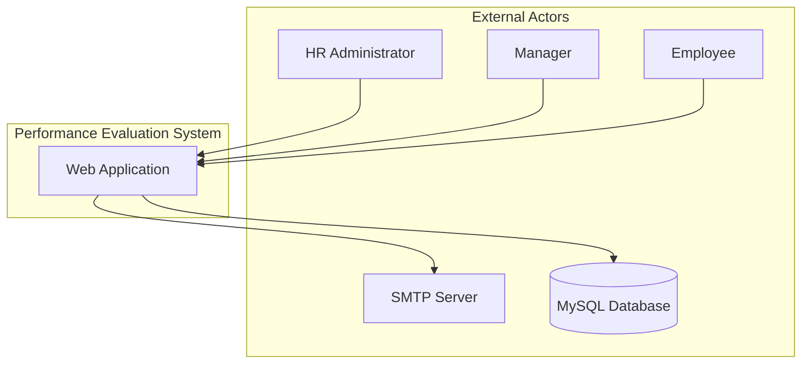
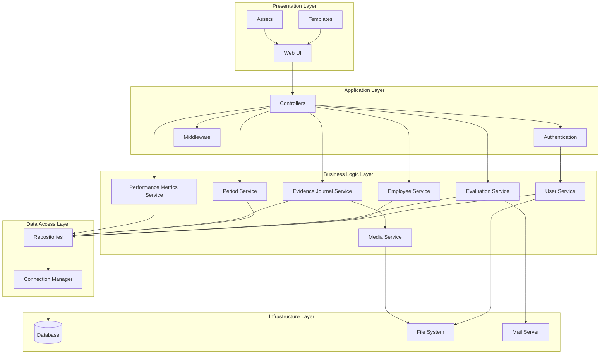
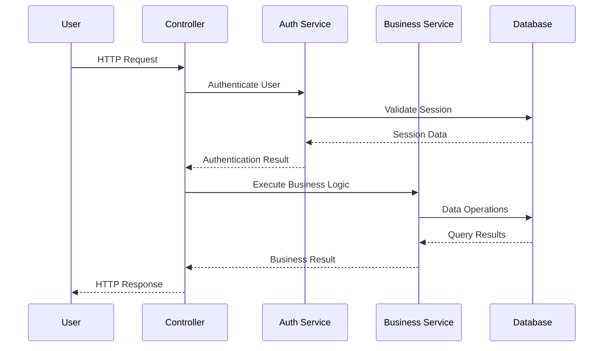
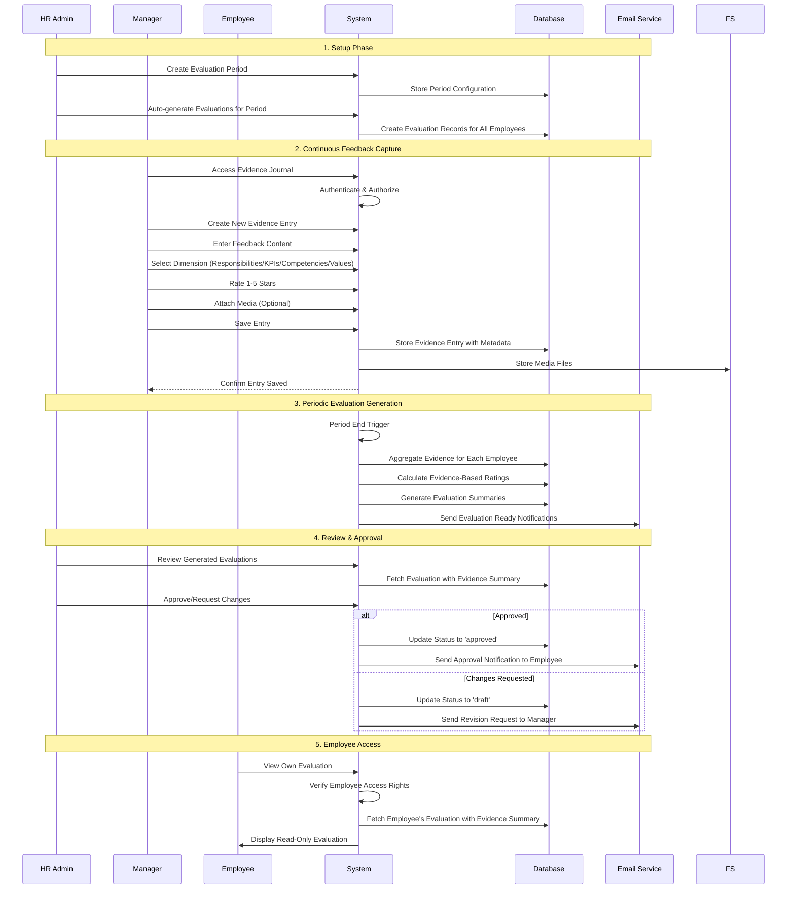
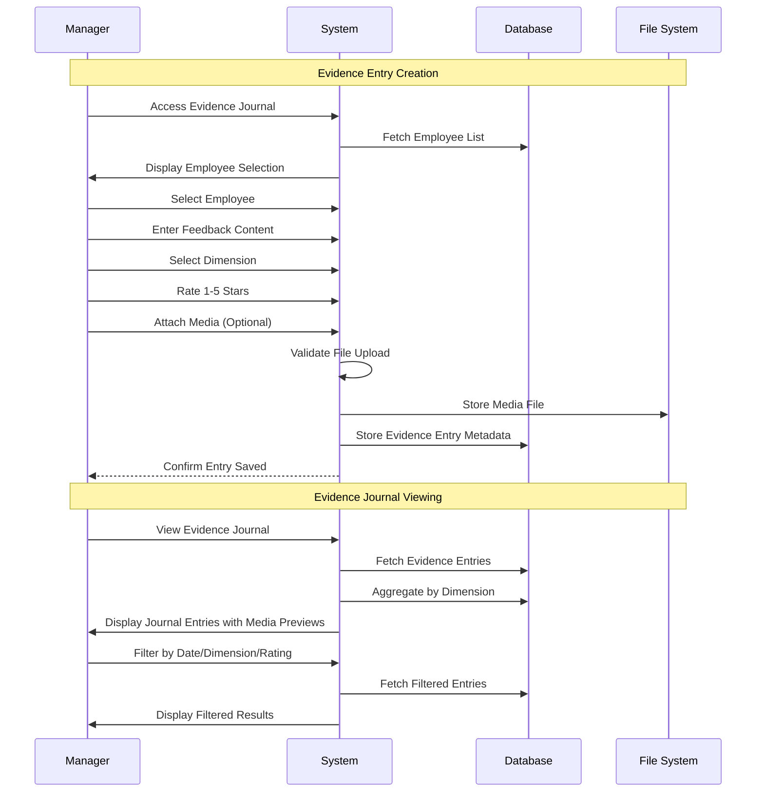
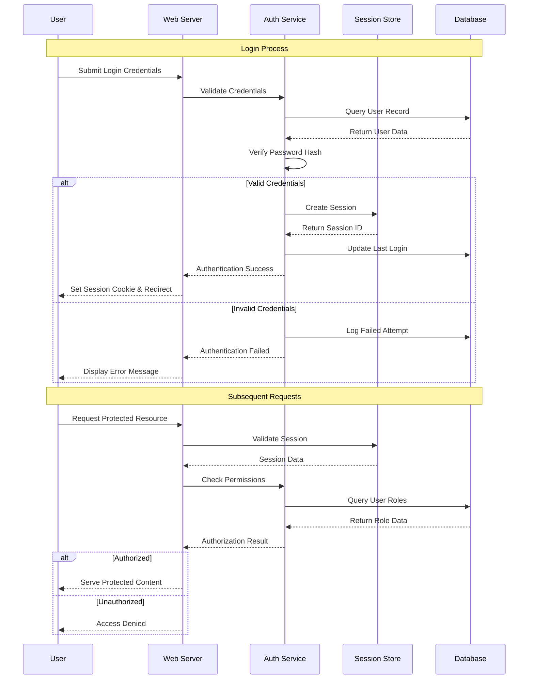
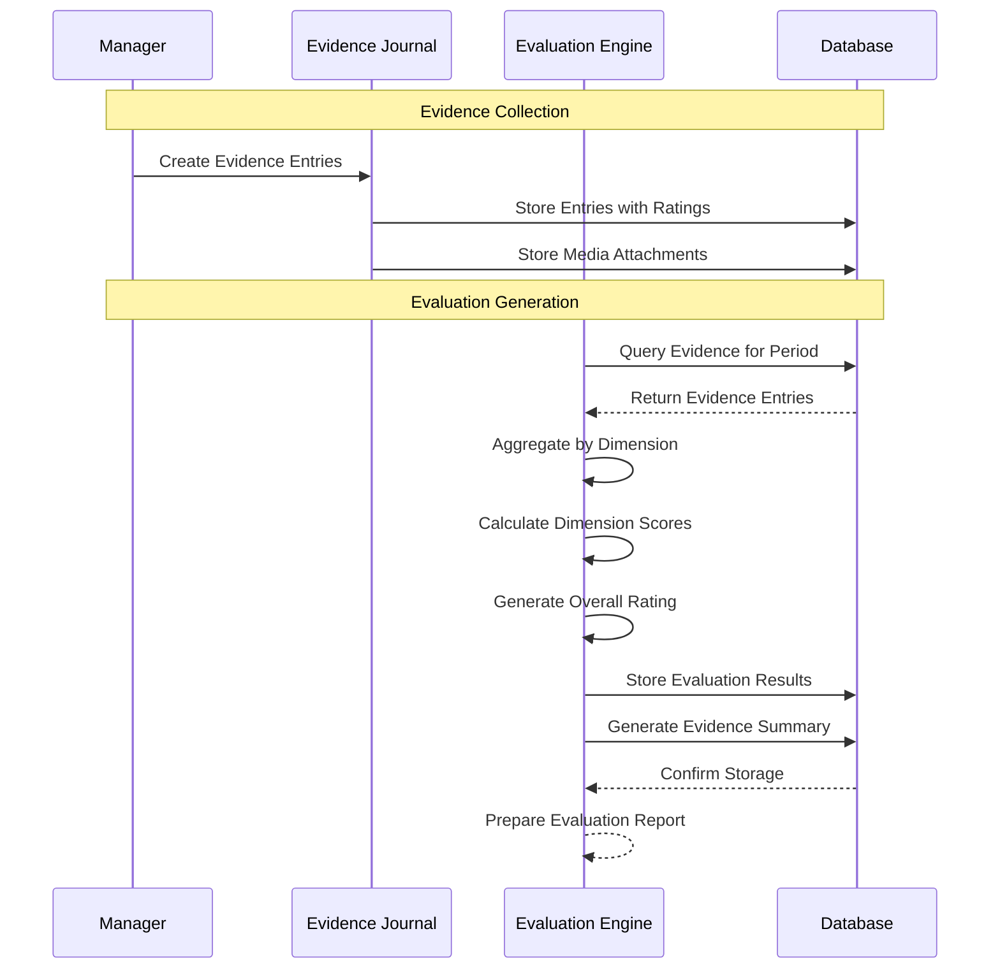
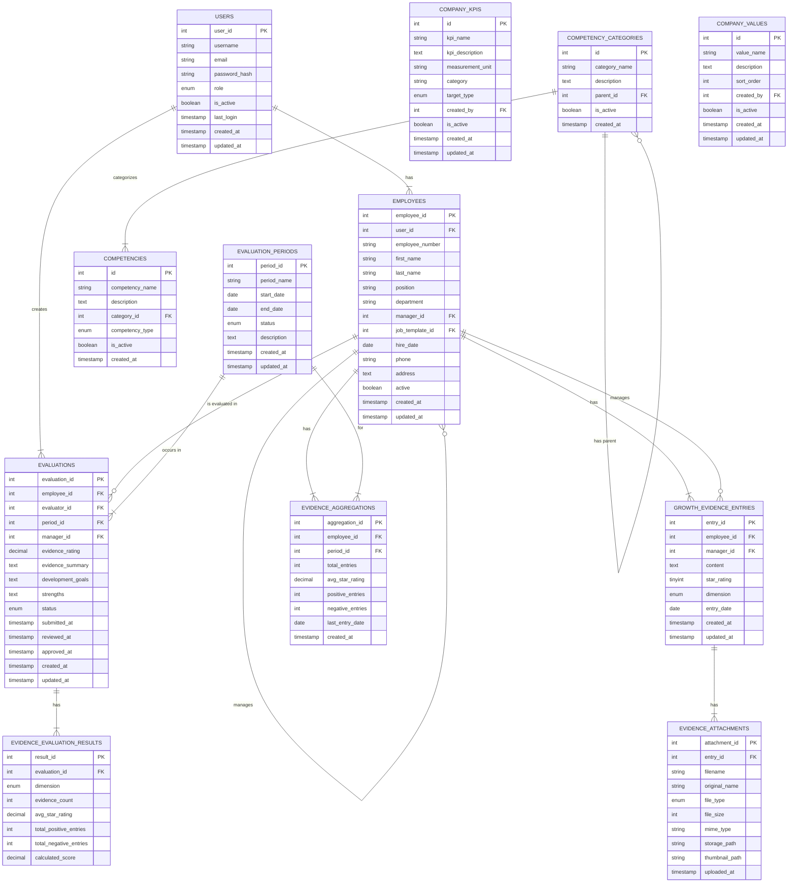

# Performance Evaluation System - Software Architecture Design Document

## Table of Contents
1. [System Architecture Overview](#system-architecture-overview)
2. [Component Inventory](#component-inventory)
3. [Component Relationship Diagrams](#component-relationship-diagrams)
4. [Interface Definitions and API Contracts](#interface-definitions-and-api-contracts)
5. [Data Architecture](#data-architecture)
6. [Deployment Architecture](#deployment-architecture)
7. [Security Architecture](#security-architecture)
8. [Integration Patterns](#integration-patterns)
9. [Performance Requirements](#performance-requirements)
10. [Error Handling and Logging](#error-handling-and-logging)
11. [Monitoring and Observability](#monitoring-and-observability)
12. [Version Control and Change Management](#version-control-and-change-management)
13. [Technical Specifications by Layer](#technical-specifications-by-layer)

---

## System Architecture Overview

### High-Level Design Patterns and Principles

#### Architectural Patterns
- **Model-View-Controller (MVC)** - Separation of concerns between data, presentation, and business logic
- **Repository Pattern** - Data access abstraction layer
- **Factory Pattern** - Object creation and dependency injection
- **Observer Pattern** - Event-driven notifications and logging
- **Strategy Pattern** - Flexible evaluation algorithms and reporting formats

#### Design Principles
- **SOLID Principles**
  - Single Responsibility: Each class has one reason to change
  - Open/Closed: Open for extension, closed for modification
  - Liskov Substitution: Derived classes must be substitutable for base classes
  - Interface Segregation: Many client-specific interfaces
  - Dependency Inversion: Depend on abstractions, not concretions

- **DRY (Don't Repeat Yourself)** - Code reusability through shared components
- **KISS (Keep It Simple, Stupid)** - Simple, maintainable solutions
- **YAGNI (You Aren't Gonna Need It)** - Implement only required features
- **Separation of Concerns** - Clear boundaries between system layers

#### Architectural Style
**Layered Architecture** with the following tiers:
```
┌─────────────────────────────────────┐
│         Presentation Layer          │ ← Web UI, Templates, Assets
├─────────────────────────────────────┤
│         Application Layer           │ ← Controllers, Authentication
├─────────────────────────────────────┤
│         Business Logic Layer        │ ← Domain Classes, Services
├─────────────────────────────────────┤
│         Data Access Layer           │ ← Database Abstraction
├─────────────────────────────────────┤
│         Infrastructure Layer        │ ← Database, File System, External APIs
└─────────────────────────────────────┘
```

---

## Component Inventory

### Core Components

#### 1. Authentication & Authorization Components

**User Management Service**
- **File**: `classes/User.php`
- **Responsibilities**: User authentication, session management, password security
- **Technical Specifications**:
  - PHP 7.4+ with password_hash() for secure password storage
  - Session-based authentication with CSRF protection
  - Role-based access control (RBAC)
  - Failed login attempt tracking and account lockout
- **Dependencies**: Database connection, session management
- **Interfaces**: IUserRepository, IAuthenticationService

**Authentication Middleware**
- **File**: `includes/auth.php`
- **Responsibilities**: Request authentication, authorization checks, session validation
- **Technical Specifications**:
  - Session timeout management (configurable, default 3600s)
  - CSRF token generation and validation
  - Role-based route protection
- **Dependencies**: User service, session storage
- **Interfaces**: IAuthenticationMiddleware

#### 2. Business Logic Components

**Employee Management Service**
- **File**: `classes/Employee.php`
- **Responsibilities**: Employee CRUD operations, organizational hierarchy, team management
- **Technical Specifications**:
  - Hierarchical data management with manager-employee relationships
  - Soft delete functionality for data integrity
  - Search and filtering capabilities
  - Bulk operations support
- **Dependencies**: Database connection, audit logging
- **Interfaces**: IEmployeeRepository, IHierarchyService

**Evidence-Based Evaluation Management Service**
- **File**: `classes/Evaluation.php`
- **Responsibilities**: Evidence-based evaluation lifecycle, scoring algorithms, workflow management
- **Technical Specifications**:
  - Evidence aggregation from continuous feedback journal
  - Star rating system (1-5) for feedback entries
  - Dimension-based evidence classification (responsibilities, KPIs, competencies, values)
  - Status workflow (draft → submitted → reviewed → approved)
  - Integration with traditional evaluation components
- **Dependencies**: Employee service, period service, evidence journal service
- **Interfaces**: IEvaluationRepository, IEvidenceScoringService, IWorkflowService

**Growth Evidence Journal Service**
- **File**: `classes/GrowthEvidenceJournal.php`
- **Responsibilities**: Continuous feedback capture, evidence management, journaling
- **Technical Specifications**:
  - Real-time feedback capture with 1-5 star ratings
  - Dimension classification (responsibilities, KPIs, competencies, values)
  - Rich media support (images, videos, documents)
  - Evidence aggregation and reporting
  - Date-based filtering and search
- **Dependencies**: Database connection, media management service
- **Interfaces**: IEvidenceJournalRepository, IMediaService

**Media Management Service**
- **File**: `classes/MediaManager.php`
- **Responsibilities**: File upload, validation, storage, and retrieval
- **Technical Specifications**:
  - Support for images (jpg, png, gif), videos (mp4, webm), documents (pdf, doc, docx)
  - Automatic thumbnail generation for images
  - File size validation and security checks
  - Secure file storage and access
  - Integration with evidence journal entries
- **Dependencies**: File system, database connection
- **Interfaces**: IMediaRepository, IFileValidationService

**Evaluation Period Management Service**
- **File**: `classes/EvaluationPeriod.php`
- **Responsibilities**: Period lifecycle, scheduling, overlap validation
- **Technical Specifications**:
  - Flexible period types (monthly, quarterly, semi-annual, annual, custom)
  - Overlap detection and validation
  - Automatic period generation
  - Period status management
- **Dependencies**: Database connection, validation service
- **Interfaces**: IPeriodRepository, ISchedulingService

**Performance Metrics Service (KPIs, Competencies, Values)**
- **Files**: `classes/CompanyKPI.php`, `classes/Competency.php`, `classes/CompanyValues.php`
- **Responsibilities**: Management of company-wide performance metrics
- **Technical Specifications**:
  - CRUD operations for KPIs, competencies, and company values
  - Categorization and management of competencies
- **Dependencies**: Database connection
- **Interfaces**: IKPIRepository, ICompetencyRepository, IValueRepository

#### 3. Data Access Components

**Database Connection Manager**
- **File**: `config/database.php`
- **Responsibilities**: Database connection pooling, query execution, transaction management
- **Technical Specifications**:
  - PDO-based MySQL connection with prepared statements
  - Connection pooling and reuse
  - Transaction support with rollback capabilities
  - Query logging and performance monitoring
- **Dependencies**: MySQL 8.0+, PDO extension
- **Interfaces**: IConnectionManager, IQueryExecutor

**Repository Base Class**
- **Responsibilities**: Common CRUD operations, query building, result mapping
- **Technical Specifications**:
  - Generic repository pattern implementation
  - Parameterized query building
  - Result set mapping to domain objects
  - Pagination and sorting support
- **Dependencies**: Database connection manager
- **Interfaces**: IRepository<T>

#### 4. Presentation Components

**Template Engine**
- **Files**: `templates/header.php`, `templates/footer.php`
- **Responsibilities**: HTML rendering, layout management, component reuse
- **Technical Specifications**:
  - PHP-based templating with output buffering
  - Component-based architecture
  - XSS protection through htmlspecialchars()
  - Responsive Bootstrap 5.3 integration
- **Dependencies**: Authentication service, configuration
- **Interfaces**: ITemplateEngine, IViewRenderer

**Asset Management**
- **Files**: `assets/css/style.css`, `assets/js/app.js`
- **Responsibilities**: Static asset serving, optimization, caching
- **Technical Specifications**:
  - CSS custom properties for theming
  - JavaScript ES6+ with backward compatibility
  - Asset minification and compression
  - CDN integration for external libraries
- **Dependencies**: Web server configuration
- **Interfaces**: IAssetManager

#### 5. Configuration Components

**Application Configuration**
- **File**: `config/config.php`
- **Responsibilities**: Environment-specific settings, feature flags, constants
- **Technical Specifications**:
  - Environment-based configuration loading
  - Secure credential management
  - Feature toggle implementation
  - Performance tuning parameters
- **Dependencies**: Environment variables, file system
- **Interfaces**: IConfigurationProvider

**Database Configuration**
- **File**: `config/database.php`
- **Responsibilities**: Database connection parameters, optimization settings
- **Technical Specifications**:
  - Connection string management
  - Pool size configuration
  - Timeout and retry settings
  - SSL/TLS configuration
- **Dependencies**: Database server
- **Interfaces**: IDatabaseConfiguration

### Supporting Components

#### 6. Utility Components

**Validation Service**
- **Responsibilities**: Input validation, business rule enforcement, data sanitization
- **Technical Specifications**:
  - Rule-based validation engine
  - Custom validation rules
  - Internationalization support
  - Error message management
- **Dependencies**: Configuration service
- **Interfaces**: IValidationService

**Logging Service**
- **Responsibilities**: Application logging, audit trails, error tracking
- **Technical Specifications**:
  - PSR-3 compliant logging interface
  - Multiple log levels (DEBUG, INFO, WARN, ERROR, FATAL)
  - Structured logging with JSON format
  - Log rotation and archival
- **Dependencies**: File system, database
- **Interfaces**: ILogger, IAuditLogger

**Notification Service**
- **Responsibilities**: Email notifications, system alerts, user communications
- **Technical Specifications**:
  - SMTP integration with authentication
  - Template-based email composition
  - Queue-based asynchronous processing
  - Delivery tracking and retry logic
- **Dependencies**: SMTP server, template engine
- **Interfaces**: INotificationService, IEmailService

---

## Component Relationship Diagrams

### System Context Diagram


### Component Dependency Diagram


### Data Flow Diagram
```mermaid
graph LR
    subgraph "User Request Flow"
        A[User Request] --> B[Authentication Check]
        B --> C[Authorization Check]
        C --> D[Controller Action]
        D --> E[Business Logic]
        E --> F[Data Access]
        F --> G[Database]
        G --> H[Response Generation]
        H --> I[Template Rendering]
        I --> J[User Response]
    end
    
    subgraph "Evidence-Based Evaluation Process Flow"
        K[Create Evidence Entry] --> L[Manager Captures Feedback]
        L --> M[Classify by Dimension]
        M --> N[Attach Media (Optional)]
        N --> O[Rate 1-5 Stars]
        O --> P[Save Evidence]
        P --> Q[Evidence Stored in Journal]
        Q --> R[Periodic Evaluation Generation]
        R --> S[Aggregate Evidence by Dimension]
        S --> T[Calculate Evidence-Based Rating]
        T --> U[Generate Evaluation Summary]
        U --> V[Review & Approval]
        V --> W[Employee Access to Evaluation]
    end
```

### Communication Patterns


### User Interaction Sequences

#### Complete Evidence-Based Evaluation Workflow Sequence


#### Evidence Journal Management Sequence


#### Authentication & Authorization Flow


#### Evidence-Based Evaluation Data Flow


---

## Interface Definitions and API Contracts

### Authentication Interfaces

```php
interface IAuthenticationService
{
    public function authenticate(string $username, string $password): AuthResult;
    public function validateSession(string $sessionId): bool;
    public function logout(string $sessionId): void;
    public function changePassword(int $userId, string $currentPassword, string $newPassword): bool;
}

interface IAuthorizationService
{
    public function hasPermission(int $userId, string $permission): bool;
    public function getUserRoles(int $userId): array;
    public function checkAccess(int $userId, string $resource, string $action): bool;
}
```

### Business Logic Interfaces

```php
interface IUserRepository
{
    public function findById(int $id): ?User;
    public function findByUsername(string $username): ?User;
    public function create(UserData $userData): int;
    public function update(int $id, UserData $userData): bool;
    public function delete(int $id): bool;
}

interface IEvaluationService
{
    public function createEvaluation(EvaluationData $data): int;
    public function updateEvaluation(int $id, EvaluationData $data): bool;
    public function calculateEvidenceRating(int $evaluationId): float;
    public function submitForReview(int $evaluationId): bool;
    public function approveEvaluation(int $evaluationId): bool;
    public function aggregateEvidence(int $evaluationId, int $employeeId, DateRange $period): bool;
}

interface IEmployeeService
{
    public function getEmployee(int $id): ?Employee;
    public function getTeamMembers(int $managerId): array;
    public function getHierarchy(int $rootId = null): array;
    public function createEmployee(EmployeeData $data): int;
    public function updateEmployee(int $id, EmployeeData $data): bool;
}

interface IEvidenceJournalService
{
    public function createEntry(EvidenceData $data): int;
    public function updateEntry(int $entryId, EvidenceData $data): bool;
    public function getEmployeeJournal(int $employeeId, DateRange $period): array;
    public function getEvidenceByDimension(int $employeeId, DateRange $period): array;
    public function deleteEntry(int $entryId): bool;
}

interface IMediaService
{
    public function uploadFile(UploadedFile $file, int $entryId): MediaFile;
    public function validateFile(UploadedFile $file): ValidationResult;
    public function generateThumbnail(MediaFile $image): string;
    public function getSecureUrl(string $filename): string;
    public function deleteAttachment(int $attachmentId): bool;
}
```

### Data Access Interfaces

```php
interface IRepository
{
    public function find(int $id): ?object;
    public function findAll(array $criteria = [], int $limit = null, int $offset = null): array;
    public function create(array $data): int;
    public function update(int $id, array $data): bool;
    public function delete(int $id): bool;
    public function count(array $criteria = []): int;
}

interface IConnectionManager
{
    public function getConnection(): PDO;
    public function beginTransaction(): void;
    public function commit(): void;
    public function rollback(): void;
    public function executeQuery(string $sql, array $params = []): PDOStatement;
}
```

### API Response Contracts

```php
class ApiResponse
{
    public bool $success;
    public mixed $data;
    public ?string $message;
    public ?array $errors;
    public int $statusCode;
    public array $metadata;
}

class PaginatedResponse extends ApiResponse
{
    public int $total;
    public int $page;
    public int $perPage;
    public int $totalPages;
    public bool $hasNext;
    public bool $hasPrevious;
}
```

---

## Data Architecture

### Database Schema Design

#### Entity Relationship Diagram


### Data Models

#### Core Domain Models

```php
class User
{
    private int $userId;
    private string $username;
    private string $email;
    private string $passwordHash;
    private UserRole $role;
    private bool $isActive;
    private ?DateTime $lastLogin;
    private DateTime $createdAt;
    private DateTime $updatedAt;
    
    // Methods for business logic
    public function authenticate(string $password): bool;
    public function hasPermission(string $permission): bool;
    public function updateLastLogin(): void;
}

class Employee
{
    private int $employeeId;
    private ?int $userId;
    private string $employeeNumber;
    private string $firstName;
    private string $lastName;
    private ?string $position;
    private ?string $department;
    private ?int $managerId;
    private ?DateTime $hireDate;
    private ?string $phone;
    private ?string $address;
    private bool $active;
    
    // Business methods
    public function getFullName(): string;
    public function getManager(): ?Employee;
    public function getDirectReports(): array;
    public function isManagerOf(Employee $employee): bool;
}

class Evaluation
{
    private int $evaluationId;
    private int $employeeId;
    private int $evaluatorId;
    private int $periodId;
    private ?float $evidenceRating;
    private ?string $evidenceSummary;
    private EvaluationStatus $status;
    
    // Business methods
    public function calculateEvidenceRating(): float;
    public function canBeEditedBy(User $user): bool;
    public function submit(): void;
    public function approve(): void;
}

class EvidenceEntry
{
    private int $entryId;
    private int $employeeId;
    private int $managerId;
    private string $content;
    private int $starRating; // 1-5
    private string $dimension; // 'responsibilities', 'kpis', 'competencies', 'values'
    private array $attachments; // images, videos, files
    private DateTime $entryDate;
    private DateTime $createdAt;
    private DateTime $updatedAt;
    
    // Business methods
    public function isPositive(): bool;
    public function getDimensionCategory(): string;
    public function addAttachment(MediaFile $file): void;
}
```

### Storage Strategies

#### Primary Storage
- **Database**: MySQL 8.0+ with InnoDB engine
- **Connection Pooling**: PDO with persistent connections
- **Indexing Strategy**:
  - Primary keys on all tables
  - Foreign key indexes for relationships
  - Composite indexes for common query patterns
  - Full-text indexes for search functionality

#### Media Storage
- **File System**: Secure directory structure for uploaded media
- **Organization**: Year/month folder structure for scalability
- **Naming**: Unique file names to prevent conflicts
- **Thumbnails**: Auto-generated for image previews

#### Caching Strategy
- **Application-level caching**: PHP APCu for configuration and session data
- **Database query caching**: MySQL query cache for repeated queries
- **Static asset caching**: Browser caching with ETags and cache headers

#### Backup and Recovery
- **Daily automated backups** with 30-day retention
- **Point-in-time recovery** capability
- **Backup verification** and restoration testing
- **Disaster recovery plan** with RTO < 4 hours, RPO < 1 hour

---
## Security Architecture

### Authentication Mechanisms

#### Multi-Factor Authentication (Future Enhancement)
```php
interface IMFAService
{
    public function generateTOTP(int $userId): string;
    public function validateTOTP(int $userId, string $token): bool;
    public function generateBackupCodes(int $userId): array;
    public function validateBackupCode(int $userId, string $code): bool;
}
```

#### Session Management
```php
class SecureSessionManager
{
    private const SESSION_TIMEOUT = 3600; // 1 hour
    private const REGENERATE_INTERVAL = 300; // 5 minutes
    
    public function startSession(): void;
    public function regenerateId(): void;
    public function validateSession(): bool;
    public function destroySession(): void;
    public function isExpired(): bool;
}
```

### Authorization Framework

#### Role-Based Access Control (RBAC)
```yaml
Roles:
  hr_admin:
    permissions:
      - user.create
      - user.read
      - user.update
      - user.delete
      - employee.create
      - employee.read
      - employee.update
      - employee.delete
      - evaluation.create
      - evaluation.read
      - evaluation.update
      - evaluation.delete
      - period.create
      - period.read
      - period.update
      - period.delete
      - evidence.create
      - evidence.read
      - evidence.update
      - evidence.delete
      - report.generate
      - system.configure
      
  manager:
    permissions:
      - employee.read (team only)
      - evidence.create (team only)
      - evidence.read (team only)
      - evidence.update (own only)
      - evaluation.read (team only)
      - report.view (team only)
      
  employee:
    permissions:
      - evaluation.read (own only)
      - profile.update (own only)
```

### Data Protection Mechanisms

#### Encryption at Rest
- **Database Encryption**: MySQL Transparent Data Encryption (TDE)
- **File System Encryption**: LUKS for Linux systems
- **Backup Encryption**: AES-256 encryption for backup files
- **Key Management**: Hardware Security Module (HSM) or cloud KMS

#### Encryption in Transit
- **HTTPS/TLS 1.3**: All web traffic encrypted
- **Database Connections**: SSL/TLS for database connections
- **API Communications**: Certificate-based authentication
- **Email**: STARTTLS for SMTP communications

#### Data Sanitization
```php
class DataSanitizer
{
    public function sanitizeInput(mixed $input): mixed;
    public function sanitizeOutput(mixed $output): mixed;
    public function validateEmail(string $email): bool;
    public function validatePassword(string $password): ValidationResult;
    public function escapeHtml(string $html): string;
    public function preventSqlInjection(string $query, array $params): string;
}
```

### Security Headers and Policies

#### HTTP Security Headers
```apache
# Security Headers
Header always set X-Content-Type-Options nosniff
Header always set X-Frame-Options DENY
Header always set X-XSS-Protection "1; mode=block"
Header always set Strict-Transport-Security "max-age=31536000; includeSubDomains"
Header always set Content-Security-Policy "default-src 'self'; script-src 'self' 'unsafe-inline' cdn.jsdelivr.net; style-src 'self' 'unsafe-inline' cdn.jsdelivr.net; img-src 'self' data:; font-src 'self' cdnjs.cloudflare.com"
Header always set Referrer-Policy "strict-origin-when-cross-origin"
Header always set Permissions-Policy "geolocation=(), microphone=(), camera=()"
```

#### Content Security Policy
```javascript
const cspPolicy = {
    'default-src': ["'self'"],
    'script-src': ["'self'", "'unsafe-inline'", "cdn.jsdelivr.net", "cdnjs.cloudflare.com"],
    'style-src': ["'self'", "'unsafe-inline'", "cdn.jsdelivr.net", "cdnjs.cloudflare.com"],
    'img-src': ["'self'", "data:", "*.gravatar.com"],
    'font-src': ["'self'", "cdnjs.cloudflare.com"],
    'connect-src': ["'self'"],
    'frame-ancestors': ["'none'"],
    'base-uri': ["'self'"],
    'form-action': ["'self'"]
};
```

### Vulnerability Management

#### Security Scanning
- **Static Code Analysis**: PHPStan, Psalm for PHP code analysis
- **Dependency Scanning**: Composer audit for vulnerable packages
- **Infrastructure Scanning**: Nessus or OpenVAS for system vulnerabilities
- **Web Application Scanning**: OWASP ZAP for runtime security testing

#### Penetration Testing Schedule
```yaml
Frequency:
  Internal Testing: Quarterly
  External Testing: Bi-annually
  Code Review: Every release
  Dependency Audit: Monthly

Scope:
  - Authentication and authorization
  - Input validation and sanitization
  - Session management
  - Database security
  - Infrastructure hardening
  - Social engineering resistance
```

---

## Integration Patterns

### External System Dependencies

#### Email Integration
```php
interface IEmailService
{
    public function sendEmail(EmailMessage $message): bool;
    public function sendBulkEmail(array $messages): BulkEmailResult;
    public function getDeliveryStatus(string $messageId): DeliveryStatus;
}

class SMTPEmailService implements IEmailService
{
    private string $host;
    private int $port;
    private string $username;
    private string $password;
    private bool $encryption;
    
    public function configure(SMTPConfig $config): void;
    public function testConnection(): bool;
}
```

#### LDAP/Active Directory Integration (Future)
```php
interface IDirectoryService
{
    public function authenticate(string $username, string $password): bool;
    public function getUserInfo(string $username): DirectoryUser;
    public function getGroupMembership(string $username): array;
    public function syncUsers(): SyncResult;
}

class LDAPDirectoryService implements IDirectoryService
{
    private string $server;
    private string $baseDn;
    private string $bindDn;
    private string $bindPassword;
    
    public function connect(): bool;
    public function search(string $filter, array $attributes = []): array;
}
```

#### Single Sign-On (SSO) Integration (Future)
```php
interface ISSOProvider
{
    public function initiateLogin(string $returnUrl): string;
    public function handleCallback(array $samlResponse): SSOResult;
    public function logout(string $sessionId): void;
}

class SAMLSSOProvider implements ISSOProvider
{
    private string $entityId;
    private string $ssoUrl;
    private string $sloUrl;
    private string $certificate;
    
    public function validateAssertion(string $assertion): bool;
    public function extractUserAttributes(string $assertion): array;
}
```

### API Integration Patterns

#### RESTful API Design
```php
abstract class BaseApiController
{
    protected function jsonResponse(mixed $data, int $statusCode = 200): JsonResponse;
    protected function errorResponse(string $message, int $statusCode = 400): JsonResponse;
    protected function validateRequest(array $rules): ValidationResult;
    protected function paginate(array $data, int $page, int $perPage): PaginatedResponse;
}

class EvaluationApiController extends BaseApiController
{
    public function index(Request $request): JsonResponse
    {
        // Get evaluations with filtering and pagination
        $filters = $request->getQueryParams();
        $page = $filters['page'] ?? 1;
        $limit = $filters['limit'] ?? 20;
        
        $evaluationService = new Evaluation();
        $result = $evaluationService->getEvaluations($page, $limit, $filters);
        
        return $this->jsonResponse($result);
    }
    
    public function create(Request $request): JsonResponse
    {
        $data = $request->getParsedBody();
        
        try {
            $evaluationService = new Evaluation();
            $evaluationId = $evaluationService->createEvaluation($data);
            
            return $this->jsonResponse([
                'evaluation_id' => $evaluationId,
                'message' => 'Evaluation created successfully'
            ], 201);
        } catch (Exception $e) {
            return $this->errorResponse($e->getMessage(), 400);
        }
    }
    
    public function getEvidenceSummary(int $evaluationId): JsonResponse
    {
        try {
            $evaluationService = new Evaluation();
            $evaluation = $evaluationService->getEvidenceEvaluation($evaluationId);
            
            if (!$evaluation) {
                return $this->errorResponse('Evaluation not found', 404);
            }
            
            return $this->jsonResponse([
                'evaluation_id' => $evaluationId,
                'evidence_summary' => $evaluation['evidence_summary_text'],
                'evidence_results' => $evaluation['evidence_results']
            ]);
        } catch (Exception $e) {
            return $this->errorResponse($e->getMessage(), 500);
        }
    }
}
```

#### Evidence Journal API
```php
class EvidenceJournalApiController extends BaseApiController
{
    public function createEntry(Request $request): JsonResponse
    {
        $data = $request->getParsedBody();
        
        try {
            $journalService = new GrowthEvidenceJournal();
            $entryId = $journalService->createEntry($data);
            
            return $this->jsonResponse([
                'entry_id' => $entryId,
                'message' => 'Evidence entry created successfully'
            ], 201);
        } catch (Exception $e) {
            return $this->errorResponse($e->getMessage(), 400);
        }
    }
    
    public function uploadMedia(int $entryId): JsonResponse
    {
        $files = $request->getUploadedFiles();
        
        if (empty($files['media'])) {
            return $this->errorResponse('No media file provided', 400);
        }
        
        try {
            $mediaService = new MediaManager();
            $result = $mediaService->uploadFile($files['media'], $entryId);
            
            return $this->jsonResponse([
                'attachment_id' => $result['attachment_id'],
                'message' => 'Media uploaded successfully'
            ]);
        } catch (Exception $e) {
            return $this->errorResponse($e->getMessage(), 400);
        }
    }
    
    public function getEmployeeJournal(int $employeeId, Request $request): JsonResponse
    {
        $filters = $request->getQueryParams();
        $startDate = $filters['start_date'] ?? null;
        $endDate = $filters['end_date'] ?? null;
        
        try {
            $journalService = new GrowthEvidenceJournal();
            $entries = $journalService->getEmployeeJournal($employeeId, $startDate, $endDate, $filters);
            
            return $this->jsonResponse($entries);
        } catch (Exception $e) {
            return $this->errorResponse($e->getMessage(), 500);
        }
    }
}
```

### Event-Driven Architecture

#### System Events
```php
interface IEvent
{
    public function getName(): string;
    public function getData(): array;
    public function getTimestamp(): DateTime;
}

class EvidenceEntryCreatedEvent implements IEvent
{
    private int $entryId;
    private int $employeeId;
    private int $managerId;
    private string $dimension;
    private int $starRating;
    private DateTime $timestamp;
    
    public function __construct(int $entryId, int $employeeId, int $managerId, string $dimension, int $starRating)
    {
        $this->entryId = $entryId;
        $this->employeeId = $employeeId;
        $this->managerId = $managerId;
        $this->dimension = $dimension;
        $this->starRating = $starRating;
        $this->timestamp = new DateTime();
    }
    
    public function getName(): string
    {
        return 'evidence.entry.created';
    }
    
    public function getData(): array
    {
        return [
            'entry_id' => $this->entryId,
            'employee_id' => $this->employeeId,
            'manager_id' => $this->managerId,
            'dimension' => $this->dimension,
            'star_rating' => $this->starRating
        ];
    }
    
    public function getTimestamp(): DateTime
    {
        return $this->timestamp;
    }
}

interface IEventDispatcher
{
    public function dispatch(IEvent $event): void;
    public function addListener(string $eventName, callable $listener): void;
}

class EventDispatcher implements IEventDispatcher
{
    private array $listeners = [];
    
    public function addListener(string $eventName, callable $listener): void
    {
        if (!isset($this->listeners[$eventName])) {
            $this->listeners[$eventName] = [];
        }
        
        $this->listeners[$eventName][] = $listener;
    }
    
    public function dispatch(IEvent $event): void
    {
        $eventName = $event->getName();
        
        if (isset($this->listeners[$eventName])) {
            foreach ($this->listeners[$eventName] as $listener) {
                $listener($event);
            }
        }
    }
}
```

#### Event Listeners
```php
class EvidenceNotificationListener
{
    private INotificationService $notificationService;
    
    public function __construct(INotificationService $notificationService)
    {
        $this->notificationService = $notificationService;
    }
    
    public function handleEvidenceEntryCreated(EvidenceEntryCreatedEvent $event): void
    {
        // Send notification to employee when positive evidence is recorded
        if ($event->getData()['star_rating'] >= 4) {
            $this->notificationService->sendEmail([
                'to' => $this->getEmployeeEmail($event->getData()['employee_id']),
                'subject' => 'Great Work Recognized!',
                'body' => "Your manager has recorded positive feedback about your work. Keep up the great job!"
            ]);
        }
    }
    
    private function getEmployeeEmail(int $employeeId): string
    {
        // Implementation to get employee email
    }
}

class EvidenceAggregationListener
{
    private EvidenceAggregationService $aggregationService;
    
    public function __construct(EvidenceAggregationService $aggregationService)
    {
        $this->aggregationService = $aggregationService;
    }
    
    public function handleEvidenceEntryCreated(EvidenceEntryCreatedEvent $event): void
    {
        // Update real-time evidence aggregations
        $this->aggregationService->updateEmployeeAggregation(
            $event->getData()['employee_id'],
            $event->getData()['dimension']
        );
    }
}
```

### Microservices Integration (Future)

#### Service Registry
```php
interface IServiceRegistry
{
    public function registerService(string $name, string $endpoint, array $metadata = []): void;
    public function getService(string $name): ?ServiceInfo;
    public function getHealthyServices(): array;
}

class ServiceRegistry implements IServiceRegistry
{
    private array $services = [];
    private IHealthCheckService $healthCheckService;
    
    public function registerService(string $name, string $endpoint, array $metadata = []): void
    {
        $this->services[$name] = [
            'endpoint' => $endpoint,
            'metadata' => $metadata,
            'registered_at' => new DateTime()
        ];
    }
    
    public function getService(string $name): ?ServiceInfo
    {
        if (!isset($this->services[$name])) {
            return null;
        }
        
        $service = $this->services[$name];
        $isHealthy = $this->healthCheckService->checkService($service['endpoint']);
        
        return new ServiceInfo(
            $name,
            $service['endpoint'],
            $isHealthy,
            $service['metadata']
        );
    }
}
```

#### API Gateway
```php
class ApiGateway
{
    private IServiceRegistry $serviceRegistry;
    private IRateLimiter $rateLimiter;
    private IAuthenticationService $authService;
    
    public function routeRequest(Request $request): Response
    {
        // Authentication
        if (!$this->authService->validateRequest($request)) {
            return new Response(401, ['error' => 'Unauthorized']);
        }
        
        // Rate limiting
        if (!$this->rateLimiter->allowRequest($request)) {
            return new Response(429, ['error' => 'Rate limit exceeded']);
        }
        
        // Service discovery
        $service = $this->serviceRegistry->getService($request->getServiceName());
        if (!$service || !$service->isHealthy()) {
            return new Response(503, ['error' => 'Service unavailable']);
        }
        
        // Route to service
        return $this->forwardRequest($request, $service->getEndpoint());
    }
}
```

---

## Performance Requirements

### Response Time Targets
- **API Endpoints**: < 200ms for 95% of requests
- **Page Load Times**: < 1 second for 95% of page views
- **Database Queries**: < 50ms for 95% of queries
- **File Uploads**: < 5 seconds for files under 10MB

### Scalability Requirements
- **Concurrent Users**: Support 1,000+ concurrent users
- **Data Volume**: Handle 100,000+ employees with 1,000,000+ evidence entries
- **Storage Growth**: 10GB+ media storage with automatic cleanup policies

### Caching Strategy
```php
interface ICacheService
{
    public function get(string $key): mixed;
    public function set(string $key, mixed $value, int $ttl = 3600): bool;
    public function delete(string $key): bool;
    public function flush(): bool;
}

class RedisCacheService implements ICacheService
{
    private Redis $redis;
    private int $defaultTtl;
    
    public function __construct(string $host, int $port, int $defaultTtl = 3600)
    {
        $this->redis = new Redis();
        $this->redis->connect($host, $port);
        $this->defaultTtl = $defaultTtl;
    }
    
    public function get(string $key): mixed
    {
        $value = $this->redis->get($key);
        return $value ? json_decode($value, true) : null;
    }
    
    public function set(string $key, mixed $value, int $ttl = null): bool
    {
        $ttl = $ttl ?? $this->defaultTtl;
        return $this->redis->setex($key, $ttl, json_encode($value));
    }
    
    public function delete(string $key): bool
    {
        return $this->redis->del($key) > 0;
    }
    
    public function flush(): bool
    {
        return $this->redis->flushDB();
    }
}
```

### Database Optimization
```sql
-- Indexes for performance
CREATE INDEX idx_evidence_employee_period ON growth_evidence_entries(employee_id, entry_date);
CREATE INDEX idx_evidence_dimension ON growth_evidence_entries(dimension);
CREATE INDEX idx_evaluations_period_status ON evaluations(period_id, status);
CREATE INDEX idx_employees_manager ON employees(manager_id);

-- Partitioning for large datasets (future)
ALTER TABLE growth_evidence_entries PARTITION BY RANGE (YEAR(entry_date)) (
    PARTITION p2024 VALUES LESS THAN (2025),
    PARTITION p2025 VALUES LESS THAN (2026),
    PARTITION p2026 VALUES LESS THAN (2027),
    PARTITION p_future VALUES LESS THAN MAXVALUE
);
```

---

## Error Handling and Logging

### Error Classification
```php
enum ErrorCode: int
{
    case VALIDATION_ERROR = 1001;
    case AUTHENTICATION_ERROR = 1002;
    case AUTHORIZATION_ERROR = 1003;
    case NOT_FOUND_ERROR = 1004;
    case DATABASE_ERROR = 1005;
    case FILE_UPLOAD_ERROR = 1006;
    case BUSINESS_LOGIC_ERROR = 1007;
    case EXTERNAL_SERVICE_ERROR = 1008;
    case SYSTEM_ERROR = 1009;
}

class ApplicationError extends Exception
{
    private ErrorCode $errorCode;
    private array $context;
    
    public function __construct(
        string $message, 
        ErrorCode $errorCode, 
        array $context = [], 
        int $code = 0, 
        ?Throwable $previous = null
    ) {
        parent::__construct($message, $code, $previous);
        $this->errorCode = $errorCode;
        $this->context = $context;
    }
    
    public function getErrorCode(): ErrorCode
    {
        return $this->errorCode;
    }
    
    public function getContext(): array
    {
        return $this->context;
    }
}
```

### Logging Framework
```php
interface ILogger
{
    public function debug(string $message, array $context = []): void;
    public function info(string $message, array $context = []): void;
    public function warning(string $message, array $context = []): void;
    public function error(string $message, array $context = []): void;
    public function critical(string $message, array $context = []): void;
}

class Logger implements ILogger
{
    private string $logFile;
    private LogLevel $minLevel;
    
    public function __construct(string $logFile, LogLevel $minLevel = LogLevel::DEBUG)
    {
        $this->logFile = $logFile;
        $this->minLevel = $minLevel;
    }
    
    public function debug(string $message, array $context = []): void
    {
        $this->log(LogLevel::DEBUG, $message, $context);
    }
    
    public function info(string $message, array $context = []): void
    {
        $this->log(LogLevel::INFO, $message, $context);
    }
    
    public function warning(string $message, array $context = []): void
    {
        $this->log(LogLevel::WARNING, $message, $context);
    }
    
    public function error(string $message, array $context = []): void
    {
        $this->log(LogLevel::ERROR, $message, $context);
    }
    
    public function critical(string $message, array $context = []): void
    {
        $this->log(LogLevel::CRITICAL, $message, $context);
    }
    
    private function log(LogLevel $level, string $message, array $context = []): void
    {
        if ($level < $this->minLevel) {
            return;
        }
        
        $logEntry = [
            'timestamp' => date('c'),
            'level' => $level->name,
            'message' => $message,
            'context' => $context,
            'user_id' => $_SESSION['user_id'] ?? null,
            'request_id' => $_SERVER['HTTP_X_REQUEST_ID'] ?? null
        ];
        
        file_put_contents(
            $this->logFile, 
            json_encode($logEntry) . PHP_EOL, 
            FILE_APPEND | LOCK_EX
        );
    }
}
```

### Audit Trail
```php
class AuditLogger
{
    private ILogger $logger;
    
    public function __construct(ILogger $logger)
    {
        $this->logger = $logger;
    }
    
    public function logActivity(
        ?int $userId, 
        string $action, 
        string $resourceType, 
        int $resourceId, 
        ?array $beforeData, 
        ?array $afterData
    ): void {
        $this->logger->info("User activity recorded", [
            'user_id' => $userId,
            'action' => $action,
            'resource_type' => $resourceType,
            'resource_id' => $resourceId,
            'before_data' => $beforeData,
            'after_data' => $afterData,
            'ip_address' => $_SERVER['REMOTE_ADDR'] ?? null,
            'user_agent' => $_SERVER['HTTP_USER_AGENT'] ?? null
        ]);
    }
}
```

---

## Monitoring and Observability

### Health Check Endpoints
```php
class HealthCheckController
{
    private DatabaseConnection $db;
    private CacheService $cache;
    private Filesystem $filesystem;
    
    public function health(): JsonResponse
    {
        $checks = [
            'database' => $this->checkDatabase(),
            'cache' => $this->checkCache(),
            'filesystem' => $this->checkFilesystem(),
            'application' => $this->checkApplication()
        ];
        
        $healthy = array_reduce($checks, function($carry, $check) {
            return $carry && $check['status'] === 'healthy';
        }, true);
        
        return new JsonResponse([
            'status' => $healthy ? 'healthy' : 'degraded',
            'checks' => $checks,
            'timestamp' => date('c')
        ], $healthy ? 200 : 503);
    }
    
    private function checkDatabase(): array
    {
        try {
            $this->db->ping();
            return ['status' => 'healthy', 'message' => 'Database connection successful'];
        } catch (Exception $e) {
            return ['status' => 'unhealthy', 'message' => 'Database connection failed: ' . $e->getMessage()];
        }
    }
    
    private function checkCache(): array
    {
        try {
            $this->cache->set('health_check', 'ok', 1);
            $result = $this->cache->get('health_check');
            return $result === 'ok' 
                ? ['status' => 'healthy', 'message' => 'Cache service operational']
                : ['status' => 'degraded', 'message' => 'Cache service not responding correctly'];
        } catch (Exception $e) {
            return ['status' => 'unhealthy', 'message' => 'Cache service failed: ' . $e->getMessage()];
        }
    }
    
    private function checkFilesystem(): array
    {
        $testFile = sys_get_temp_dir() . '/health_check_' . uniqid();
        
        try {
            file_put_contents($testFile, 'test');
            $result = file_get_contents($testFile);
            unlink($testFile);
            
            return $result === 'test'
                ? ['status' => 'healthy', 'message' => 'Filesystem accessible']
                : ['status' => 'degraded', 'message' => 'Filesystem read/write test failed'];
        } catch (Exception $e) {
            return ['status' => 'unhealthy', 'message' => 'Filesystem access failed: ' . $e->getMessage()];
        }
    }
    
    private function checkApplication(): array
    {
        // Check application-specific dependencies
        return ['status' => 'healthy', 'message' => 'Application components loaded'];
    }
}
```

### Metrics Collection
```php
interface IMetricsCollector
{
    public function increment(string $metric, array $labels = []): void;
    public function gauge(string $metric, float $value, array $labels = []): void;
    public function timing(string $metric, float $duration, array $labels = []): void;
    public function histogram(string $metric, float $value, array $buckets, array $labels = []): void;
}

class MetricsCollector implements IMetricsCollector
{
    private array $counters = [];
    private array $gauges = [];
    private array $timings = [];
    
    public function increment(string $metric, array $labels = []): void
    {
        $key = $this->getKey($metric, $labels);
        $this->counters[$key] = ($this->counters[$key] ?? 0) + 1;
    }
    
    public function gauge(string $metric, float $value, array $labels = []): void
    {
        $key = $this->getKey($metric, $labels);
        $this->gauges[$key] = $value;
    }
    
    public function timing(string $metric, float $duration, array $labels = []): void
    {
        $key = $this->getKey($metric, $labels);
        if (!isset($this->timings[$key])) {
            $this->timings[$key] = [];
        }
        $this->timings[$key][] = $duration;
    }
    
    public function histogram(string $metric, float $value, array $buckets, array $labels = []): void
    {
        // Implementation for histogram metrics
    }
    
    private function getKey(string $metric, array $labels): string
    {
        ksort($labels);
        $labelString = http_build_query($labels);
        return $metric . '{' . $labelString . '}';
    }
    
    public function getMetrics(): array
    {
        return [
            'counters' => $this->counters,
            'gauges' => $this->gauges,
            'timings' => $this->timings
        ];
    }
}
```

### Performance Monitoring
```php
class PerformanceMonitor
{
    private IMetricsCollector $metrics;
    private Stopwatch $stopwatch;
    
    public function __construct(IMetricsCollector $metrics)
    {
        $this->metrics = $metrics;
        $this->stopwatch = new Stopwatch();
    }
    
    public function start(string $operation): void
    {
        $this->stopwatch->start($operation);
    }
    
    public function stop(string $operation): void
    {
        $event = $this->stopwatch->stop($operation);
        $this->metrics->timing('operation_duration_seconds', $event->getDuration() / 1000, [
            'operation' => $operation
        ]);
    }
    
    public function recordDatabaseQuery(string $query, float $duration): void
    {
        $this->metrics->timing('database_query_duration_seconds', $duration, [
            'query_type' => $this->getQueryType($query)
        ]);
    }
    
    private function getQueryType(string $query): string
    {
        $query = trim($query);
        $words = explode(' ', $query, 2);
        return strtolower($words[0]); // SELECT, INSERT, UPDATE, DELETE
    }
}
```

---

## Version Control and Change Management

### Database Migration Strategy
```php
interface IMigration
{
    public function up(): void;
    public function down(): void;
    public function getVersion(): string;
    public function getDescription(): string;
}

class MigrationManager
{
    private PDO $pdo;
    private string $migrationTable = 'schema_migrations';
    
    public function __construct(PDO $pdo)
    {
        $this->pdo = $pdo;
        $this->ensureMigrationTableExists();
    }
    
    public function runMigration(IMigration $migration): void
    {
        $version = $migration->getVersion();
        
        if ($this->hasMigrationRun($version)) {
            throw new Exception("Migration $version has already been run");
        }
        
        try {
            $this->pdo->beginTransaction();
            $migration->up();
            $this->recordMigration($version);
            $this->pdo->commit();
        } catch (Exception $e) {
            $this->pdo->rollBack();
            throw $e;
        }
    }
    
    public function rollbackMigration(IMigration $migration): void
    {
        $version = $migration->getVersion();
        
        if (!$this->hasMigrationRun($version)) {
            throw new Exception("Migration $version has not been run");
        }
        
        try {
            $this->pdo->beginTransaction();
            $migration->down();
            $this->removeMigration($version);
            $this->pdo->commit();
        } catch (Exception $e) {
            $this->pdo->rollBack();
            throw $e;
        }
    }
    
    private function hasMigrationRun(string $version): bool
    {
        $stmt = $this->pdo->prepare("SELECT COUNT(*) FROM $this->migrationTable WHERE version = ?");
        $stmt->execute([$version]);
        return $stmt->fetchColumn() > 0;
    }
    
    private function recordMigration(string $version): void
    {
        $stmt = $this->pdo->prepare("INSERT INTO $this->migrationTable (version, run_at) VALUES (?, NOW())");
        $stmt->execute([$version]);
    }
    
    private function removeMigration(string $version): void
    {
        $stmt = $this->pdo->prepare("DELETE FROM $this->migrationTable WHERE version = ?");
        $stmt->execute([$version]);
    }
    
    private function ensureMigrationTableExists(): void
    {
        $this->pdo->exec("
            CREATE TABLE IF NOT EXISTS $this->migrationTable (
                version VARCHAR(255) PRIMARY KEY,
                run_at TIMESTAMP DEFAULT CURRENT_TIMESTAMP
            )
        ");
    }
}
```

### Configuration Management
```php
class Configuration
{
    private array $config;
    private string $environment;
    
    public function __construct(string $environment = 'production')
    {
        $this->environment = $environment;
        $this->loadConfiguration();
    }
    
    private function loadConfiguration(): void
    {
        $configFiles = [
            __DIR__ . "/config/base.php",
            __DIR__ . "/config/{$this->environment}.php"
        ];
        
        $this->config = [];
        foreach ($configFiles as $file) {
            if (file_exists($file)) {
                $this->config = array_merge($this->config, require $file);
            }
        }
        
        // Override with environment variables
        $this->config = $this->overrideWithEnvironment($this->config);
    }
    
    private function overrideWithEnvironment(array $config): array
    {
        $envOverrides = [
            'DATABASE_URL' => 'database.url',
            'CACHE_DRIVER' => 'cache.driver',
            'LOG_LEVEL' => 'logging.level',
            'APP_DEBUG' => 'app.debug'
        ];
        
        foreach ($envOverrides as $envVar => $configKey) {
            $value = getenv($envVar);
            if ($value !== false) {
                $this->setNestedValue($config, $configKey, $value);
            }
        }
        
        return $config;
    }
    
    public function get(string $key, $default = null)
    {
        return $this->getNestedValue($this->config, $key, $default);
    }
    
    public function set(string $key, $value): void
    {
        $this->setNestedValue($this->config, $key, $value);
    }
    
    private function getNestedValue(array $array, string $key, $default = null)
    {
        $keys = explode('.', $key);
        $current = $array;
        
        foreach ($keys as $k) {
            if (!isset($current[$k])) {
                return $default;
            }
            $current = $current[$k];
        }
        
        return $current;
    }
    
    private function setNestedValue(array &$array, string $key, $value): void
    {
        $keys = explode('.', $key);
        $lastKey = array_pop($keys);
        $current = &$array;
        
        foreach ($keys as $k) {
            if (!isset($current[$k])) {
                $current[$k] = [];
            }
            $current = &$current[$k];
        }
        
        $current[$lastKey] = $value;
    }
}
```

### Deployment Process
```yaml
# Deployment Pipeline
stages:
  - test
  - build
  - deploy
  - verify

test:
  stage: test
  script:
    - composer install --no-interaction
    - vendor/bin/phpunit tests/
    - vendor/bin/phpstan analyse src/
    - vendor/bin/psalm

build:
  stage: build
  script:
    - composer install --no-dev --optimize-autoloader
    - npm run build
  artifacts:
    paths:
      - vendor/
      - public/assets/

deploy:
  stage: deploy
  script:
    - rsync -av --delete ./ user@server:/var/www/app/
    - ssh user@server "cd /var/www/app && php bin/console cache:clear"
    - ssh user@server "cd /var/www/app && php bin/console database:migrate"
  only:
    - master

verify:
  stage: verify
  script:
    - curl -f https://app.example.com/health
    - curl -f https://app.example.com/api/version
```

---

## Technical Specifications by Layer

### Presentation Layer

#### Web UI Framework
- **Technology**: HTML5, CSS3, JavaScript (ES6+)
- **Framework**: Bootstrap 5.3 for responsive design
- **Components**: Custom web components for reusable UI elements
- **Accessibility**: WCAG 2.1 AA compliance

#### Template Engine
```php
class TemplateEngine
{
    private string $templateDir;
    private array $globals = [];
    
    public function __construct(string $templateDir)
    {
        $this->templateDir = $templateDir;
    }
    
    public function render(string $template, array $data = []): string
    {
        $templatePath = $this->templateDir . '/' . $template . '.php';
        
        if (!file_exists($templatePath)) {
            throw new Exception("Template not found: $template");
        }
        
        // Merge global data with template data
        $data = array_merge($this->globals, $data);
        
        // Extract data for use in template
        extract($data);
        
        // Start output buffering
        ob_start();
        
        // Include template
        include $templatePath;
        
        // Get output and clean buffer
        $output = ob_get_clean();
        
        return $output;
    }
    
    public function setGlobal(string $key, $value): void
    {
        $this->globals[$key] = $value;
    }
}
```

#### Asset Management
```php
class AssetManager
{
    private string $assetDir;
    private string $baseUrl;
    private array $manifest = [];
    
    public function __construct(string $assetDir, string $baseUrl)
    {
        $this->assetDir = $assetDir;
        $this->baseUrl = rtrim($baseUrl, '/');
        $this->loadManifest();
    }
    
    private function loadManifest(): void
    {
        $manifestPath = $this->assetDir . '/manifest.json';
        if (file_exists($manifestPath)) {
            $this->manifest = json_decode(file_get_contents($manifestPath), true);
        }
    }
    
    public function css(string $filename): string
    {
        $path = $this->manifest[$filename] ?? $filename;
        return '<link rel="stylesheet" href="' . $this->baseUrl . '/' . $path . '">';
    }
    
    public function js(string $filename): string
    {
        $path = $this->manifest[$filename] ?? $filename;
        return '<script src="' . $this->baseUrl . '/' . $path . '"></script>';
    }
    
    public function asset(string $filename): string
    {
        $path = $this->manifest[$filename] ?? $filename;
        return $this->baseUrl . '/' . $path;
    }
}
```

### Application Layer

#### Routing System
```php
class Router
{
    private array $routes = [];
    
    public function addRoute(string $method, string $pattern, callable $handler): void
    {
        $this->routes[] = [
            'method' => strtoupper($method),
            'pattern' => $pattern,
            'handler' => $handler,
            'compiled' => $this->compileRoutePattern($pattern)
        ];
    }
    
    public function dispatch(string $method, string $path): void
    {
        foreach ($this->routes as $route) {
            if ($route['method'] === $method || $route['method'] === 'ANY') {
                if (preg_match($route['compiled'], $path, $matches)) {
                    // Remove full match
                    array_shift($matches);
                    
                    // Call handler with matches as parameters
                    call_user_func_array($route['handler'], $matches);
                    return;
                }
            }
        }
        
        // No route found
        http_response_code(404);
        echo "404 Not Found";
    }
    
    private function compileRoutePattern(string $pattern): string
    {
        // Convert route pattern to regex
        $pattern = preg_quote($pattern, '/');
        $pattern = preg_replace('/\\\{([^\/]+)\\\}/', '([^\/]+)', $pattern);
        return '/^' . $pattern . '$/';
    }
}
```

#### Middleware System
```php
interface MiddlewareInterface
{
    public function handle(Request $request, callable $next): Response;
}

class MiddlewareStack
{
    private array $middlewares = [];
    
    public function add(MiddlewareInterface $middleware): void
    {
        $this->middlewares[] = $middleware;
    }
    
    public function process(Request $request, callable $handler): Response
    {
        $next = function($request) use ($handler) {
            return call_user_func($handler, $request);
        };
        
        // Build middleware chain in reverse order
        for ($i = count($this->middlewares) - 1; $i >= 0; $i--) {
            $middleware = $this->middlewares[$i];
            $next = function($request) use ($middleware, $next) {
                return $middleware->handle($request, $next);
            };
        }
        
        return $next($request);
    }
}

class AuthenticationMiddleware implements MiddlewareInterface
{
    private AuthenticationService $authService;
    
    public function __construct(AuthenticationService $authService)
    {
        $this->authService = $authService;
    }
    
    public function handle(Request $request, callable $next): Response
    {
        if (!$this->authService->validateRequest($request)) {
            return new Response(401, ['error' => 'Authentication required']);
        }
        
        return $next($request);
    }
}

class LoggingMiddleware implements MiddlewareInterface
{
    private Logger $logger;
    
    public function __construct(Logger $logger)
    {
        $this->logger = $logger;
    }
    
    public function handle(Request $request, callable $next): Response
    {
        $startTime = microtime(true);
        
        try {
            $response = $next($request);
            
            $duration = (microtime(true) - $startTime) * 1000;
            $this->logger->info("Request processed", [
                'method' => $request->getMethod(),
                'path' => $request->getPath(),
                'status' => $response->getStatusCode(),
                'duration_ms' => round($duration, 2)
            ]);
            
            return $response;
        } catch (Exception $e) {
            $duration = (microtime(true) - $startTime) * 1000;
            $this->logger->error("Request failed", [
                'method' => $request->getMethod(),
                'path' => $request->getPath(),
                'error' => $e->getMessage(),
                'duration_ms' => round($duration, 2)
            ]);
            
            throw $e;
        }
    }
}
```

### Business Logic Layer

#### Domain Services
```php
class EvidenceAggregationService
{
    private DatabaseConnection $db;
    
    public function updateEmployeeAggregation(int $employeeId, string $dimension): void
    {
        $sql = "INSERT INTO evidence_aggregations 
                (employee_id, period_id, total_entries, avg_star_rating, positive_entries, negative_entries, last_entry_date)
                VALUES (?, ?, 1, ?, 
                    CASE WHEN ? >= 4 THEN 1 ELSE 0 END,
                    CASE WHEN ? <= 2 THEN 1 ELSE 0 END,
                    CURDATE())
                ON DUPLICATE KEY UPDATE
                    total_entries = total_entries + 1,
                    avg_star_rating = ((avg_star_rating * (total_entries - 1)) + ?) / total_entries,
                    positive_entries = positive_entries + CASE WHEN ? >= 4 THEN 1 ELSE 0 END,
                    negative_entries = negative_entries + CASE WHEN ? <= 2 THEN 1 ELSE 0 END,
                    last_entry_date = CURDATE()";
        
        $this->db->execute($sql, [
            $employeeId,
            $this->getCurrentPeriodId(),
            $starRating,
            $starRating,
            $starRating,
            $starRating,
            $starRating,
            $starRating
        ]);
    }
    
    private function getCurrentPeriodId(): int
    {
        // Implementation to get current period ID
    }
}
```
