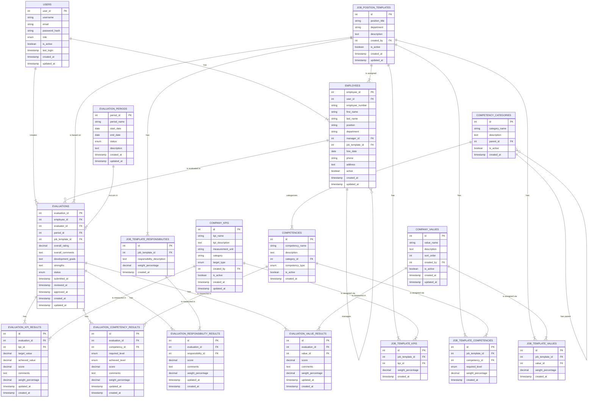

# Performance Evaluation System - Software Architecture Design Document

## Table of Contents
1. [System Architecture Overview](#system-architecture-overview)
2. [Component Inventory](#component-inventory)
3. [Component Relationship Diagrams](#component-relationship-diagrams)
4. [Interface Definitions and API Contracts](#interface-definitions-and-api-contracts)
5. [Data Architecture](#data-architecture)
6. [Deployment Architecture](#deployment-architecture)
7. [Security Architecture](#security-architecture)
8. [Integration Patterns](#integration-patterns)
9. [Performance Requirements](#performance-requirements)
10. [Error Handling and Logging](#error-handling-and-logging)
11. [Monitoring and Observability](#monitoring-and-observability)
12. [Version Control and Change Management](#version-control-and-change-management)
13. [Technical Specifications by Layer](#technical-specifications-by-layer)

---

## System Architecture Overview

### High-Level Design Patterns and Principles

#### Architectural Patterns
- **Model-View-Controller (MVC)** - Separation of concerns between data, presentation, and business logic
- **Repository Pattern** - Data access abstraction layer
- **Factory Pattern** - Object creation and dependency injection
- **Observer Pattern** - Event-driven notifications and logging
- **Strategy Pattern** - Flexible evaluation algorithms and reporting formats

#### Design Principles
- **SOLID Principles**
  - Single Responsibility: Each class has one reason to change
  - Open/Closed: Open for extension, closed for modification
  - Liskov Substitution: Derived classes must be substitutable for base classes
  - Interface Segregation: Many client-specific interfaces
  - Dependency Inversion: Depend on abstractions, not concretions

- **DRY (Don't Repeat Yourself)** - Code reusability through shared components
- **KISS (Keep It Simple, Stupid)** - Simple, maintainable solutions
- **YAGNI (You Aren't Gonna Need It)** - Implement only required features
- **Separation of Concerns** - Clear boundaries between system layers

#### Architectural Style
**Layered Architecture** with the following tiers:
```
┌─────────────────────────────────────┐
│         Presentation Layer          │ ← Web UI, Templates, Assets
├─────────────────────────────────────┤
│         Application Layer           │ ← Controllers, Authentication
├─────────────────────────────────────┤
│         Business Logic Layer        │ ← Domain Classes, Services
├─────────────────────────────────────┤
│         Data Access Layer           │ ← Database Abstraction
├─────────────────────────────────────┤
│         Infrastructure Layer        │ ← Database, File System, External APIs
└─────────────────────────────────────┘
```

---

## Component Inventory

### Core Components

#### 1. Authentication & Authorization Components

**User Management Service**
- **File**: `classes/User.php`
- **Responsibilities**: User authentication, session management, password security
- **Technical Specifications**:
  - PHP 7.4+ with password_hash() for secure password storage
  - Session-based authentication with CSRF protection
  - Role-based access control (RBAC)
  - Failed login attempt tracking and account lockout
- **Dependencies**: Database connection, session management
- **Interfaces**: IUserRepository, IAuthenticationService

**Authentication Middleware**
- **File**: `includes/auth.php`
- **Responsibilities**: Request authentication, authorization checks, session validation
- **Technical Specifications**:
  - Session timeout management (configurable, default 3600s)
  - CSRF token generation and validation
  - Role-based route protection
- **Dependencies**: User service, session storage
- **Interfaces**: IAuthenticationMiddleware

#### 2. Business Logic Components

**Employee Management Service**
- **File**: `classes/Employee.php`
- **Responsibilities**: Employee CRUD operations, organizational hierarchy, team management
- **Technical Specifications**:
  - Hierarchical data management with manager-employee relationships
  - Soft delete functionality for data integrity
  - Search and filtering capabilities
  - Bulk operations support
- **Dependencies**: Database connection, audit logging
- **Interfaces**: IEmployeeRepository, IHierarchyService

**Evaluation Management Service**
- **File**: `classes/Evaluation.php`
- **Responsibilities**: Evaluation lifecycle, scoring algorithms, workflow management
- **Technical Specifications**:
  - JSON-based flexible evaluation data storage
  - Weighted scoring calculation (Expected Results: 40%, Skills: 25%, Responsibilities: 25%, Values: 10%)
  - Status workflow (draft → submitted → reviewed → approved)
  - Comment and feedback management
- **Dependencies**: Employee service, period service, notification service
- **Interfaces**: IEvaluationRepository, IScoringService, IWorkflowService

**Evaluation Period Management Service**
- **File**: `classes/EvaluationPeriod.php`
- **Responsibilities**: Period lifecycle, scheduling, overlap validation
- **Technical Specifications**:
  - Flexible period types (monthly, quarterly, semi-annual, annual, custom)
  - Overlap detection and validation
  - Automatic period generation
  - Period status management
- **Dependencies**: Database connection, validation service
- **Interfaces**: IPeriodRepository, ISchedulingService

**Job Template Management Service**
- **File**: `classes/JobTemplate.php`
- **Responsibilities**: Job template CRUD operations, assignment of KPIs, competencies, and values
- **Technical Specifications**:
  - Management of job templates with associated responsibilities, KPIs, competencies, and values
  - Weighting and scoring configuration for each template component
- **Dependencies**: Database connection, KPI service, Competency service, Value service
- **Interfaces**: IJobTemplateRepository

**Performance Metrics Service (KPIs, Competencies, Values)**
- **Files**: `classes/CompanyKPI.php`, `classes/Competency.php`, `classes/CompanyValues.php`
- **Responsibilities**: Management of company-wide performance metrics
- **Technical Specifications**:
  - CRUD operations for KPIs, competencies, and company values
  - Categorization and management of competencies
- **Dependencies**: Database connection
- **Interfaces**: IKPIRepository, ICompetencyRepository, IValueRepository

#### 3. Data Access Components

**Database Connection Manager**
- **File**: `config/database.php`
- **Responsibilities**: Database connection pooling, query execution, transaction management
- **Technical Specifications**:
  - PDO-based MySQL connection with prepared statements
  - Connection pooling and reuse
  - Transaction support with rollback capabilities
  - Query logging and performance monitoring
- **Dependencies**: MySQL 8.0+, PDO extension
- **Interfaces**: IConnectionManager, IQueryExecutor

**Repository Base Class**
- **Responsibilities**: Common CRUD operations, query building, result mapping
- **Technical Specifications**:
  - Generic repository pattern implementation
  - Parameterized query building
  - Result set mapping to domain objects
  - Pagination and sorting support
- **Dependencies**: Database connection manager
- **Interfaces**: IRepository<T>

#### 4. Presentation Components

**Template Engine**
- **Files**: `templates/header.php`, `templates/footer.php`
- **Responsibilities**: HTML rendering, layout management, component reuse
- **Technical Specifications**:
  - PHP-based templating with output buffering
  - Component-based architecture
  - XSS protection through htmlspecialchars()
  - Responsive Bootstrap 5.3 integration
- **Dependencies**: Authentication service, configuration
- **Interfaces**: ITemplateEngine, IViewRenderer

**Asset Management**
- **Files**: `assets/css/style.css`, `assets/js/app.js`
- **Responsibilities**: Static asset serving, optimization, caching
- **Technical Specifications**:
  - CSS custom properties for theming
  - JavaScript ES6+ with backward compatibility
  - Asset minification and compression
  - CDN integration for external libraries
- **Dependencies**: Web server configuration
- **Interfaces**: IAssetManager

#### 5. Configuration Components

**Application Configuration**
- **File**: `config/config.php`
- **Responsibilities**: Environment-specific settings, feature flags, constants
- **Technical Specifications**:
  - Environment-based configuration loading
  - Secure credential management
  - Feature toggle implementation
  - Performance tuning parameters
- **Dependencies**: Environment variables, file system
- **Interfaces**: IConfigurationProvider

**Database Configuration**
- **File**: `config/database.php`
- **Responsibilities**: Database connection parameters, optimization settings
- **Technical Specifications**:
  - Connection string management
  - Pool size configuration
  - Timeout and retry settings
  - SSL/TLS configuration
- **Dependencies**: Database server
- **Interfaces**: IDatabaseConfiguration

### Supporting Components

#### 6. Utility Components

**Validation Service**
- **Responsibilities**: Input validation, business rule enforcement, data sanitization
- **Technical Specifications**:
  - Rule-based validation engine
  - Custom validation rules
  - Internationalization support
  - Error message management
- **Dependencies**: Configuration service
- **Interfaces**: IValidationService

**Logging Service**
- **Responsibilities**: Application logging, audit trails, error tracking
- **Technical Specifications**:
  - PSR-3 compliant logging interface
  - Multiple log levels (DEBUG, INFO, WARN, ERROR, FATAL)
  - Structured logging with JSON format
  - Log rotation and archival
- **Dependencies**: File system, database
- **Interfaces**: ILogger, IAuditLogger

**Notification Service**
- **Responsibilities**: Email notifications, system alerts, user communications
- **Technical Specifications**:
  - SMTP integration with authentication
  - Template-based email composition
  - Queue-based asynchronous processing
  - Delivery tracking and retry logic
- **Dependencies**: SMTP server, template engine
- **Interfaces**: INotificationService, IEmailService

---

## Component Relationship Diagrams

### System Context Diagram


### Component Dependency Diagram


### Data Flow Diagram


### Communication Patterns


### User Interaction Sequences

#### Complete Evaluation Workflow Sequence


#### Job Template Management Sequence


#### Authentication & Authorization Flow


#### Evaluation Data Flow with Weighted Scoring


---

## Interface Definitions and API Contracts

### Authentication Interfaces

```php
interface IAuthenticationService
{
    public function authenticate(string $username, string $password): AuthResult;
    public function validateSession(string $sessionId): bool;
    public function logout(string $sessionId): void;
    public function changePassword(int $userId, string $currentPassword, string $newPassword): bool;
}

interface IAuthorizationService
{
    public function hasPermission(int $userId, string $permission): bool;
    public function getUserRoles(int $userId): array;
    public function checkAccess(int $userId, string $resource, string $action): bool;
}
```

### Business Logic Interfaces

```php
interface IUserRepository
{
    public function findById(int $id): ?User;
    public function findByUsername(string $username): ?User;
    public function create(UserData $userData): int;
    public function update(int $id, UserData $userData): bool;
    public function delete(int $id): bool;
}

interface IEvaluationService
{
    public function createEvaluation(EvaluationData $data): int;
    public function updateEvaluation(int $id, EvaluationData $data): bool;
    public function calculateScore(EvaluationData $data): float;
    public function submitForReview(int $evaluationId): bool;
    public function approveEvaluation(int $evaluationId): bool;
}

interface IEmployeeService
{
    public function getEmployee(int $id): ?Employee;
    public function getTeamMembers(int $managerId): array;
    public function getHierarchy(int $rootId = null): array;
    public function createEmployee(EmployeeData $data): int;
    public function updateEmployee(int $id, EmployeeData $data): bool;
}

interface IJobTemplateService
{
    public function getTemplate(int $id): ?JobTemplate;
    public function createTemplate(JobTemplateData $data): int;
    public function updateTemplate(int $id, JobTemplateData $data): bool;
    public function assignKpi(int $templateId, int $kpiId, float $weight): bool;
    public function assignCompetency(int $templateId, int $competencyId, string $level, float $weight): bool;
}
```

### Data Access Interfaces

```php
interface IRepository
{
    public function find(int $id): ?object;
    public function findAll(array $criteria = [], int $limit = null, int $offset = null): array;
    public function create(array $data): int;
    public function update(int $id, array $data): bool;
    public function delete(int $id): bool;
    public function count(array $criteria = []): int;
}

interface IConnectionManager
{
    public function getConnection(): PDO;
    public function beginTransaction(): void;
    public function commit(): void;
    public function rollback(): void;
    public function executeQuery(string $sql, array $params = []): PDOStatement;
}
```

### API Response Contracts

```php
class ApiResponse
{
    public bool $success;
    public mixed $data;
    public ?string $message;
    public ?array $errors;
    public int $statusCode;
    public array $metadata;
}

class PaginatedResponse extends ApiResponse
{
    public int $total;
    public int $page;
    public int $perPage;
    public int $totalPages;
    public bool $hasNext;
    public bool $hasPrevious;
}
```

---

## Data Architecture

### Database Schema Design

#### Entity Relationship Diagram


### Data Models

#### Core Domain Models

```php
class User
{
    private int $userId;
    private string $username;
    private string $email;
    private string $passwordHash;
    private UserRole $role;
    private bool $isActive;
    private ?DateTime $lastLogin;
    private DateTime $createdAt;
    private DateTime $updatedAt;
    
    // Methods for business logic
    public function authenticate(string $password): bool;
    public function hasPermission(string $permission): bool;
    public function updateLastLogin(): void;
}

class Employee
{
    private int $employeeId;
    private ?int $userId;
    private string $employeeNumber;
    private string $firstName;
    private string $lastName;
    private ?string $position;
    private ?string $department;
    private ?int $managerId;
    private ?DateTime $hireDate;
    private ?string $phone;
    private ?string $address;
    private bool $active;
    
    // Business methods
    public function getFullName(): string;
    public function getManager(): ?Employee;
    public function getDirectReports(): array;
    public function isManagerOf(Employee $employee): bool;
}

class Evaluation
{
    private int $evaluationId;
    private int $employeeId;
    private int $evaluatorId;
    private int $periodId;
    private EvaluationData $expectedResults;
    private EvaluationData $skillsCompetencies;
    private EvaluationData $keyResponsibilities;
    private EvaluationData $livingValues;
    private ?float $overallRating;
    private EvaluationStatus $status;
    
    // Business methods
    public function calculateOverallRating(): float;
    public function canBeEditedBy(User $user): bool;
    public function submit(): void;
    public function approve(): void;
}
```

### Storage Strategies

#### Primary Storage
- **Database**: MySQL 8.0+ with InnoDB engine
- **Connection Pooling**: PDO with persistent connections
- **Indexing Strategy**:
  - Primary keys on all tables
  - Foreign key indexes for relationships
  - Composite indexes for common query patterns
  - Full-text indexes for search functionality

#### Caching Strategy
- **Application-level caching**: PHP APCu for configuration and session data
- **Database query caching**: MySQL query cache for repeated queries
- **Static asset caching**: Browser caching with ETags and cache headers

#### Backup and Recovery
- **Daily automated backups** with 30-day retention
- **Point-in-time recovery** capability
- **Backup verification** and restoration testing
- **Disaster recovery plan** with RTO < 4 hours, RPO < 1 hour

---
## Security Architecture

### Authentication Mechanisms

#### Multi-Factor Authentication (Future Enhancement)
```php
interface IMFAService
{
    public function generateTOTP(int $userId): string;
    public function validateTOTP(int $userId, string $token): bool;
    public function generateBackupCodes(int $userId): array;
    public function validateBackupCode(int $userId, string $code): bool;
}
```

#### Session Management
```php
class SecureSessionManager
{
    private const SESSION_TIMEOUT = 3600; // 1 hour
    private const REGENERATE_INTERVAL = 300; // 5 minutes
    
    public function startSession(): void;
    public function regenerateId(): void;
    public function validateSession(): bool;
    public function destroySession(): void;
    public function isExpired(): bool;
}
```

### Authorization Framework

#### Role-Based Access Control (RBAC)
```yaml
Roles:
  hr_admin:
    permissions:
      - user.create
      - user.read
      - user.update
      - user.delete
      - employee.create
      - employee.read
      - employee.update
      - employee.delete
      - evaluation.create
      - evaluation.read
      - evaluation.update
      - evaluation.delete
      - period.create
      - period.read
      - period.update
      - period.delete
      - report.generate
      - system.configure
      
  manager:
    permissions:
      - employee.read (team only)
      - evaluation.create (team only)
      - evaluation.read (team only)
      - evaluation.update (own only)
      - report.view (team only)
      
  employee:
    permissions:
      - evaluation.read (own only)
      - profile.update (own only)
```

### Data Protection Mechanisms

#### Encryption at Rest
- **Database Encryption**: MySQL Transparent Data Encryption (TDE)
- **File System Encryption**: LUKS for Linux systems
- **Backup Encryption**: AES-256 encryption for backup files
- **Key Management**: Hardware Security Module (HSM) or cloud KMS

#### Encryption in Transit
- **HTTPS/TLS 1.3**: All web traffic encrypted
- **Database Connections**: SSL/TLS for database connections
- **API Communications**: Certificate-based authentication
- **Email**: STARTTLS for SMTP communications

#### Data Sanitization
```php
class DataSanitizer
{
    public function sanitizeInput(mixed $input): mixed;
    public function sanitizeOutput(mixed $output): mixed;
    public function validateEmail(string $email): bool;
    public function validatePassword(string $password): ValidationResult;
    public function escapeHtml(string $html): string;
    public function preventSqlInjection(string $query, array $params): string;
}
```

### Security Headers and Policies

#### HTTP Security Headers
```apache
# Security Headers
Header always set X-Content-Type-Options nosniff
Header always set X-Frame-Options DENY
Header always set X-XSS-Protection "1; mode=block"
Header always set Strict-Transport-Security "max-age=31536000; includeSubDomains"
Header always set Content-Security-Policy "default-src 'self'; script-src 'self' 'unsafe-inline' cdn.jsdelivr.net; style-src 'self' 'unsafe-inline' cdn.jsdelivr.net; img-src 'self' data:; font-src 'self' cdnjs.cloudflare.com"
Header always set Referrer-Policy "strict-origin-when-cross-origin"
Header always set Permissions-Policy "geolocation=(), microphone=(), camera=()"
```

#### Content Security Policy
```javascript
const cspPolicy = {
    'default-src': ["'self'"],
    'script-src': ["'self'", "'unsafe-inline'", "cdn.jsdelivr.net", "cdnjs.cloudflare.com"],
    'style-src': ["'self'", "'unsafe-inline'", "cdn.jsdelivr.net", "cdnjs.cloudflare.com"],
    'img-src': ["'self'", "data:", "*.gravatar.com"],
    'font-src': ["'self'", "cdnjs.cloudflare.com"],
    'connect-src': ["'self'"],
    'frame-ancestors': ["'none'"],
    'base-uri': ["'self'"],
    'form-action': ["'self'"]
};
```

### Vulnerability Management

#### Security Scanning
- **Static Code Analysis**: PHPStan, Psalm for PHP code analysis
- **Dependency Scanning**: Composer audit for vulnerable packages
- **Infrastructure Scanning**: Nessus or OpenVAS for system vulnerabilities
- **Web Application Scanning**: OWASP ZAP for runtime security testing

#### Penetration Testing Schedule
```yaml
Frequency:
  Internal Testing: Quarterly
  External Testing: Bi-annually
  Code Review: Every release
  Dependency Audit: Monthly

Scope:
  - Authentication and authorization
  - Input validation and sanitization
  - Session management
  - Database security
  - Infrastructure hardening
  - Social engineering resistance
```

---

## Integration Patterns

### External System Dependencies

#### Email Integration
```php
interface IEmailService
{
    public function sendEmail(EmailMessage $message): bool;
    public function sendBulkEmail(array $messages): BulkEmailResult;
    public function getDeliveryStatus(string $messageId): DeliveryStatus;
}

class SMTPEmailService implements IEmailService
{
    private string $host;
    private int $port;
    private string $username;
    private string $password;
    private bool $encryption;
    
    public function configure(SMTPConfig $config): void;
    public function testConnection(): bool;
}
```

#### LDAP/Active Directory Integration (Future)
```php
interface IDirectoryService
{
    public function authenticate(string $username, string $password): bool;
    public function getUserInfo(string $username): DirectoryUser;
    public function getGroupMembership(string $username): array;
    public function syncUsers(): SyncResult;
}

class LDAPDirectoryService implements IDirectoryService
{
    private string $server;
    private string $baseDn;
    private string $bindDn;
    private string $bindPassword;
    
    public function connect(): bool;
    public function search(string $filter, array $attributes = []): array;
}
```

#### Single Sign-On (SSO) Integration (Future)
```php
interface ISSOProvider
{
    public function initiateLogin(string $returnUrl): string;
    public function handleCallback(array $samlResponse): SSOResult;
    public function logout(string $sessionId): void;
}

class SAMLSSOProvider implements ISSOProvider
{
    private string $entityId;
    private string $ssoUrl;
    private string $sloUrl;
    private string $certificate;
    
    public function validateAssertion(string $assertion): bool;
    public function extractUserAttributes(string $assertion): array;
}
```

### API Integration Patterns

#### RESTful API Design
```php
abstract class BaseApiController
{
    protected function jsonResponse(mixed $data, int $statusCode = 200): JsonResponse;
    protected function errorResponse(string $message, int $statusCode = 400): JsonResponse;
    protected function validateRequest(array $rules): ValidationResult;
    protected function paginate(array $data, int $page, int $perPage): PaginatedResponse;
}

class EvaluationApiController extends BaseApiController
{
    public function index(Request $request
