# Plan de Integración: Job Template en Dashboard con Autofeedback

## 📋 Resumen Ejecutivo

Este documento describe el plan de arquitectura para integrar la visualización completa del job template en el dashboard de usuario y habilitar la funcionalidad de autofeedback para todos los usuarios.

**Fecha**: 2025-11-08  
**Versión**: 1.0  
**Estado**: Planificación

---

## 🎯 Objetivos

1. **Visualización del Job Template**: Mostrar todas las secciones del job template (KPIs, Responsabilidades, Skills Técnicas, Skills Blandas, Valores) en el dashboard del usuario de forma colapsable
2. **Autofeedback Universal**: Permitir que todos los usuarios (employee, manager, hr_admin) puedan darse feedback a sí mismos
3. **Claridad Visual**: Hacer evidente cuando un feedback es AUTOFEEDBACK vs feedback de manager
4. **UI/UX Mejorada**: Mantener el dashboard limpio y navegable con un acordeón expandible/colapsable

---

## 🏗️ Arquitectura General

### Componentes Afectados

```
📁 Sistema de Performance Evaluation
├── 📄 public/dashboard.php (MODIFICAR)
├── 📄 public/employees/give-feedback.php (MODIFICAR)
├── 📄 public/api/job-template.php (MODIFICAR)
├── 📄 includes/components/dashboard-job-template.php (CREAR)
├── 📄 public/assets/css/dashboard-job-template.css (CREAR)
├── 📄 public/assets/js/dashboard-job-template.js (CREAR)
└── 📄 classes/JobTemplate.php (verificar métodos existentes)
```

### Diagrama de Flujo de Datos

```mermaid
graph TD
    A[Usuario accede a Dashboard] --> B{¿Tiene Job Template?}
    B -->|Sí| C[Cargar datos del template]
    B -->|No| D[Mostrar mensaje: Pendiente de asignar]
    C --> E[Renderizar acordeón colapsado]
    E --> F{Usuario expande acordeón?}
    F -->|Sí| G[Mostrar todas las secciones del template]
    F -->|No| H[Mantener colapsado]
    G --> I[Usuario ve botón Autofeedback]
    I --> J{Click en Autofeedback?}
    J -->|Sí| K[Redirigir a give-feedback.php con flag de autofeedback]
    K --> L[Mostrar interfaz con banner AUTOFEEDBACK]
    L --> M[Guardar feedback en BD con manager_id = employee_id]
```



---

## 📦 Especificación de Componentes

### 1. Componente de Visualización: `dashboard-job-template.php`

**Ubicación**: `includes/components/dashboard-job-template.php`

**Propósito**: Renderizar el job template completo en modo solo lectura dentro de un acordeón Bootstrap colapsable.

**Parámetros de entrada**:
```php
/**
 * @param array $jobTemplateData - Datos del template con todas las secciones
 * @param int $employeeId - ID del empleado para el botón de autofeedback
 * @param bool $isExpanded - Estado inicial del acordeón (default: false)
 * @return string - HTML renderizado
 */
function renderDashboardJobTemplate($jobTemplateData, $employeeId, $isExpanded = false)
```

**Estructura del HTML**:
```html
<div class="card mb-4">
  <div class="card-header" id="jobTemplateHeader">
    <div class="d-flex justify-content-between align-items-center">
      <h5 class="mb-0">
        <button class="btn btn-link" type="button" data-bs-toggle="collapse">
          📋 Mi Ficha de Puesto - [Position Title]
        </button>
      </h5>
      <div>
        <span class="badge">4 Secciones</span>
        <button class="btn btn-sm btn-success" onclick="goToSelfFeedback()">
          ⭐ Dar Autofeedback
        </button>
      </div>
    </div>
  </div>
  
  <div id="jobTemplateCollapse" class="collapse" [show]>
    <div class="card-body">
      <!-- Sección 1: KPIs -->
      <div class="template-section">
        <h6>📊 Desired Results (KPIs)</h6>
        [Tabla de KPIs en modo lectura]
      </div>
      
      <!-- Sección 2: Responsabilidades -->
      <div class="template-section">
        <h6>📝 Key Responsibilities</h6>
        [Lista de responsabilidades]
      </div>
      
      <!-- Sección 3: Skills (Technical + Soft) -->
      <div class="template-section">
        <h6>🧩 Skills & Competencies</h6>
        [Tabs o subsecciones para Technical/Soft Skills]
      </div>
      
      <!-- Sección 4: Company Values -->
      <div class="template-section">
        <h6>💎 Company Values</h6>
        [Grid de valores]
      </div>
    </div>
  </div>
</div>
```

**Características**:
- Modo solo lectura: No se pueden editar, añadir o borrar elementos
- Mismo formato visual que [`job_templates.php?edit=1`](public/admin/job_templates.php:1)
- Colapsable/expandible mediante Bootstrap collapse
- Íconos y badges para mejor visualización
- Responsive design

---

### 2. Modificación del Dashboard: `dashboard.php`

**Cambios requeridos**:

1. **Agregar require del nuevo componente** (línea ~13):
```php
require_once __DIR__ . '/../includes/components/dashboard-job-template.php';
```

2. **Modificar la sección del Job Template Hero** (línea ~176-314):
   - Reemplazar la card actual por el nuevo componente acordeón
   - El botón "View Full Template" se integra en el acordeón
   - Mantener los stats cards del template
   - Añadir el botón de "Dar Autofeedback" prominente

3. **Nueva estructura propuesta**:
```php
<!-- Job Template Accordion Section -->
<div class="row mb-4">
    <div class="col-12">
        <?php if ($jobTemplateAssignment['has_template']): ?>
            <?php echo renderDashboardJobTemplate(
                $jobTemplateAssignment['details'], 
                $jobTemplateAssignment['employee']['employee_id'],
                false // collapsed by default
            ); ?>
        <?php else: ?>
            <!-- Mensaje de "Pendiente de asignar" -->
            <div class="card">
                <div class="card-body text-center py-4">
                    <i class="fas fa-briefcase fa-3x text-muted mb-3"></i>
                    <h5 class="text-muted">Sin Ficha de Puesto Asignada</h5>
                    <p>Contacta con HR para que te asignen tu job template.</p>
                </div>
            </div>
        <?php endif; ?>
    </div>
</div>
```

---

### 3. Modificación de Give Feedback: `give-feedback.php`

**Cambios requeridos**:

1. **Eliminar restricción de roles** (líneas ~16-19):
```php
// ANTERIOR:
if (!in_array($_SESSION['user_role'], ['manager', 'hr_admin'])) {
    setFlashMessage('You do not have permission to give feedback.', 'error');
    redirect('/dashboard.php');
}

// NUEVO:
// Permitir todos los roles para autofeedback
requireAuth();
```

2. **Detectar si es autofeedback** (línea ~45):
```php
$currentUserEmployeeId = $_SESSION['employee_id'] ?? null;
$isSelfFeedback = ($employeeId == $currentUserEmployeeId);

// Si es autofeedback, todos pueden acceder
// Si NO es autofeedback, solo managers y hr_admin
if (!$isSelfFeedback && !in_array($_SESSION['user_role'], ['manager', 'hr_admin'])) {
    setFlashMessage('Solo puedes dar feedback a ti mismo o, si eres manager, a tu equipo.', 'error');
    redirect('/dashboard.php');
}
```

3. **Validación de permisos ajustada** (línea ~46-49):
```php
if (!$isSelfFeedback) {
    // Si NO es autofeedback, validar que sea manager del empleado
    if ($_SESSION['user_role'] === 'manager' && $employee['manager_id'] != $currentUserEmployeeId) {
        setFlashMessage('Solo puedes dar feedback a tus subordinados directos.', 'error');
        redirect('/employees/list.php');
    }
}
```

4. **Banner de AUTOFEEDBACK** (después de línea ~112):
```php
<?php if ($isSelfFeedback): ?>
<div class="alert alert-info border-primary mb-4">
    <div class="d-flex align-items-center">
        <i class="fas fa-user-circle fa-3x me-3"></i>
        <div>
            <h5 class="alert-heading mb-1">
                ⭐ AUTOFEEDBACK - Reflexión Personal
            </h5>
            <p class="mb-0">
                Estás documentando feedback sobre tu propio desempeño. 
                Esta es una oportunidad para reflexionar sobre tus logros, 
                aprendizajes y áreas de mejora.
            </p>
        </div>
    </div>
</div>
<?php endif; ?>
```

5. **Actualizar título del card** (línea ~114):
```php
<h5 class="card-title mb-0">
    <?php if ($isSelfFeedback): ?>
        ⭐ Autofeedback - Reflexión Personal
    <?php else: ?>
        Give Feedback to <?php echo htmlspecialchars($employee['first_name'] . ' ' . $employee['last_name']); ?>
    <?php endif; ?>
</h5>
```

---

### 4. Actualización de API: `job-template.php`

**Cambios requeridos**:

1. **Permitir autofeedback** (línea ~20-24):
```php
// ANTERIOR:
if (!in_array($_SESSION['user_role'], ['manager', 'hr_admin'])) {
    http_response_code(403);
    echo json_encode(['success' => false, 'message' => 'Forbidden']);
    exit;
}

// NUEVO:
$currentUserEmployeeId = $_SESSION['employee_id'] ?? null;
$employeeId = isset($_GET['employee_id']) ? (int)$_GET['employee_id'] : 0;
$isSelfFeedback = ($employeeId == $currentUserEmployeeId);

// Permitir si es autofeedback o si es manager/hr_admin
if (!$isSelfFeedback && !in_array($_SESSION['user_role'], ['manager', 'hr_admin'])) {
    http_response_code(403);
    echo json_encode(['success' => false, 'message' => 'No autorizado']);
    exit;
}
```

2. **Validación ajustada** (línea ~54-59):
```php
if (!$isSelfFeedback) {
    if ($_SESSION['user_role'] === 'manager' && $employee['manager_id'] != $currentUserEmployeeId) {
        http_response_code(403);
        echo json_encode(['success' => false, 'message' => 'Solo puedes ver templates de tus subordinados']);
        exit;
    }
}
```

---

### 5. Estilos CSS: `dashboard-job-template.css`

**Ubicación**: `public/assets/css/dashboard-job-template.css`

**Contenido**:
```css
/* Job Template Accordion Styles */
.job-template-accordion .card-header {
    background: linear-gradient(135deg, #667eea 0%, #764ba2 100%);
    color: white;
    border: none;
}

.job-template-accordion .btn-link {
    color: white;
    text-decoration: none;
    font-weight: 600;
    font-size: 1.1rem;
}

.job-template-accordion .btn-link:hover {
    color: #e0e0e0;
}

/* Template Sections */
.template-section {
    padding: 1.5rem;
    margin-bottom: 1.5rem;
    border-left: 4px solid #667eea;
    background: #f8f9fa;
    border-radius: 0.5rem;
}

.template-section:last-child {
    margin-bottom: 0;
}

.template-section h6 {
    color: #667eea;
    font-weight: 700;
    margin-bottom: 1rem;
    font-size: 1.1rem;
}

/* Self-Feedback Button */
.btn-self-feedback {
    background: linear-gradient(135deg, #f093fb 0%, #f5576c 100%);
    border: none;
    color: white;
    font-weight: 600;
    padding: 0.5rem 1.5rem;
    transition: all 0.3s ease;
}

.btn-self-feedback:hover {
    transform: translateY(-2px);
    box-shadow: 0 4px 12px rgba(245, 87, 108, 0.4);
    color: white;
}

/* Self-Feedback Alert Banner */
.alert-self-feedback {
    background: linear-gradient(135deg, #667eea 0%, #764ba2 100%);
    color: white;
    border: 3px solid #5a67d8;
    border-radius: 0.75rem;
}

.alert-self-feedback .alert-heading {
    color: white;
}

/* Read-only Tables */
.template-section table {
    background: white;
}

.template-section .badge {
    font-size: 0.85rem;
    padding: 0.35rem 0.65rem;
}

/* Skills Grid */
.skills-grid {
    display: grid;
    grid-template-columns: repeat(auto-fill, minmax(280px, 1fr));
    gap: 1rem;
}

.skill-card {
    background: white;
    border: 1px solid #e0e0e0;
    border-radius: 0.5rem;
    padding: 1rem;
    transition: all 0.3s ease;
}

.skill-card:hover {
    border-color: #667eea;
    box-shadow: 0 2px 8px rgba(102, 126, 234, 0.15);
}

/* Responsive */
@media (max-width: 768px) {
    .skills-grid {
        grid-template-columns: 1fr;
    }
    
    .template-section {
        padding: 1rem;
    }
}

/* No Template State */
.no-template-card {
    border: 2px dashed #dee2e6;
    background: #fafafa;
}

.no-template-card .card-body {
    padding: 3rem 2rem;
}
```

---

### 6. JavaScript: `dashboard-job-template.js`

**Ubicación**: `public/assets/js/dashboard-job-template.js`

**Contenido**:
```javascript
/**
 * Dashboard Job Template Functionality
 */

document.addEventListener('DOMContentLoaded', function() {
    // Store collapse state in localStorage
    const collapseElement = document.getElementById('jobTemplateCollapse');
    
    if (collapseElement) {
        // Restore previous state
        const savedState = localStorage.getItem('jobTemplateExpanded');
        if (savedState === 'true') {
            collapseElement.classList.add('show');
        }
        
        // Save state on toggle
        collapseElement.addEventListener('shown.bs.collapse', function() {
            localStorage.setItem('jobTemplateExpanded', 'true');
        });
        
        collapseElement.addEventListener('hidden.bs.collapse', function() {
            localStorage.setItem('jobTemplateExpanded', 'false');
        });
    }
    
    // Self-feedback button with animation
    const selfFeedbackBtn = document.querySelector('.btn-self-feedback');
    if (selfFeedbackBtn) {
        selfFeedbackBtn.addEventListener('click', function() {
            // Add pulse animation
            this.classList.add('pulse-animation');
            setTimeout(() => {
                this.classList.remove('pulse-animation');
            }, 600);
        });
    }
    
    // Smooth scroll to sections if hash is present
    if (window.location.hash) {
        const element = document.querySelector(window.location.hash);
        if (element) {
            setTimeout(() => {
                element.scrollIntoView({ behavior: 'smooth', block: 'start' });
            }, 100);
        }
    }
});

/**
 * Navigate to self-feedback page
 */
function goToSelfFeedback() {
    const employeeId = document.querySelector('[data-employee-id]')?.dataset.employeeId;
    if (employeeId) {
        window.location.href = `/employees/give-feedback.php?employee_id=${employeeId}`;
    }
}

/**
 * Toggle all sections (future enhancement)
 */
function toggleAllSections(expand) {
    const sections = document.querySelectorAll('.template-section');
    sections.forEach(section => {
        if (expand) {
            section.classList.remove('collapsed');
        } else {
            section.classList.add('collapsed');
        }
    });
}
```

---

## 🔒 Consideraciones de Seguridad

1. **Validación de Autofeedback**:
   - Verificar que `manager_id` = `employee_id` en la BD al guardar
   - Evitar spoofing de IDs en URLs
   - Sanitizar todos los inputs

2. **Control de Acceso**:
   - Employees solo pueden ver su propio template
   - Managers pueden ver templates de su equipo
   - HR admins tienen acceso completo

3. **CSRF Protection**:
   - Mantener tokens CSRF en todos los formularios
   - Validar tokens en el backend

4. **SQL Injection Prevention**:
   - Usar prepared statements (ya implementado)
   - Validar tipos de datos

---

## 🎨 Especificación Visual

### Paleta de Colores

- **Accordión Header**: Gradiente púrpura `#667eea` → `#764ba2`
- **Botón Autofeedback**: Gradiente rosa `#f093fb` → `#f5576c`
- **Secciones**: Fondo `#f8f9fa`, borde izquierdo `#667eea`
- **Banner Autofeedback**: Gradiente púrpura con borde `#5a67d8`

### Íconos Sugeridos (FontAwesome)

- 📋 Job Template: `fa-briefcase` o `fa-clipboard-list`
- 📊 KPIs: `fa-chart-line`
- 📝 Responsabilidades: `fa-tasks`
- 🧩 Skills: `fa-puzzle-piece`
- 💎 Valores: `fa-gem`
- ⭐ Autofeedback: `fa-user-circle`

---

## 📊 Estructura de Datos

### Job Template Data Structure

```php
$jobTemplateAssignment = [
    'has_profile' => true,
    'has_template' => true,
    'status' => 'ready',
    'employee' => [
        'employee_id' => 123,
        'first_name' => 'Juan',
        'last_name' => 'Pérez'
    ],
    'template' => [
        'id' => 1,
        'position_title' => 'Senior Developer',
        'department' => 'Engineering',
        'description' => '...'
    ],
    'counts' => [
        'kpis' => 5,
        'responsibilities' => 7,
        'skills' => 12,
        'technical_skills' => 8,
        'soft_skills' => 4,
        'values' => 5
    ],
    'details' => [
        'kpis' => [...],
        'responsibilities' => [...],
        'technical_skills' => [...],
        'soft_skills' => [...],
        'values' => [...]
    ]
];
```

---

## 🧪 Plan de Pruebas

### Casos de Prueba

1. **Usuario sin job template asignado**:
   - ✓ Ver mensaje "Pendiente de asignar"
   - ✓ No mostrar acordeón
   - ✓ No mostrar botón de autofeedback

2. **Usuario con job template**:
   - ✓ Ver acordeón colapsado por defecto
   - ✓ Poder expandir/colapsar el acordeón
   - ✓ Ver todas las 4 secciones correctamente
   - ✓ Ver botón de autofeedback

3. **Autofeedback - Employee**:
   - ✓ Click en botón de autofeedback
   - ✓ Ver banner de AUTOFEEDBACK
   - ✓ Poder completar formulario
   - ✓ Guardar con manager_id = employee_id

4. **Autofeedback - Manager**:
   - ✓ Puede darse autofeedback a sí mismo
   - ✓ Puede dar feedback a subordinados
   - ✓ Banner solo aparece en autofeedback

5. **Feedback a otros - Manager**:
   - ✓ No ver banner de autofeedback
   - ✓ Ver nombre del empleado en título
   - ✓ Poder completar normalmente

6. **Persistencia de estado**:
   - ✓ Estado del acordeón se guarda en localStorage
   - ✓ Al recargar página, mantiene estado

---

## 📝 Checklist de Implementación

### Fase 1: Componentes Base
- [ ] Crear `dashboard-job-template.php` con función de renderizado
- [ ] Crear `dashboard-job-template.css` con todos los estilos
- [ ] Crear `dashboard-job-template.js` con funcionalidad del acordeón

### Fase 2: Integración Dashboard
- [ ] Modificar [`dashboard.php`](public/dashboard.php:1) para incluir nuevo componente
- [ ] Añadir require de CSS y JS en header
- [ ] Probar visualización con/sin template

### Fase 3: Autofeedback
- [ ] Modificar [`give-feedback.php`](public/employees/give-feedback.php:1) para permitir todos los roles
- [ ] Añadir detección de autofeedback
- [ ] Implementar banner de AUTOFEEDBACK
- [ ] Actualizar validaciones de permisos

### Fase 4: API
- [ ] Modificar [`job-template.php`](public/api/job-template.php:1) para soportar autofeedback
- [ ] Probar endpoint con diferentes escenarios

### Fase 5: Testing
- [ ] Probar con role employee
- [ ] Probar con role manager
- [ ] Probar con role hr_admin
- [ ] Probar responsive design
- [ ] Probar en diferentes navegadores

### Fase 6: Documentación
- [ ] Actualizar README con nueva funcionalidad
- [ ] Crear capturas de pantalla
- [ ] Documentar APIs modificadas

---

## 🚀 Plan de Despliegue

1. **Backup**: Realizar backup de archivos a modificar
2. **Desarrollo**: Implementar en entorno local
3. **Testing**: Ejecutar suite de pruebas completa
4. **Staging**: Desplegar en ambiente de staging
5. **Validación**: QA por usuario final
6. **Producción**: Desplegar en producción
7. **Monitoreo**: Observar logs por 24h

---

## 📚 Referencias

- Dashboard actual: [`public/dashboard.php`](public/dashboard.php:1)
- Editor de templates: [`public/admin/job_templates.php`](public/admin/job_templates.php:1)
- Give Feedback: [`public/employees/give-feedback.php`](public/employees/give-feedback.php:1)
- Job Template API: [`public/api/job-template.php`](public/api/job-template.php:1)
- Job Template Class: [`classes/JobTemplate.php`](classes/JobTemplate.php:1)

---

## ✅ Criterios de Aceptación

1. ✓ Dashboard muestra job template en acordeón colapsable
2. ✓ Todas las 4 secciones se visualizan correctamente en modo lectura
3. ✓ Botón de autofeedback visible y funcional
4. ✓ Todos los usuarios pueden darse autofeedback
5. ✓ Banner de AUTOFEEDBACK claro y visible
6. ✓ No se pueden editar elementos del template desde dashboard
7. ✓ Estado del acordeón persiste entre sesiones
8. ✓ Responsive design funciona en móvil y desktop
9. ✓ Sin errores en consola JavaScript
10. ✓ Sin errores PHP en logs

---

## 🔄 Actualizaciones Futuras (Post-MVP)

- [ ] Filtros/búsqueda dentro del template
- [ ] Export PDF del job template
- [ ] Comparación de autofeedback vs feedback de manager
- [ ] Gráficas de evolución por dimensión
- [ ] Notificaciones push al recibir feedback
- [ ] Sistema de comentarios en cada sección
