# Database Schema Diagram - Employee Evaluation System

## Overview

This document contains a comprehensive Entity Relationship Diagram (ERD) that visualizes the complete database schema for the Employee Evaluation System. The system is built around a job template-based evaluation framework that allows for flexible, structured performance assessments.

## Key Relationship Patterns

The database follows several important patterns:

1. **Job Template System**: Central to the evaluation process, job templates define the structure of evaluations through associated KPIs, competencies, responsibilities, and values.

2. **Many-to-Many Relationships**: Junction tables connect job templates to their various components (KPIs, competencies, responsibilities, values) and evaluations to their detailed results.

3. **Self-Referencing Relationships**: 
   - Employee hierarchy (manager-employee relationships)
   - Competency categories (parent-child relationships)

4. **Evaluation Results Structure**: Each evaluation is broken down into four main sections (KPIs, competencies, responsibilities, values) with individual result tables for detailed scoring and comments.

5. **Flexible Weighting System**: Section weights can be customized per evaluation through the `evaluation_section_weights` table.

## Complete Database Schema

```mermaid
erDiagram
    %% Core User and Employee Management
    users {
        int user_id PK
        string username UK
        string email UK
        string password_hash
        enum role "hr_admin, manager, employee"
        boolean is_active
        timestamp last_login
        timestamp created_at
        timestamp updated_at
    }

    employees {
        int employee_id PK
        int user_id FK
        string employee_number UK
        string first_name
        string last_name
        string position
        string department
        int manager_id FK
        int job_template_id FK
        date hire_date
        string phone
        text address
        boolean active
        timestamp created_at
        timestamp updated_at
    }

    departments {
        int id PK
        string department_name UK
        text description
        int manager_id FK
        boolean is_active
        int created_by FK
        timestamp created_at
        timestamp updated_at
    }

    %% Job Template System
    job_position_templates {
        int id PK
        string position_title
        string department
        text description
        int created_by FK
        boolean is_active
        timestamp created_at
        timestamp updated_at
    }

    company_kpis {
        int id PK
        string kpi_name
        text kpi_description
        string measurement_unit
        int category_id FK
        enum target_type "higher_better, lower_better, target_range"
        int created_by FK
        boolean is_active
        timestamp created_at
        timestamp updated_at
    }

    kpi_categories {
        int id PK
        string name
        timestamp created_at
        timestamp updated_at
    }

    competency_categories {
        int id PK
        string category_name
        text description
        int parent_id FK
        boolean is_active
        timestamp created_at
    }

    competencies {
        int id PK
        string competency_name
        text description
        int category_id FK
        enum competency_type "technical, soft_skill, leadership, core"
        boolean is_active
        timestamp created_at
    }

    company_values {
        int id PK
        string value_name
        text description
        int sort_order
        int created_by FK
        boolean is_active
        timestamp created_at
        timestamp updated_at
    }

    %% Job Template Junction Tables
    job_template_kpis {
        int id PK
        int job_template_id FK
        int kpi_id FK
        decimal target_value
        decimal weight_percentage
        timestamp created_at
    }

    job_template_competencies {
        int id PK
        int job_template_id FK
        int competency_id FK
        enum required_level "basic, intermediate, advanced, expert"
        decimal weight_percentage
        timestamp created_at
    }

    job_template_responsibilities {
        int id PK
        int job_template_id FK
        text responsibility_text
        int sort_order
        decimal weight_percentage
        timestamp created_at
    }

    job_template_values {
        int id PK
        int job_template_id FK
        int value_id FK
        decimal weight_percentage
        timestamp created_at
    }

    %% Evaluation System
    evaluation_periods {
        int period_id PK
        string period_name
        enum period_type "monthly, quarterly, semi_annual, annual, custom"
        date start_date
        date end_date
        enum status "draft, active, completed, archived"
        text description
        int created_by FK
        timestamp created_at
        timestamp updated_at
    }

    evaluations {
        int evaluation_id PK
        int employee_id FK
        int evaluator_id FK
        int manager_id FK
        int period_id FK
        int job_template_id FK
        json expected_results
        decimal expected_results_score
        decimal expected_results_weight
        json skills_competencies
        decimal skills_competencies_score
        decimal skills_competencies_weight
        json key_responsibilities
        decimal key_responsibilities_score
        decimal key_responsibilities_weight
        json living_values
        decimal living_values_score
        decimal living_values_weight
        decimal overall_rating
        text overall_comments
        text goals_next_period
        text development_areas
        text strengths
        enum status "draft, submitted, reviewed, approved, rejected"
        timestamp submitted_at
        timestamp reviewed_at
        timestamp approved_at
        timestamp created_at
        timestamp updated_at
    }

    %% Evaluation Results Tables
    evaluation_kpi_results {
        int id PK
        int evaluation_id FK
        int kpi_id FK
        decimal target_value
        decimal achieved_value
        decimal score
        text comments
        decimal weight_percentage
        timestamp created_at
        timestamp updated_at
    }

    evaluation_competency_results {
        int id PK
        int evaluation_id FK
        int competency_id FK
        enum required_level "basic, intermediate, advanced, expert"
        enum achieved_level "basic, intermediate, advanced, expert"
        decimal score
        text comments
        decimal weight_percentage
        timestamp created_at
        timestamp updated_at
    }

    evaluation_responsibility_results {
        int id PK
        int evaluation_id FK
        int responsibility_id FK
        decimal score
        text comments
        decimal weight_percentage
        timestamp created_at
        timestamp updated_at
    }

    evaluation_value_results {
        int id PK
        int evaluation_id FK
        int value_id FK
        decimal score
        text comments
        decimal weight_percentage
        timestamp created_at
        timestamp updated_at
    }

    evaluation_section_weights {
        int id PK
        int evaluation_id FK
        enum section_type "kpis, competencies, responsibilities, values"
        decimal weight_percentage
        timestamp created_at
        timestamp updated_at
    }

    %% Supporting Tables
    evaluation_comments {
        int comment_id PK
        int evaluation_id FK
        string section
        string criterion
        text comment
        int created_by FK
        timestamp created_at
    }

    system_settings {
        int setting_id PK
        string setting_key UK
        text setting_value
        text description
        timestamp created_at
        timestamp updated_at
    }

    audit_log {
        int log_id PK
        int user_id FK
        string action
        string table_name
        int record_id
        json old_values
        json new_values
        string ip_address
        text user_agent
        timestamp created_at
    }

    schema_migrations {
        int id PK
        string version UK
        string filename
        timestamp executed_at
        int execution_time_ms
        string checksum
        enum status "pending, running, completed, failed, rolled_back"
        text rollback_sql
        text description
    }

    %% Core Relationships
    users ||--o{ employees : "has user account"
    users ||--o{ evaluations : "creates as evaluator"
    users ||--o{ evaluation_periods : "creates"
    users ||--o{ job_position_templates : "creates"
    users ||--o{ company_kpis : "creates"
    users ||--o{ company_values : "creates"
    users ||--o{ evaluation_comments : "creates"
    users ||--o{ audit_log : "generates"

    %% Employee and Department Relationships
    employees ||--o{ employees : "manages (self-referencing)"
    employees ||--o{ evaluations : "is evaluated"
    employees ||--o{ evaluations : "manages evaluations"
    employees }o--|| job_position_templates : "assigned to"
    employees ||--o{ departments : "manages department"
    users ||--o{ departments : "creates"

    %% Job Template System Relationships
    job_position_templates ||--o{ job_template_kpis : "has KPIs"
    job_position_templates ||--o{ job_template_competencies : "has competencies"
    job_position_templates ||--o{ job_template_responsibilities : "has responsibilities"
    job_position_templates ||--o{ job_template_values : "has values"
    job_position_templates ||--o{ evaluations : "basis for"

    company_kpis ||--o{ job_template_kpis : "assigned via"
    company_kpis ||--o{ evaluation_kpi_results : "measured in"
    kpi_categories ||--o{ company_kpis : "categorizes"

    competency_categories ||--o{ competencies : "categorizes"
    competency_categories ||--o{ competency_categories : "has parent (self-referencing)"
    competencies ||--o{ job_template_competencies : "assigned via"
    competencies ||--o{ evaluation_competency_results : "measured in"

    company_values ||--o{ job_template_values : "assigned via"
    company_values ||--o{ evaluation_value_results : "measured in"

    %% Evaluation System Relationships
    evaluation_periods ||--o{ evaluations : "contains"
    evaluations ||--o{ evaluation_kpi_results : "has KPI results"
    evaluations ||--o{ evaluation_competency_results : "has competency results"
    evaluations ||--o{ evaluation_responsibility_results : "has responsibility results"
    evaluations ||--o{ evaluation_value_results : "has value results"
    evaluations ||--o{ evaluation_section_weights : "has section weights"
    evaluations ||--o{ evaluation_comments : "has comments"

    %% Junction Table Relationships
    job_template_responsibilities ||--o{ evaluation_responsibility_results : "measured in"
```

## Table Descriptions

### Core Tables
- **users**: System users with role-based access (HR admin, manager, employee)
- **employees**: Employee records with hierarchical relationships and job template assignments
- **departments**: Organizational departments with assigned managers and soft delete capability
- **evaluation_periods**: Time periods for conducting evaluations
- **evaluations**: Main evaluation records with overall scores and status workflow

### Job Template System
- **job_position_templates**: Reusable templates defining evaluation structure for specific positions
- **company_kpis**: Key Performance Indicators catalog
- **competency_categories**: Hierarchical categorization of competencies
- **competencies**: Skills and competencies catalog
- **company_values**: Company values and cultural principles

### Junction Tables (Many-to-Many Relationships)
- **job_template_kpis**: Links job templates to KPIs with weights and targets
- **job_template_competencies**: Links job templates to competencies with required levels
- **job_template_responsibilities**: Defines key responsibilities for job templates
- **job_template_values**: Links job templates to company values

### Evaluation Results
- **evaluation_kpi_results**: Detailed KPI scores and achievements
- **evaluation_competency_results**: Competency assessments with achieved levels
- **evaluation_responsibility_results**: Responsibility performance scores
- **evaluation_value_results**: Company values demonstration scores
- **evaluation_section_weights**: Flexible weighting system for evaluation sections

### Supporting Tables
- **evaluation_comments**: Additional feedback and comments
- **system_settings**: Application configuration
- **audit_log**: System activity tracking
- **schema_migrations**: Database version control

## Key Features

1. **Flexible Job Templates**: Positions can have customized evaluation criteria
2. **Weighted Scoring**: Each component can have different weights in the overall score
3. **Hierarchical Competencies**: Support for nested competency categories
4. **Self-Referencing Relationships**: Employee management hierarchy and competency categorization
5. **Department Management**: Organizational structure with manager assignments and soft delete capability
6. **Comprehensive Audit Trail**: Full tracking of system changes and user actions
7. **Migration System**: Structured database version control
