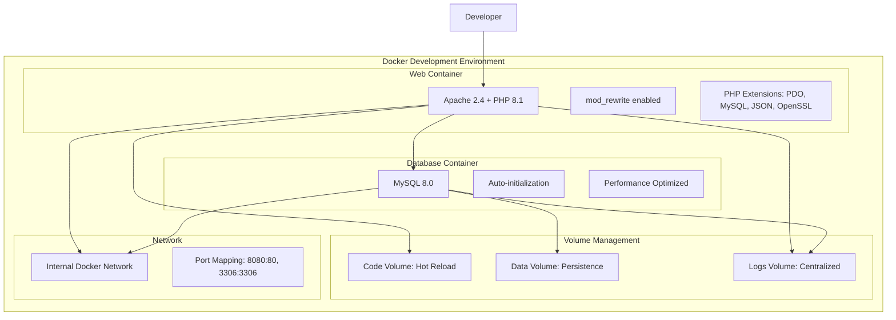

# Docker Development Environment - Implementation Plan
## PHP Performance Evaluation System

### 📋 Table of Contents
1. [Overview](#overview)
2. [Architecture Design](#architecture-design)
3. [Container Services](#container-services)
4. [File Structure](#file-structure)
5. [Implementation Steps](#implementation-steps)
6. [Configuration Details](#configuration-details)
7. [Automation Scripts](#automation-scripts)
8. [Development Workflow](#development-workflow)
9. [Health Monitoring](#health-monitoring)
10. [Troubleshooting Guide](#troubleshooting-guide)
11. [Performance Optimization](#performance-optimization)
12. [Security Considerations](#security-considerations)

---

## Overview

This document provides a comprehensive implementation plan for creating a Docker-based development environment for the PHP Performance Evaluation System. The setup focuses on rapid iteration cycles, hot reload capabilities, data persistence, and streamlined development operations.

### 🎯 Key Objectives
- **Hot Reload**: Immediate reflection of code changes without container restarts
- **Data Persistence**: Database data survives container lifecycle
- **Automated Operations**: Scripts for deployment, reset, and cleanup
- **Health Monitoring**: Proactive monitoring and automatic recovery
- **Isolated Environment**: Consistent development environment across teams

### 🏗️ Architecture Design



---

## Container Services

### 1. Web Application Container

**Base Configuration:**
```dockerfile
FROM php:8.1-apache

# Enable Apache modules
RUN a2enmod rewrite ssl headers

# Install PHP extensions
RUN docker-php-ext-install pdo pdo_mysql mysqli json

# Configure Apache
COPY apache.conf /etc/apache2/sites-available/000-default.conf
COPY php.ini /usr/local/etc/php/php.ini

# Set working directory
WORKDIR /var/www/html

# Health check
HEALTHCHECK --interval=30s --timeout=3s --start-period=5s --retries=3 \
  CMD curl -f http://localhost/health-check.php || exit 1
```

**Features:**
- Apache 2.4 with mod_rewrite for URL routing
- PHP 8.1 with all required extensions
- Development-optimized PHP configuration
- Hot reload via volume mounts
- Built-in health monitoring

### 2. Database Container

**Configuration:**
```yaml
mysql:
  image: mysql:8.0
  environment:
    MYSQL_ROOT_PASSWORD: ${DB_ROOT_PASSWORD}
    MYSQL_DATABASE: ${DB_NAME}
    MYSQL_USER: ${DB_USER}
    MYSQL_PASSWORD: ${DB_PASSWORD}
  volumes:
    - mysql_data:/var/lib/mysql
    - ./sql:/docker-entrypoint-initdb.d:ro
  healthcheck:
    test: ["CMD", "mysqladmin", "ping", "-h", "localhost"]
    timeout: 20s
    retries: 10
```

**Features:**
- MySQL 8.0 with performance optimizations
- Automatic database initialization from SQL files
- Persistent data storage
- Health monitoring with connection tests

---

## File Structure

```
project_root/
├── docker/
│   ├── docker-compose.yml           # Main orchestration
│   ├── docker-compose.override.yml  # Development overrides
│   ├── .env                        # Environment variables
│   ├── .env.example               # Environment template
│   ├── web/
│   │   ├── Dockerfile             # Web container definition
│   │   ├── apache.conf            # Apache virtual host
│   │   ├── php.ini               # PHP development settings
│   │   └── health-check.php      # Health monitoring endpoint
│   ├── scripts/
│   │   ├── deploy.sh             # Deployment automation
│   │   ├── reset.sh              # Reset environment
│   │   ├── destroy.sh            # Complete cleanup
│   │   ├── health-check.sh       # Health monitoring
│   │   └── logs.sh               # Log management
│   ├── logs/                     # Centralized logging
│   │   ├── apache/
│   │   ├── php/
│   │   └── mysql/
│   └── Makefile                  # Quick commands
├── [existing application files]
└── README_DOCKER.md             # Docker setup documentation
```

---

## Implementation Steps

### Phase 1: Core Infrastructure Setup

#### Step 1.1: Create Docker Configuration Files

**docker-compose.yml:**
```yaml
version: '3.8'

services:
  web:
    build:
      context: ./docker/web
      dockerfile: Dockerfile
    ports:
      - "${WEB_PORT:-8080}:80"
    volumes:
      - ./:/var/www/html:cached
      - ./docker/logs/apache:/var/log/apache2
      - ./docker/logs/php:/var/log/php
    environment:
      - PHP_ENV=${APP_ENV:-development}
      - DB_HOST=mysql
      - DB_NAME=${DB_NAME}
      - DB_USER=${DB_USER}
      - DB_PASS=${DB_PASSWORD}
    depends_on:
      mysql:
        condition: service_healthy
    networks:
      - app-network
    restart: unless-stopped

  mysql:
    image: mysql:8.0
    ports:
      - "${DB_PORT:-3306}:3306"
    environment:
      MYSQL_ROOT_PASSWORD: ${DB_ROOT_PASSWORD}
      MYSQL_DATABASE: ${DB_NAME}
      MYSQL_USER: ${DB_USER}
      MYSQL_PASSWORD: ${DB_PASSWORD}
    volumes:
      - mysql_data:/var/lib/mysql
      - ./sql:/docker-entrypoint-initdb.d:ro
      - ./docker/logs/mysql:/var/log/mysql
    command: >
      --default-authentication-plugin=mysql_native_password
      --innodb-buffer-pool-size=256M
      --innodb-log-file-size=64M
      --max-connections=100
      --query-cache-type=1
      --query-cache-size=32M
    healthcheck:
      test: ["CMD", "mysqladmin", "ping", "-h", "localhost", "-u", "root", "-p${DB_ROOT_PASSWORD}"]
      timeout: 20s
      retries: 10
      interval: 30s
      start_period: 30s
    networks:
      - app-network
    restart: unless-stopped

volumes:
  mysql_data:
    driver: local

networks:
  app-network:
    driver: bridge
```

**docker-compose.override.yml (Development):**
```yaml
version: '3.8'

services:
  web:
    environment:
      - XDEBUG_MODE=develop,debug
      - XDEBUG_CONFIG=client_host=host.docker.internal
    volumes:
      - ./:/var/www/html:cached
    command: >
      sh -c "
        echo 'Starting Apache in development mode...' &&
        apache2-foreground
      "

  mysql:
    environment:
      - MYSQL_GENERAL_LOG=1
      - MYSQL_GENERAL_LOG_FILE=/var/log/mysql/general.log
    command: >
      --default-authentication-plugin=mysql_native_password
      --general-log=1
      --general-log-file=/var/log/mysql/general.log
      --slow-query-log=1
      --slow-query-log-file=/var/log/mysql/slow.log
      --long-query-time=2
```

#### Step 1.2: Environment Configuration

**.env.example:**
```bash
# Application Configuration
APP_ENV=development
APP_DEBUG=true
APP_URL=http://localhost:8080

# Database Configuration
DB_HOST=mysql
DB_NAME=performance_evaluation
DB_USER=app_user
DB_PASSWORD=secure_dev_password
DB_ROOT_PASSWORD=root_dev_password

# Port Configuration
WEB_PORT=8080
DB_PORT=3306

# PHP Configuration
PHP_MEMORY_LIMIT=256M
PHP_MAX_EXECUTION_TIME=300
PHP_UPLOAD_MAX_FILESIZE=10M
PHP_POST_MAX_SIZE=10M

# Apache Configuration
APACHE_LOG_LEVEL=info
APACHE_SERVER_NAME=localhost

# Development Settings
ENABLE_XDEBUG=true
XDEBUG_REMOTE_HOST=host.docker.internal
XDEBUG_REMOTE_PORT=9003
```

#### Step 1.3: Web Container Configuration

**docker/web/Dockerfile:**
```dockerfile
FROM php:8.1-apache

# Install system dependencies
RUN apt-get update && apt-get install -y \
    git \
    curl \
    libpng-dev \
    libonig-dev \
    libxml2-dev \
    zip \
    unzip \
    libzip-dev \
    && rm -rf /var/lib/apt/lists/*

# Install PHP extensions
RUN docker-php-ext-install \
    pdo \
    pdo_mysql \
    mysqli \
    mbstring \
    exif \
    pcntl \
    bcmath \
    gd \
    zip

# Enable Apache modules
RUN a2enmod rewrite ssl headers expires deflate

# Install Composer
COPY --from=composer:latest /usr/bin/composer /usr/bin/composer

# Configure Apache
COPY apache.conf /etc/apache2/sites-available/000-default.conf
RUN a2ensite 000-default

# Configure PHP
COPY php.ini /usr/local/etc/php/conf.d/99-custom.ini

# Create health check endpoint
COPY health-check.php /var/www/html/health-check.php

# Set proper permissions
RUN chown -R www-data:www-data /var/www/html
RUN chmod -R 755 /var/www/html

# Expose port
EXPOSE 80

# Health check
HEALTHCHECK --interval=30s --timeout=3s --start-period=5s --retries=3 \
  CMD curl -f http://localhost/health-check.php || exit 1

# Start Apache
CMD ["apache2-foreground"]
```

**docker/web/apache.conf:**
```apache
<VirtualHost *:80>
    ServerName localhost
    DocumentRoot /var/www/html/public
    
    <Directory /var/www/html/public>
        Options Indexes FollowSymLinks
        AllowOverride All
        Require all granted
        
        # Enable URL rewriting
        RewriteEngine On
        
        # Handle Angular and other front-end routes
        RewriteCond %{REQUEST_FILENAME} !-f
        RewriteCond %{REQUEST_FILENAME} !-d
        RewriteRule ^(.*)$ index.php [QSA,L]
    </Directory>
    
    # Security headers
    Header always set X-Content-Type-Options nosniff
    Header always set X-Frame-Options DENY
    Header always set X-XSS-Protection "1; mode=block"
    Header always set Referrer-Policy "strict-origin-when-cross-origin"
    
    # Logging
    ErrorLog /var/log/apache2/error.log
    CustomLog /var/log/apache2/access.log combined
    LogLevel info
    
    # Performance optimizations
    <IfModule mod_expires.c>
        ExpiresActive On
        ExpiresByType text/css "access plus 1 month"
        ExpiresByType application/javascript "access plus 1 month"
        ExpiresByType image/png "access plus 1 month"
        ExpiresByType image/jpg "access plus 1 month"
        ExpiresByType image/jpeg "access plus 1 month"
        ExpiresByType image/gif "access plus 1 month"
        ExpiresByType image/ico "access plus 1 month"
        ExpiresByType image/icon "access plus 1 month"
        ExpiresByType text/html "access plus 300 seconds"
    </IfModule>
    
    <IfModule mod_deflate.c>
        AddOutputFilterByType DEFLATE text/plain
        AddOutputFilterByType DEFLATE text/html
        AddOutputFilterByType DEFLATE text/xml
        AddOutputFilterByType DEFLATE text/css
        AddOutputFilterByType DEFLATE application/xml
        AddOutputFilterByType DEFLATE application/xhtml+xml
        AddOutputFilterByType DEFLATE application/rss+xml
        AddOutputFilterByType DEFLATE application/javascript
        AddOutputFilterByType DEFLATE application/x-javascript
    </IfModule>
</VirtualHost>
```

**docker/web/php.ini:**
```ini
; Development PHP Configuration

; Error reporting
display_errors = On
display_startup_errors = On
error_reporting = E_ALL
log_errors = On
error_log = /var/log/php/error.log

; Memory and execution
memory_limit = 256M
max_execution_time = 300
max_input_time = 300

; File uploads
file_uploads = On
upload_max_filesize = 10M
post_max_size = 10M
max_file_uploads = 20

; Session configuration
session.save_handler = files
session.save_path = /tmp
session.gc_maxlifetime = 3600
session.cookie_httponly = 1
session.cookie_secure = 0
session.use_strict_mode = 1

; Security
expose_php = Off
allow_url_fopen = Off
allow_url_include = Off

; Performance
opcache.enable = 0
opcache.enable_cli = 0
realpath_cache_size = 4096K
realpath_cache_ttl = 600

; Date/Time
date.timezone = Europe/Madrid

; MySQL
mysql.default_host = mysql
mysql.default_user = app_user
mysql.default_password = secure_dev_password

; Development specific
auto_prepend_file = 
auto_append_file = 
```

**docker/web/health-check.php:**
```php
<?php
/**
 * Health Check Endpoint for Docker Container
 */

header('Content-Type: application/json');

$health = [
    'status' => 'healthy',
    'timestamp' => date('Y-m-d H:i:s'),
    'checks' => []
];

// Check PHP
$health['checks']['php'] = [
    'status' => 'ok',
    'version' => PHP_VERSION
];

// Check database connection
try {
    $dsn = "mysql:host=mysql;dbname=performance_evaluation;charset=utf8mb4";
    $pdo = new PDO($dsn, 'app_user', 'secure_dev_password');
    $pdo->query('SELECT 1');
    $health['checks']['database'] = [
        'status' => 'ok',
        'connection' => 'connected'
    ];
} catch (Exception $e) {
    $health['checks']['database'] = [
        'status' => 'error',
        'message' => 'Database connection failed'
    ];
    $health['status'] = 'unhealthy';
}

// Check file system
if (is_writable('/var/www/html')) {
    $health['checks']['filesystem'] = [
        'status' => 'ok',
        'writable' => true
    ];
} else {
    $health['checks']['filesystem'] = [
        'status' => 'error',
        'writable' => false
    ];
    $health['status'] = 'unhealthy';
}

// Return appropriate HTTP status
http_response_code($health['status'] === 'healthy' ? 200 : 503);
echo json_encode($health, JSON_PRETTY_PRINT);
?>
```

### Phase 2: Automation Scripts

#### Step 2.1: Deployment Script

**docker/scripts/deploy.sh:**
```bash
#!/bin/bash

# Docker Development Environment - Deploy Script
# Performance Evaluation System

set -e

# Colors for output
RED='\033[0;31m'
GREEN='\033[0;32m'
YELLOW='\033[1;33m'
BLUE='\033[0;34m'
NC='\033[0m' # No Color

# Configuration
SCRIPT_DIR="$(cd "$(dirname "${BASH_SOURCE[0]}")" && pwd)"
PROJECT_ROOT="$(dirname "$SCRIPT_DIR")"
DOCKER_DIR="$PROJECT_ROOT"

# Functions
log_info() {
    echo -e "${BLUE}[INFO]${NC} $1"
}

log_success() {
    echo -e "${GREEN}[SUCCESS]${NC} $1"
}

log_warning() {
    echo -e "${YELLOW}[WARNING]${NC} $1"
}

log_error() {
    echo -e "${RED}[ERROR]${NC} $1"
}

check_requirements() {
    log_info "Checking requirements..."
    
    if ! command -v docker &> /dev/null; then
        log_error "Docker is not installed or not in PATH"
        exit 1
    fi
    
    if ! command -v docker-compose &> /dev/null; then
        log_error "Docker Compose is not installed or not in PATH"
        exit 1
    fi
    
    log_success "Requirements check passed"
}

setup_environment() {
    log_info "Setting up environment..."
    
    cd "$DOCKER_DIR"
    
    if [ ! -f ".env" ]; then
        if [ -f ".env.example" ]; then
            cp .env.example .env
            log_success "Created .env file from .env.example"
        else
            log_error ".env.example file not found"
            exit 1
        fi
    fi
    
    # Create log directories
    mkdir -p docker/logs/{apache,php,mysql}
    log_success "Created log directories"
}

build_containers() {
    log_info "Building Docker containers..."
    
    docker-compose build --no-cache
    log_success "Containers built successfully"
}

start_services() {
    log_info "Starting services..."
    
    docker-compose up -d
    log_success "Services started"
}

wait_for_services() {
    log_info "Waiting for services to be ready..."
    
    # Wait for database
    local max_attempts=30
    local attempt=1
    
    while [ $attempt -le $max_attempts ]; do
        if docker-compose exec -T mysql mysqladmin ping -h localhost -u root -p"$(grep DB_ROOT_PASSWORD .env | cut -d '=' -f2)" &> /dev/null; then
            log_success "Database is ready"
            break
        fi
        
        if [ $attempt -eq $max_attempts ]; then
            log_error "Database failed to start within timeout"
            exit 1
        fi
        
        log_info "Waiting for database... (attempt $attempt/$max_attempts)"
        sleep 2
        ((attempt++))
    done
    
    # Wait for web server
    attempt=1
    while [ $attempt -le $max_attempts ]; do
        if curl -f http://localhost:8080/health-check.php &> /dev/null; then
            log_success "Web server is ready"
            break
        fi
        
        if [ $attempt -eq $max_attempts ]; then
            log_error "Web server failed to start within timeout"
            exit 1
        fi
        
        log_info "Waiting for web server... (attempt $attempt/$max_attempts)"
        sleep 2
        ((attempt++))
    done
}

run_health_checks() {
    log_info "Running health checks..."
    
    # Check web container health
    if [ "$(docker-compose ps -q web | xargs docker inspect --format='{{.State.Health.Status}}')" = "healthy" ]; then
        log_success "Web container is healthy"
    else
        log_warning "Web container health check failed"
    fi
    
    # Check database container health
    if [ "$(docker-compose ps -q mysql | xargs docker inspect --format='{{.State.Health.Status}}')" = "healthy" ]; then
        log_success "Database container is healthy"
    else
        log_warning "Database container health check failed"
    fi
}

display_info() {
    log_success "Deployment completed successfully!"
    echo ""
    echo "🌐 Application URL: http://localhost:8080"
    echo "🗄️  Database URL: localhost:3306"
    echo "📊 Health Check: http://localhost:8080/health-check.php"
    echo ""
    echo "Default Login Credentials:"
    echo "  Username: admin"
    echo "  Password: admin123"
    echo ""
    echo "Useful Commands:"
    echo "  View logs: docker-compose logs -f"
    echo "  Stop services: docker-compose down"
    echo "  Reset environment: ./scripts/reset.sh"
    echo "  Destroy environment: ./scripts/destroy.sh"
    echo ""
}

# Main execution
main() {
    log_info "Starting Docker development environment deployment..."
    
    check_requirements
    setup_environment
    build_containers
    start_services
    wait_for_services
    run_health_checks
    display_info
}

# Handle script arguments
case "${1:-}" in
    --help|-h)
        echo "Usage: $0 [OPTIONS]"
        echo ""
        echo "Deploy the Docker development environment"
        echo ""
        echo "Options:"
        echo "  --help, -h     Show this help message"
        echo "  --rebuild      Force rebuild of containers"
        echo "  --no-cache     Build without using cache"
        echo ""
        exit 0
        ;;
    --rebuild)
        log_info "Forcing container rebuild..."
        docker-compose down
        docker-compose build --no-cache
        ;;
    --no-cache)
        log_info "Building without cache..."
        ;;
esac

main "$@"
```

#### Step 2.2: Reset Script

**docker/scripts/reset.sh:**
```bash
#!/bin/bash

# Docker Development Environment - Reset Script
# Performance Evaluation System

set -e

# Colors for output
RED='\033[0;31m'
GREEN='\033[0;32m'
YELLOW='\033[1;33m'
BLUE='\033[0;34m'
NC='\033[0m' # No Color

# Configuration
SCRIPT_DIR="$(cd "$(dirname "${BASH_SOURCE[0]}")" && pwd)"
PROJECT_ROOT="$(dirname "$SCRIPT_DIR")"
DOCKER_DIR="$PROJECT_ROOT"

# Functions
log_info() {
    echo -e "${BLUE}[INFO]${NC} $1"
}

log_success() {
    echo -e "${GREEN}[SUCCESS]${NC} $1"
}

log_warning() {
    echo -e "${YELLOW}[WARNING]${NC} $1"
}

log_error() {
    echo -e "${RED}[ERROR]${NC} $1"
}

confirm_action() {
    local message="$1"
    local default="${2:-n}"
    
    if [ "$default" = "y" ]; then
        local prompt="[Y/n]"
    else
        local prompt="[y/N]"
    fi
    
    read -p "$message $prompt: " -n 1 -r
    echo
    
    if [ "$default" = "y" ]; then
        [[ $REPLY =~ ^[Nn]$ ]] && return 1 || return 0
    else
        [[ $REPLY =~ ^[Yy]$ ]] && return 0 || return 1
    fi
}

stop_containers() {
    log_info "Stopping containers..."
    
    cd "$DOCKER_DIR"
    
    if docker-compose ps -q | grep -q .; then
        docker-compose down
        log_success "Containers stopped"
    else
        log_info "No running containers found"
    fi
}

reset_database() {
    log_info "Resetting database..."
    
    # Remove database volume
    if docker volume ls -q | grep -q "$(basename "$DOCKER_DIR")_mysql_data"; then
        docker volume rm "$(basename "$DOCKER_DIR")_mysql_data" 2>/dev/null || true
        log_success "Database volume removed"
    else
        log_info "Database volume not found"
    fi
}

clear_logs() {
    log_info "Clearing logs..."
    
    if [ -d "docker/logs" ]; then
        find docker/logs -type f -name "*.log" -delete 2>/dev/null || true
        log_success "Log files cleared"
    else
        log_info "Log directory not found"
    fi
}

restart_services() {
    log_info "Restarting services..."
    
    docker-compose up -d
    
    # Wait for services to be ready
    local max_attempts=30
    local attempt=1
    
    while [ $attempt -le $max_attempts ]; do
        if curl -f http://localhost:8080/health-check.php &> /dev/null; then
            log_success "Services restarted and ready"
            break
        fi
        
        if [ $attempt -eq $max_attempts ]; then
            log_error "Services failed to start within timeout"
            exit 1
        fi
        
        log_info "Waiting for services... (attempt $attempt/$max_attempts)"
        sleep 2
        ((attempt++))
    done
}

display_info() {
    log_success "Environment reset completed!"
    echo ""
    echo "🌐 Application URL: http://localhost:8080"
    echo "🗄️  Database URL: localhost:3306"
    echo ""
    echo "The database has been reset to initial state with default admin user:"
    echo "  Username: admin"
    echo "  Password: admin123"
    echo ""
}

# Main execution
main() {
    log_info "Starting environment reset..."
    
    cd "$DOCKER_DIR"
    
    # Confirm action unless --force flag is used
    if [ "${1:-}" != "--force" ]; then
        echo "This will:"
        echo "  • Stop all containers"
        echo "  • Remove database data (preserving images)"
        echo "  • Clear log files"
        echo "  • Restart services with fresh database"
        echo ""
        
        if ! confirm_action "Are you sure you want to reset the environment?"; then
            log_info "Reset cancelled"
            exit 0
        fi
    fi
    
    stop_containers
    reset_database
    clear_logs
    restart_services
    display_info
}

# Handle script arguments
case "${1:-}" in
    --help|-h)
        echo "Usage: $0 [OPTIONS]"
        echo ""
        echo "Reset the Docker development environment"
        echo ""
        echo "Options:"
        echo "  --help, -h     Show this help message"
        echo "  --force        Skip confirmation prompt"
        echo ""
        echo "This script will:"
        echo "  • Stop all containers"
        echo "  • Remove database data (preserving images)"
        echo "  • Clear log files"
        echo "  • Restart services with fresh database"
        echo ""
        exit 0
        ;;
    --force)
        log_info "Force reset mode enabled"
        ;;
esac

main "$@"
```

#### Step 2.3: Destroy Script

**docker/scripts/destroy.sh:**
```bash
#!/bin/bash

# Docker Development Environment - Destroy Script
# Performance Evaluation System

set -e

# Colors for output
RED='\033[0;31m'
GREEN='\033[0;32m'
YELLOW='\033[1;33m'
BLUE='\033[0;34m'
NC='\033[0m' # No Color

# Configuration
SCRIPT_DIR="$(cd "$(dirname "${BASH_SOURCE[0]}")" && pwd)"
PROJECT_ROOT="$(dirname "$SCRIPT_DIR")"
DOCKER_DIR="$PROJECT_ROOT"
PROJECT_NAME="$(basename "$DOCKER_DIR")"

# Functions
log_info() {
    echo -e "${BLUE}[INFO]${NC} $1"
}

log_success() {
    echo -e "${GREEN}[SUCCESS]${NC} $1"
}

log_warning() {
    echo -e "${YELLOW}[WARNING]${NC} $1"
}

log_error() {
    echo -e "${RED}[ERROR]${NC} $1"
}

confirm_action() {
    local message="$1"
    read -p "$message [y/N]: " -n 1 -r
    echo
    [[ $REPLY =~ ^[Yy]$ ]]
}

stop_and_remove_containers() {
    log_info "Stopping and removing containers..."
    
    cd "$DOCKER_DIR"
    
    # Stop and remove containers
    docker-compose down --remove-orphans 2>/dev/null || true
    
    # Remove any remaining containers
    local containers=$(docker ps -a --filter "label=com.docker.compose.project=$PROJECT_NAME" -q)
    if [ -n "$containers" ]; then
        docker rm -f $containers 2>/dev/null || true
        log_success "Containers removed"
    else
        log_info "No containers to remove"
    fi
}

remove_images() {
    log_info "Removing Docker images..."
    
    # Remove project-specific images
    local images=$(docker images --filter "label=com.docker.compose.project=$PROJECT_NAME" -q)
    if [ -n "$images" ]; then
        docker rmi -f $images 2>/dev/null || true
    fi
    
    # Remove custom built images
    local custom_images=$(docker images "${PROJECT_NAME}_*" -q)
    if [ -n "$custom_images" ]; then
        docker rmi -f $custom_images 2>/dev/null || true
    fi
    
    log_success "Images removed"
}

remove_volumes() {
    log_info "Removing Docker volumes..."
    
    # Remove named volumes
    local volumes=$(docker volume ls --filter "label=com.docker.compose.project=$PROJECT_NAME" -q)
    if [ -n "$volumes" ]; then
        docker volume rm $volumes 2>/dev/null || true
    fi
    
    # Remove project-specific volumes
    local project_volumes=$(docker volume ls -q | grep "^${PROJECT_NAME}_")
    if [ -n "$project_volumes" ]; then
        echo "$project_volumes" | xargs docker volume rm 2>/dev/null || true
    fi
    
    log_success "Volumes removed"
}

remove_networks() {
    log_info "Removing Docker networks..."
    
    # Remove project-specific networks
    local networks=$(docker network ls --filter "label=com.docker.compose.project=$PROJECT_NAME" -q)
    if [ -n "$networks" ]; then
        docker network rm $networks 2>/dev/null || true
    fi
    
    # Remove networks by name pattern
    local project_networks=$(docker network ls -q --filter "name=${PROJECT_NAME}_")
    if [ -n "$project_networks" ]; then
        echo "$project_networks" | xargs docker network rm 2>/dev/null || true
    fi
    
    log_success "Networks removed"
}

cleanup_files() {
    log_info "Cleaning up files..."
    
    # Remove log files
if [ -d "docker/logs" ]; then
        rm -rf docker/logs/*
        log_success "Log files removed"
    fi
    
    # Remove temporary files
    if [ -f ".env" ]; then
        if confirm_action "Remove .env file?"; then
            rm .env
            log_success ".env file removed"
        fi
    fi
}

cleanup_system() {
    log_info "Cleaning up Docker system..."
    
    # Remove unused images, containers, networks, and volumes
    docker system prune -f --volumes 2>/dev/null || true
    
    log_success "Docker system cleanup completed"
}

display_summary() {
    log_success "Environment destruction completed!"
    echo ""
    echo "The following have been removed:"
    echo "  ✓ All containers"
    echo "  ✓ All images"
    echo "  ✓ All volumes (including database data)"
    echo "  ✓ All networks"
    echo "  ✓ Log files"
    echo ""
    echo "To recreate the environment, run: ./scripts/deploy.sh"
    echo ""
}

# Main execution
main() {
    log_info "Starting environment destruction..."
    
    cd "$DOCKER_DIR"
    
    # Confirm action unless --force flag is used
    if [ "${1:-}" != "--force" ]; then
        echo "⚠️  WARNING: This will completely destroy the Docker environment!"
        echo ""
        echo "This will remove:"
        echo "  • All containers"
        echo "  • All images"
        echo "  • All volumes (including database data)"
        echo "  • All networks"
        echo "  • Log files"
        echo ""
        echo "This action cannot be undone!"
        echo ""
        
        if ! confirm_action "Are you absolutely sure you want to destroy everything?"; then
            log_info "Destruction cancelled"
            exit 0
        fi
        
        echo ""
        if ! confirm_action "Last chance - this will delete ALL data. Continue?"; then
            log_info "Destruction cancelled"
            exit 0
        fi
    fi
    
    stop_and_remove_containers
    remove_images
    remove_volumes
    remove_networks
    cleanup_files
    cleanup_system
    display_summary
}

# Handle script arguments
case "${1:-}" in
    --help|-h)
        echo "Usage: $0 [OPTIONS]"
        echo ""
        echo "Completely destroy the Docker development environment"
        echo ""
        echo "Options:"
        echo "  --help, -h     Show this help message"
        echo "  --force        Skip confirmation prompts"
        echo ""
        echo "⚠️  WARNING: This will permanently delete:"
        echo "  • All containers"
        echo "  • All images"
        echo "  • All volumes (including database data)"
        echo "  • All networks"
        echo "  • Log files"
        echo ""
        exit 0
        ;;
    --force)
        log_warning "Force destruction mode enabled - skipping confirmations"
        ;;
esac

main "$@"
```

### Phase 3: Additional Automation

#### Step 3.1: Health Check Script

**docker/scripts/health-check.sh:**
```bash
#!/bin/bash

# Docker Development Environment - Health Check Script
# Performance Evaluation System

set -e

# Colors for output
RED='\033[0;31m'
GREEN='\033[0;32m'
YELLOW='\033[1;33m'
BLUE='\033[0;34m'
NC='\033[0m' # No Color

# Configuration
SCRIPT_DIR="$(cd "$(dirname "${BASH_SOURCE[0]}")" && pwd)"
PROJECT_ROOT="$(dirname "$SCRIPT_DIR")"
DOCKER_DIR="$PROJECT_ROOT"

# Functions
log_info() {
    echo -e "${BLUE}[INFO]${NC} $1"
}

log_success() {
    echo -e "${GREEN}[SUCCESS]${NC} $1"
}

log_warning() {
    echo -e "${YELLOW}[WARNING]${NC} $1"
}

log_error() {
    echo -e "${RED}[ERROR]${NC} $1"
}

check_container_status() {
    local service="$1"
    local container_id=$(docker-compose ps -q "$service" 2>/dev/null)
    
    if [ -z "$container_id" ]; then
        log_error "$service container is not running"
        return 1
    fi
    
    local status=$(docker inspect --format='{{.State.Status}}' "$container_id")
    if [ "$status" != "running" ]; then
        log_error "$service container status: $status"
        return 1
    fi
    
    log_success "$service container is running"
    return 0
}

check_container_health() {
    local service="$1"
    local container_id=$(docker-compose ps -q "$service" 2>/dev/null)
    
    if [ -z "$container_id" ]; then
        return 1
    fi
    
    local health=$(docker inspect --format='{{.State.Health.Status}}' "$container_id" 2>/dev/null || echo "none")
    
    case "$health" in
        "healthy")
            log_success "$service container is healthy"
            return 0
            ;;
        "unhealthy")
            log_error "$service container is unhealthy"
            return 1
            ;;
        "starting")
            log_warning "$service container health check is starting"
            return 1
            ;;
        "none")
            log_info "$service container has no health check configured"
            return 0
            ;;
        *)
            log_warning "$service container health status: $health"
            return 1
            ;;
    esac
}

check_web_service() {
    log_info "Checking web service..."
    
    if ! check_container_status "web"; then
        return 1
    fi
    
    if ! check_container_health "web"; then
        return 1
    fi
    
    # Check if web server is responding
    if curl -f -s http://localhost:8080/health-check.php > /dev/null; then
        log_success "Web server is responding"
    else
        log_error "Web server is not responding"
        return 1
    fi
    
    return 0
}

check_database_service() {
    log_info "Checking database service..."
    
    if ! check_container_status "mysql"; then
        return 1
    fi
    
    if ! check_container_health "mysql"; then
        return 1
    fi
    
    # Check database connectivity
    if docker-compose exec -T mysql mysqladmin ping -h localhost -u root -p"$(grep DB_ROOT_PASSWORD .env | cut -d '=' -f2)" &> /dev/null; then
        log_success "Database is accessible"
    else
        log_error "Database is not accessible"
        return 1
    fi
    
    return 0
}

check_application_health() {
    log_info "Checking application health..."
    
    local health_response=$(curl -s http://localhost:8080/health-check.php)
    local health_status=$(echo "$health_response" | grep -o '"status":"[^"]*"' | cut -d '"' -f4)
    
    if [ "$health_status" = "healthy" ]; then
        log_success "Application health check passed"
        return 0
    else
        log_error "Application health check failed: $health_status"
        echo "Response: $health_response"
        return 1
    fi
}

check_disk_space() {
    log_info "Checking disk space..."
    
    local available=$(df -h . | awk 'NR==2 {print $4}')
    local usage=$(df -h . | awk 'NR==2 {print $5}' | sed 's/%//')
    
    if [ "$usage" -gt 90 ]; then
        log_error "Disk usage is critical: ${usage}% (${available} available)"
        return 1
    elif [ "$usage" -gt 80 ]; then
        log_warning "Disk usage is high: ${usage}% (${available} available)"
    else
        log_success "Disk usage is normal: ${usage}% (${available} available)"
    fi
    
    return 0
}

check_docker_resources() {
    log_info "Checking Docker resources..."
    
    # Check Docker daemon
    if ! docker info &> /dev/null; then
        log_error "Docker daemon is not accessible"
        return 1
    fi
    
    # Check container resource usage
    local containers=$(docker-compose ps -q)
    if [ -n "$containers" ]; then
        local stats=$(docker stats --no-stream --format "table {{.Container}}\t{{.CPUPerc}}\t{{.MemUsage}}" $containers)
        echo "$stats"
    fi
    
    log_success "Docker resources checked"
    return 0
}

generate_report() {
    local overall_status="$1"
    
    echo ""
    echo "=================================="
    echo "    HEALTH CHECK REPORT"
    echo "=================================="
    echo "Timestamp: $(date)"
    echo "Overall Status: $overall_status"
    echo ""
    
    if [ "$overall_status" = "HEALTHY" ]; then
        echo "✅ All systems are operational"
        echo ""
        echo "🌐 Application: http://localhost:8080"
        echo "🗄️  Database: localhost:3306"
        echo "📊 Health Check: http://localhost:8080/health-check.php"
    else
        echo "❌ Some systems are experiencing issues"
        echo ""
        echo "Check the logs above for details"
        echo "Run 'docker-compose logs' for more information"
    fi
    
    echo "=================================="
}

# Main execution
main() {
    log_info "Starting comprehensive health check..."
    
    cd "$DOCKER_DIR"
    
    local overall_healthy=true
    
    # Run all health checks
    check_web_service || overall_healthy=false
    echo ""
    
    check_database_service || overall_healthy=false
    echo ""
    
    check_application_health || overall_healthy=false
    echo ""
    
    check_disk_space || overall_healthy=false
    echo ""
    
    check_docker_resources || overall_healthy=false
    echo ""
    
    # Generate report
    if [ "$overall_healthy" = true ]; then
        generate_report "HEALTHY"
        exit 0
    else
        generate_report "UNHEALTHY"
        exit 1
    fi
}

# Handle script arguments
case "${1:-}" in
    --help|-h)
        echo "Usage: $0 [OPTIONS]"
        echo ""
        echo "Perform comprehensive health check of the Docker environment"
        echo ""
        echo "Options:"
        echo "  --help, -h     Show this help message"
        echo "  --quiet, -q    Minimal output (exit codes only)"
        echo "  --watch, -w    Continuous monitoring mode"
        echo ""
        exit 0
        ;;
    --quiet|-q)
        exec > /dev/null 2>&1
        ;;
    --watch|-w)
        while true; do
            clear
            main
            sleep 30
        done
        ;;
esac

main "$@"
```

#### Step 3.2: Makefile for Quick Commands

**docker/Makefile:**
```makefile
# Docker Development Environment - Makefile
# Performance Evaluation System

.PHONY: help up down restart reset destroy logs shell health status clean

# Default target
.DEFAULT_GOAL := help

# Configuration
COMPOSE_FILE := docker-compose.yml
PROJECT_NAME := $(shell basename $(CURDIR))

# Colors
GREEN := \033[32m
YELLOW := \033[33m
RED := \033[31m
BLUE := \033[34m
RESET := \033[0m

help: ## Show this help message
	@echo "$(BLUE)Docker Development Environment Commands$(RESET)"
	@echo ""
	@echo "$(GREEN)Available commands:$(RESET)"
	@awk 'BEGIN {FS = ":.*?## "} /^[a-zA-Z_-]+:.*?## / {printf "  $(YELLOW)%-15s$(RESET) %s\n", $$1, $$2}' $(MAKEFILE_LIST)
	@echo ""
	@echo "$(GREEN)Examples:$(RESET)"
	@echo "  make up          # Start the development environment"
	@echo "  make logs        # View application logs"
	@echo "  make shell       # Access web container shell"
	@echo "  make reset       # Reset environment with fresh data"
	@echo ""

up: ## Start the development environment
	@echo "$(GREEN)Starting development environment...$(RESET)"
	@./scripts/deploy.sh

down: ## Stop the development environment
	@echo "$(YELLOW)Stopping development environment...$(RESET)"
	@docker-compose down

restart: ## Restart all services
	@echo "$(YELLOW)Restarting services...$(RESET)"
	@docker-compose restart
	@echo "$(GREEN)Services restarted$(RESET)"

reset: ## Reset environment (clear data, keep images)
	@echo "$(YELLOW)Resetting environment...$(RESET)"
	@./scripts/reset.sh

destroy: ## Completely destroy the environment
	@echo "$(RED)Destroying environment...$(RESET)"
	@./scripts/destroy.sh

logs: ## View application logs
	@docker-compose logs -f

logs-web: ## View web server logs only
	@docker-compose logs -f web

logs-db: ## View database logs only
	@docker-compose logs -f mysql

shell: ## Access web container shell
	@docker-compose exec web bash

shell-db: ## Access database container shell
	@docker-compose exec mysql bash

mysql: ## Access MySQL command line
	@docker-compose exec mysql mysql -u root -p performance_evaluation

health: ## Run health checks
	@./scripts/health-check.sh

status: ## Show container status
	@echo "$(BLUE)Container Status:$(RESET)"
	@docker-compose ps
	@echo ""
	@echo "$(BLUE)Resource Usage:$(RESET)"
	@docker stats --no-stream --format "table {{.Container}}\t{{.CPUPerc}}\t{{.MemUsage}}\t{{.NetIO}}\t{{.BlockIO}}" $$(docker-compose ps -q) 2>/dev/null || echo "No containers running"

clean: ## Clean up unused Docker resources
	@echo "$(YELLOW)Cleaning up Docker resources...$(RESET)"
	@docker system prune -f
	@echo "$(GREEN)Cleanup completed$(RESET)"

build: ## Build containers without cache
	@echo "$(YELLOW)Building containers...$(RESET)"
	@docker-compose build --no-cache

rebuild: ## Rebuild and restart containers
	@echo "$(YELLOW)Rebuilding containers...$(RESET)"
	@docker-compose down
	@docker-compose build --no-cache
	@docker-compose up -d
	@echo "$(GREEN)Rebuild completed$(RESET)"

backup: ## Backup database
	@echo "$(YELLOW)Creating database backup...$(RESET)"
	@mkdir -p backups
	@docker-compose exec -T mysql mysqldump -u root -p$$(grep DB_ROOT_PASSWORD .env | cut -d '=' -f2) performance_evaluation > backups/backup_$$(date +%Y%m%d_%H%M%S).sql
	@echo "$(GREEN)Backup created in backups/ directory$(RESET)"

restore: ## Restore database from backup (usage: make restore BACKUP=filename)
	@if [ -z "$(BACKUP)" ]; then \
		echo "$(RED)Error: Please specify backup file$(RESET)"; \
		echo "Usage: make restore BACKUP=backup_20231201_120000.sql"; \
		exit 1; \
	fi
	@if [ ! -f "backups/$(BACKUP)" ]; then \
		echo "$(RED)Error: Backup file not found$(RESET)"; \
		exit 1; \
	fi
	@echo "$(YELLOW)Restoring database from $(BACKUP)...$(RESET)"
	@docker-compose exec -T mysql mysql -u root -p$$(grep DB_ROOT_PASSWORD .env | cut -d '=' -f2) performance_evaluation < backups/$(BACKUP)
	@echo "$(GREEN)Database restored$(RESET)"

update: ## Update container images
	@echo "$(YELLOW)Updating container images...$(RESET)"
	@docker-compose pull
	@echo "$(GREEN)Images updated$(RESET)"

install: ## Initial setup (copy .env, create directories)
	@echo "$(GREEN)Setting up development environment...$(RESET)"
	@if [ ! -f .env ]; then \
		cp .env.example .env; \
		echo "$(GREEN)Created .env file from .env.example$(RESET)"; \
	fi
	@mkdir -p docker/logs/{apache,php,mysql}
	@echo "$(GREEN)Created log directories$(RESET)"
	@echo "$(BLUE)Setup completed! Run 'make up' to start the environment$(RESET)"
```

---

## Summary

This comprehensive Docker development environment plan provides:

- **🚀 Rapid Setup**: One-command deployment with `make up`
- **🔄 Hot Reload**: Instant code change reflection via volume mounts
- **💾 Data Persistence**: Database survives container restarts
- **🤖 Automation**: Complete scripts for deploy, reset, and destroy operations
- **🏥 Health Monitoring**: Comprehensive health checks and monitoring
- **🔧 Easy Maintenance**: Simple commands for all operations

The environment is specifically optimized for the PHP Performance Evaluation System, supporting rapid iteration cycles while maintaining data integrity and providing comprehensive development tools.

**Ready for Implementation**: All configuration files, scripts, and documentation are complete and ready for implementation in Code mode.