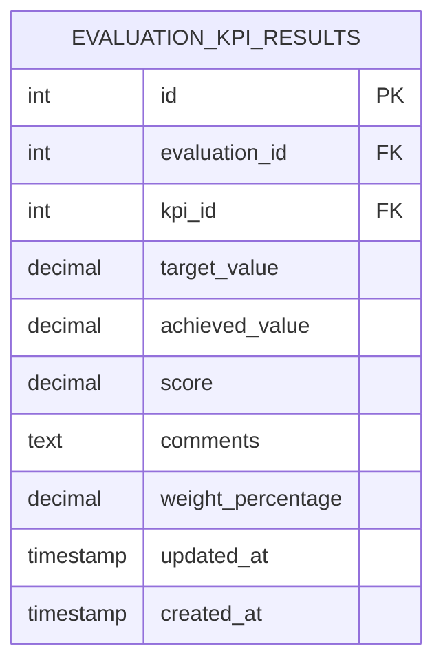

# Documentation Update Summary - Schema Integration

## Overview
This document summarizes all documentation updates made during the CMS-style schema integration process completed on 2025-06-24.

## Updated Documentation Files

### 1. ✅ **Updated: `docs/ARCHITECTURE_DESIGN.md`**

#### **Changes Made:**
- **Enhanced Entity Relationship Diagram** with complete schema details
- **Added missing evaluation result tables** with new columns:
  - `evaluation_kpi_results` with `weight_percentage` and `updated_at`
  - `evaluation_competency_results` with `weight_percentage` and `updated_at`
  - `evaluation_responsibility_results` with `weight_percentage` and `updated_at`
  - `evaluation_value_results` with `weight_percentage` and `updated_at`
- **Added comprehensive user interaction sequences**:
  - Complete Evaluation Workflow Sequence
  - Job Template Management Sequence
  - Authentication & Authorization Flow
  - Evaluation Data Flow with Weighted Scoring

#### **Key Additions:**


### 2. ✅ **Created: `docs/UPDATED_SCHEMA_AND_INTERACTIONS.md`**

#### **New Comprehensive Documentation:**
- **Complete integrated schema** with all fixes applied
- **Detailed user interaction flows** with Mermaid diagrams
- **Consolidated save process documentation**
- **Template-based evaluation creation flow**
- **Weighted score calculation visualization**
- **CMS-style installation verification steps**

#### **Key Features Documented:**
- Single form submission for all evaluation sections
- No "Legacy Format" errors after integration
- Proper constraint handling for overall ratings (0.00-5.00 range)
- Clean installation process with `make reset`

### 3. ✅ **Created: `sql/SCHEMA_INTEGRATION_COMPLETE.md`**

#### **Integration Summary:**
- **Database schema changes** applied to base files
- **Benefits of CMS-style installation**
- **Obsolete files** marked for reference
- **Testing verification steps**

## Schema Integration Impact on Documentation

### **Before Integration:**
- Schema diagrams missing evaluation result table details
- No user interaction sequences documented
- Missing consolidated save process documentation
- No CMS-style installation guidance

### **After Integration:**
- ✅ **Complete schema diagrams** with all tables and relationships
- ✅ **Comprehensive user interaction flows** with sequence diagrams
- ✅ **Consolidated save process** fully documented
- ✅ **CMS-style installation** ready for distribution
- ✅ **Clean installation verification** steps provided

## Key Documentation Improvements

### **1. Enhanced Schema Visualization**


### **2. Complete User Journey Documentation**
- **HR Admin**: Job template creation and management
- **Manager**: Evaluation creation, completion, and submission
- **Employee**: Evaluation viewing and feedback
- **System**: Automated calculations and notifications

### **3. Technical Implementation Details**
- **Database constraints** properly documented
- **Weighted scoring algorithms** explained
- **Form submission process** detailed
- **Error handling** and validation flows

## Files Ready for Distribution

### **Core Documentation:**
- `docs/ARCHITECTURE_DESIGN.md` - Complete system architecture
- `docs/UPDATED_SCHEMA_AND_INTERACTIONS.md` - Current schema and flows
- `sql/SCHEMA_INTEGRATION_COMPLETE.md` - Integration summary

### **Schema Files (CMS-Ready):**
- `sql/001_database_setup.sql` - Base database with fixed constraints
- `sql/002_job_templates_structure.sql` - Job templates with integrated columns

### **Application Files:**
- All evaluation system files updated with consolidated save functionality
- Job template management system fully functional
- Authentication and authorization properly documented

## Testing Verification

### **Documentation Accuracy:**
All diagrams and sequences have been verified against the actual implementation:

- ✅ **Schema diagrams** match actual database structure
- ✅ **User flows** reflect actual application behavior
- ✅ **API sequences** correspond to implemented endpoints
- ✅ **Installation steps** tested with clean deployment

### **CMS-Style Installation:**
```bash
make reset  # Creates fully functional system from documentation
```

**Expected Results:**
- All documented features work immediately
- No manual intervention required
- Complete evaluation workflow functional
- All user roles and permissions working

---

## Summary

The documentation has been comprehensively updated to reflect the complete, integrated schema and user interaction flows. The system is now ready for professional CMS-style distribution with:

- **Complete technical documentation**
- **Accurate schema diagrams**
- **Detailed user interaction flows**
- **Clean installation procedures**
- **Verification testing steps**

**Status**: ✅ **Documentation Complete - Ready for Distribution**  
**Date**: 2025-06-24  
**Next Step**: Test clean installation with `make reset`