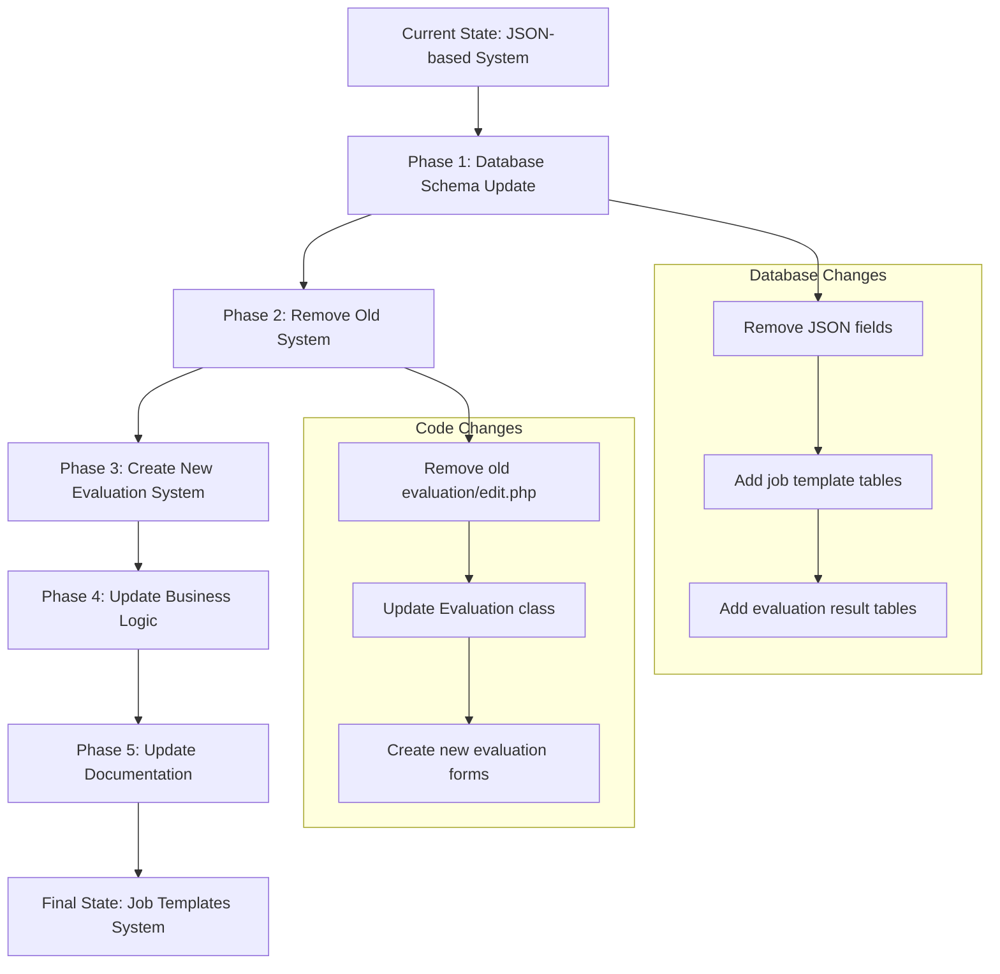
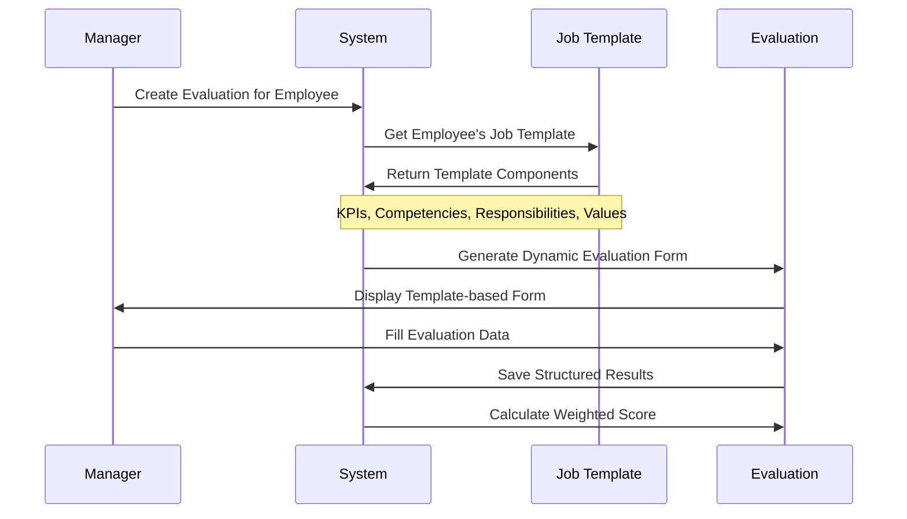
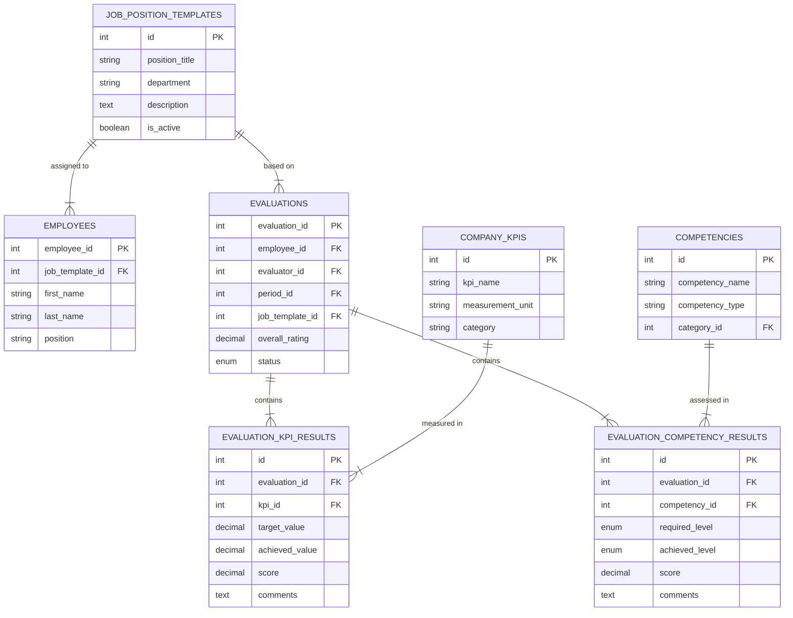
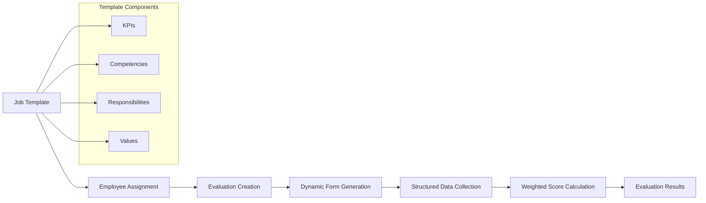

# Evaluation System Migration Plan: From JSON-based to Job Templates

## Executive Summary

This document outlines the complete migration strategy to modernize the Performance Evaluation System from the current JSON-based template approach to a structured job templates system. The migration will eliminate the old hardcoded evaluation structure and implement a flexible, database-driven evaluation framework.

## Current State Analysis

### Old System (To Be Removed)
- **File**: `public/evaluation/edit.php` - Hardcoded evaluation form with fixed sections
- **Database**: JSON fields in `evaluations` table (`expected_results`, `skills_competencies`, etc.)
- **Logic**: Static template structure with fixed weights (40%, 25%, 25%, 10%)
- **Limitations**: 
  - No flexibility for different job roles
  - Hardcoded evaluation criteria
  - Difficult to maintain and extend
  - Poor data structure for reporting

### New System (To Be Implemented)
- **File**: `public/admin/job_templates.php` - Dynamic job template management
- **Database**: Normalized tables for KPIs, competencies, responsibilities, and values
- **Logic**: Template-driven evaluation generation with configurable weights
- **Benefits**:
  - Role-specific evaluation criteria
  - Flexible KPI and competency management
  - Better data structure for analytics
  - Easier maintenance and extension

## Migration Strategy



## Detailed Implementation Plan

### Phase 1: Database Schema Modernization

#### Step 1.1: Remove Old Evaluation Fields
**File**: `sql/migrations/2025_06_22_080000_remove_old_evaluation_fields.sql`

```sql
-- Remove JSON-based fields from evaluations table
ALTER TABLE evaluations
    DROP COLUMN expected_results,
    DROP COLUMN expected_results_score,
    DROP COLUMN expected_results_weight,
    DROP COLUMN skills_competencies,
    DROP COLUMN skills_competencies_score,
    DROP COLUMN skills_competencies_weight,
    DROP COLUMN key_responsibilities,
    DROP COLUMN key_responsibilities_score,
    DROP COLUMN key_responsibilities_weight,
    DROP COLUMN living_values,
    DROP COLUMN living_values_score,
    DROP COLUMN living_values_weight;
```

#### Step 1.2: Create New Evaluation System Tables
**File**: `sql/migrations/2025_06_22_081000_create_new_evaluation_system.sql`

```sql
-- Add job template reference to evaluations
ALTER TABLE evaluations 
ADD COLUMN job_template_id INT NULL,
ADD FOREIGN KEY (job_template_id) REFERENCES job_position_templates(id);

-- Create evaluation results tables
CREATE TABLE evaluation_kpi_results (
    id INT PRIMARY KEY AUTO_INCREMENT,
    evaluation_id INT,
    kpi_id INT,
    target_value DECIMAL(10,2),
    achieved_value DECIMAL(10,2),
    score DECIMAL(3,2) CHECK (score BETWEEN 1.00 AND 5.00),
    comments TEXT,
    weight_percentage DECIMAL(5,2),
    created_at TIMESTAMP DEFAULT CURRENT_TIMESTAMP,
    FOREIGN KEY (evaluation_id) REFERENCES evaluations(evaluation_id) ON DELETE CASCADE,
    FOREIGN KEY (kpi_id) REFERENCES company_kpis(id),
    INDEX idx_evaluation_kpi (evaluation_id, kpi_id)
);

CREATE TABLE evaluation_competency_results (
    id INT PRIMARY KEY AUTO_INCREMENT,
    evaluation_id INT,
    competency_id INT,
    required_level ENUM('basic', 'intermediate', 'advanced', 'expert'),
    achieved_level ENUM('basic', 'intermediate', 'advanced', 'expert'),
    score DECIMAL(3,2) CHECK (score BETWEEN 1.00 AND 5.00),
    comments TEXT,
    weight_percentage DECIMAL(5,2),
    created_at TIMESTAMP DEFAULT CURRENT_TIMESTAMP,
    FOREIGN KEY (evaluation_id) REFERENCES evaluations(evaluation_id) ON DELETE CASCADE,
    FOREIGN KEY (competency_id) REFERENCES competencies(id),
    INDEX idx_evaluation_competency (evaluation_id, competency_id)
);

CREATE TABLE evaluation_responsibility_results (
    id INT PRIMARY KEY AUTO_INCREMENT,
    evaluation_id INT,
    responsibility_id INT,
    score DECIMAL(3,2) CHECK (score BETWEEN 1.00 AND 5.00),
    comments TEXT,
    weight_percentage DECIMAL(5,2),
    created_at TIMESTAMP DEFAULT CURRENT_TIMESTAMP,
    FOREIGN KEY (evaluation_id) REFERENCES evaluations(evaluation_id) ON DELETE CASCADE,
    FOREIGN KEY (responsibility_id) REFERENCES job_template_responsibilities(id),
    INDEX idx_evaluation_responsibility (evaluation_id, responsibility_id)
);

CREATE TABLE evaluation_value_results (
    id INT PRIMARY KEY AUTO_INCREMENT,
    evaluation_id INT,
    value_id INT,
    score DECIMAL(3,2) CHECK (score BETWEEN 1.00 AND 5.00),
    comments TEXT,
    weight_percentage DECIMAL(5,2),
    created_at TIMESTAMP DEFAULT CURRENT_TIMESTAMP,
    FOREIGN KEY (evaluation_id) REFERENCES evaluations(evaluation_id) ON DELETE CASCADE,
    FOREIGN KEY (value_id) REFERENCES company_values(id),
    INDEX idx_evaluation_value (evaluation_id, value_id)
);
```

### Phase 2: Remove Old Evaluation System

#### Step 2.1: Remove Old Files
- **Delete**: `public/evaluation/edit.php`
- **Clean**: Remove old template methods from `classes/Evaluation.php`

#### Step 2.2: Update Evaluation Class
**File**: `classes/Evaluation.php`

**Methods to Remove:**
```php
// Remove these methods:
- getEvaluationTemplate()
- calculateOverallRating() (old JSON-based version)
- JSON field handling in updateEvaluation()
```

**Methods to Add:**
```php
// New job template-based methods:
public function createFromJobTemplate(int $employeeId, int $periodId, int $evaluatorId): int;
public function getJobTemplateEvaluation(int $evaluationId): array;
public function updateKPIResult(int $evaluationId, int $kpiId, array $data): bool;
public function updateCompetencyResult(int $evaluationId, int $competencyId, array $data): bool;
public function updateResponsibilityResult(int $evaluationId, int $responsibilityId, array $data): bool;
public function updateValueResult(int $evaluationId, int $valueId, array $data): bool;
public function calculateTemplateBasedScore(int $evaluationId): float;
```

### Phase 3: Create New Job Template-Based Evaluation System

#### Step 3.1: New Evaluation Creation Flow



#### Step 3.2: New Evaluation Interface
**File**: `public/evaluation/edit.php` (completely rewritten)

**Key Features:**
- Dynamic form generation based on employee's job template
- Separate sections for each evaluation component
- Real-time score calculation
- Template-driven validation
- Progressive saving capability

#### Step 3.3: Enhanced Evaluation Management
**Files to Update:**
- `public/evaluation/create.php` - Template-based creation
- `public/evaluation/view.php` - Structured data display
- `public/evaluation/list.php` - Enhanced filtering and search

### Phase 4: Update Business Logic

#### Step 4.1: Enhanced Evaluation Class Methods

```php
class Evaluation {
    /**
     * Create evaluation from employee's job template
     */
    public function createFromJobTemplate(int $employeeId, int $periodId, int $evaluatorId): int {
        // Get employee's job template
        $employee = new Employee();
        $employeeData = $employee->getEmployeeById($employeeId);
        
        if (!$employeeData['job_template_id']) {
            throw new Exception("Employee does not have an assigned job template");
        }
        
        // Create base evaluation
        $evaluationId = $this->createEvaluation([
            'employee_id' => $employeeId,
            'evaluator_id' => $evaluatorId,
            'period_id' => $periodId,
            'job_template_id' => $employeeData['job_template_id']
        ]);
        
        // Initialize evaluation components from template
        $this->initializeEvaluationFromTemplate($evaluationId, $employeeData['job_template_id']);
        
        return $evaluationId;
    }
    
    /**
     * Calculate overall score based on template weights
     */
    public function calculateTemplateBasedScore(int $evaluationId): float {
        $totalScore = 0;
        $totalWeight = 0;
        
        // Calculate KPI scores
        $kpiScore = $this->calculateKPIScore($evaluationId);
        $totalScore += $kpiScore['weighted_score'];
        $totalWeight += $kpiScore['total_weight'];
        
        // Calculate competency scores
        $competencyScore = $this->calculateCompetencyScore($evaluationId);
        $totalScore += $competencyScore['weighted_score'];
        $totalWeight += $competencyScore['total_weight'];
        
        // Calculate responsibility scores
        $responsibilityScore = $this->calculateResponsibilityScore($evaluationId);
        $totalScore += $responsibilityScore['weighted_score'];
        $totalWeight += $responsibilityScore['total_weight'];
        
        // Calculate values scores
        $valueScore = $this->calculateValueScore($evaluationId);
        $totalScore += $valueScore['weighted_score'];
        $totalWeight += $valueScore['total_weight'];
        
        return $totalWeight > 0 ? round($totalScore / $totalWeight, 2) : 0;
    }
}
```

#### Step 4.2: Integration with Job Templates

**Enhanced JobTemplate Class:**
```php
class JobTemplate {
    /**
     * Get complete evaluation template for employee
     */
    public function getEvaluationTemplate(int $templateId): array {
        $template = $this->getCompleteJobTemplate($templateId);
        
        return [
            'kpis' => $template['kpis'],
            'competencies' => $template['competencies'],
            'responsibilities' => $template['responsibilities'],
            'values' => $template['values'],
            'weights' => $this->calculateSectionWeights($templateId)
        ];
    }
    
    /**
     * Calculate section weights based on template configuration
     */
    private function calculateSectionWeights(int $templateId): array {
        // Calculate weights for each section based on assigned components
        return [
            'kpis_weight' => $this->calculateKPIWeight($templateId),
            'competencies_weight' => $this->calculateCompetencyWeight($templateId),
            'responsibilities_weight' => $this->calculateResponsibilityWeight($templateId),
            'values_weight' => $this->calculateValueWeight($templateId)
        ];
    }
}
```

### Phase 5: Update Documentation and Configuration

#### Step 5.1: Documentation Updates

**Files to Update:**
- `docs/PROJECT_SPECIFICATION.md` - Update evaluation system description
- `docs/ARCHITECTURE_DESIGN.md` - Update component relationships
- `README.md` - Update feature descriptions

#### Step 5.2: Configuration Updates

**File**: `config/config.php`
```php
// Remove old evaluation constants
// Add new job template configuration
define('DEFAULT_EVALUATION_SCALE_MIN', 1);
define('DEFAULT_EVALUATION_SCALE_MAX', 5);
define('ENABLE_DYNAMIC_WEIGHTS', true);
define('REQUIRE_JOB_TEMPLATE_FOR_EVALUATION', true);
```

## New System Architecture

### Database Schema



### Component Flow



## Implementation Benefits

### Improved Flexibility
- **Dynamic Evaluation Forms**: Generated based on job templates
- **Role-Specific Criteria**: Different evaluation criteria for different positions
- **Configurable Weights**: Adjustable importance of different evaluation components
- **Easy Extension**: Simple addition of new KPIs, competencies, and values

### Better Data Structure
- **Normalized Design**: Proper relational database structure
- **Structured Data**: No more JSON fields, proper data types
- **Better Reporting**: Enhanced analytics and reporting capabilities
- **Data Integrity**: Foreign key constraints and validation

### Enhanced User Experience
- **Template-Driven Creation**: Consistent evaluation criteria
- **Real-Time Calculation**: Immediate feedback on scores
- **Progressive Saving**: Auto-save functionality
- **Intuitive Interface**: Clear separation of evaluation components

### Maintainability
- **Cleaner Architecture**: Separation of concerns
- **Easier Testing**: Unit testable components
- **Better Documentation**: Self-documenting template structure
- **Reduced Complexity**: Elimination of hardcoded logic

## Risk Mitigation

### Data Protection
- **Complete Backup**: Full database backup before migration
- **Staged Deployment**: Development → Staging → Production
- **Rollback Procedures**: Ability to revert changes if needed

### System Continuity
- **Parallel Development**: New system developed alongside old
- **Comprehensive Testing**: Unit, integration, and user acceptance testing
- **User Training**: Documentation and training materials

### Quality Assurance
- **Code Review**: Peer review of all changes
- **Performance Testing**: Load testing of new system
- **Security Review**: Security assessment of new components

## Implementation Timeline

### Week 1: Database Migration
- [ ] Execute database schema changes
- [ ] Verify data integrity
- [ ] Test database performance

### Week 2: Backend Development
- [ ] Update Evaluation class
- [ ] Enhance JobTemplate class
- [ ] Create new evaluation methods

### Week 3: Frontend Development
- [ ] Rewrite evaluation forms
- [ ] Update evaluation management pages
- [ ] Implement dynamic form generation

### Week 4: Testing and Documentation
- [ ] Comprehensive testing
- [ ] Update documentation
- [ ] User training materials

### Week 5: Deployment and Monitoring
- [ ] Production deployment
- [ ] System monitoring
- [ ] User feedback collection

## Success Criteria

### Technical Metrics
- [ ] All old JSON fields removed from database
- [ ] New evaluation system fully functional
- [ ] Performance meets or exceeds current system
- [ ] Zero data loss during migration

### User Experience Metrics
- [ ] Evaluation creation time reduced by 30%
- [ ] User satisfaction score > 4.0/5.0
- [ ] Training time for new users < 2 hours
- [ ] Error rate < 1%

### Business Metrics
- [ ] Support for multiple job templates
- [ ] Improved reporting capabilities
- [ ] Reduced maintenance overhead
- [ ] Enhanced system flexibility

## Conclusion

This migration plan provides a comprehensive roadmap for modernizing the evaluation system from a rigid JSON-based approach to a flexible, job template-driven system. The new architecture will provide better user experience, improved maintainability, and enhanced reporting capabilities while maintaining data integrity and system performance.

The phased approach ensures minimal disruption to current operations while delivering significant improvements in system functionality and user experience.