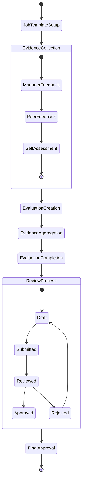
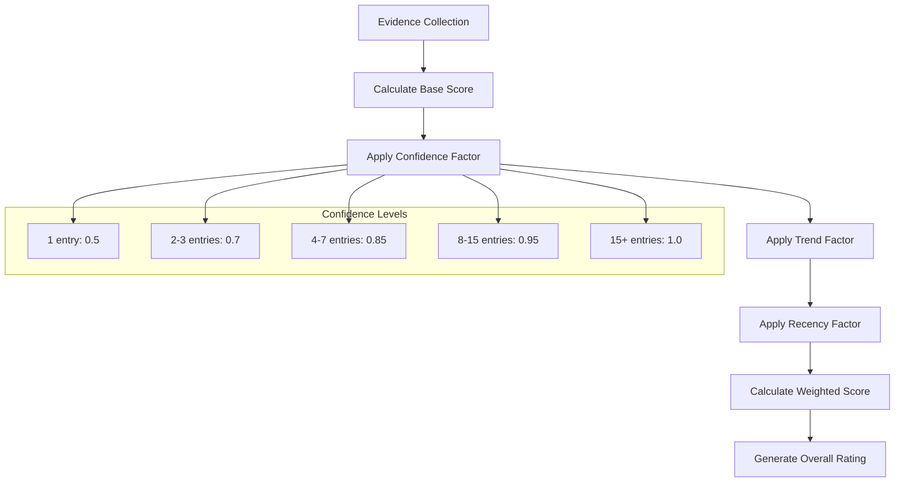
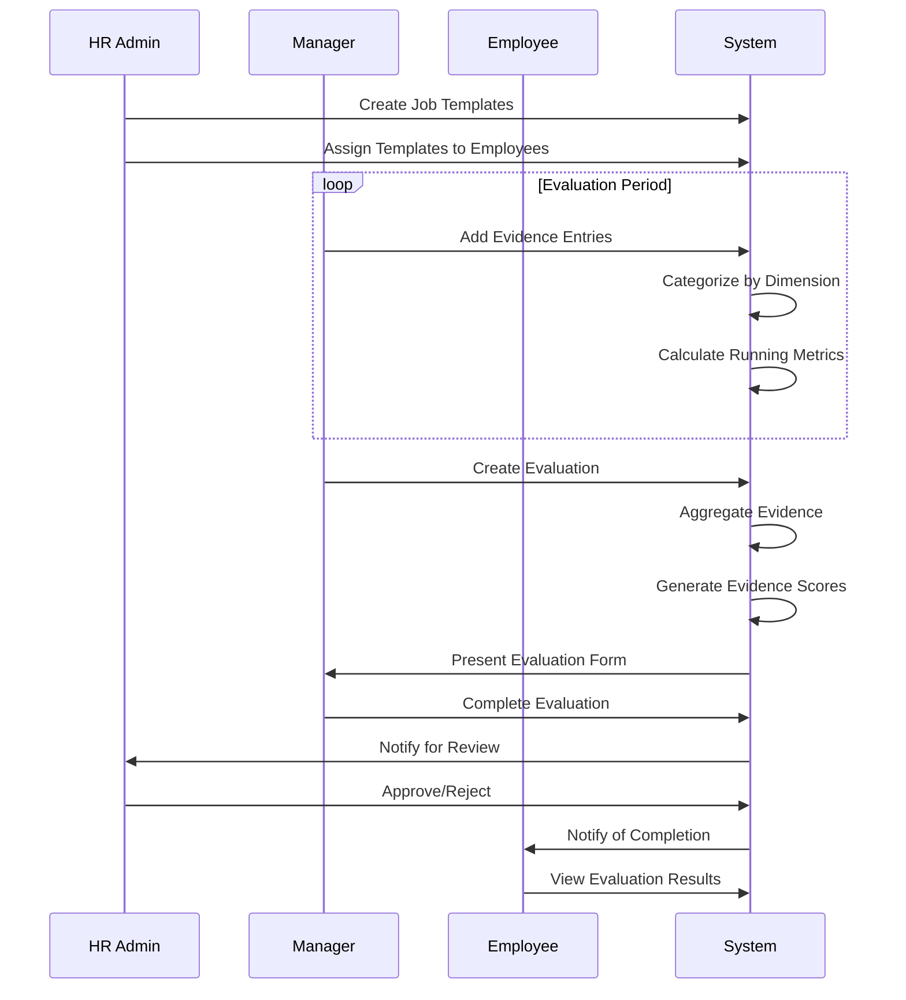
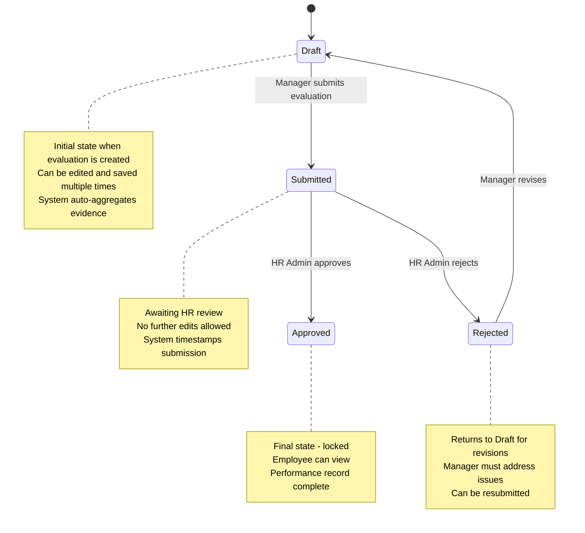
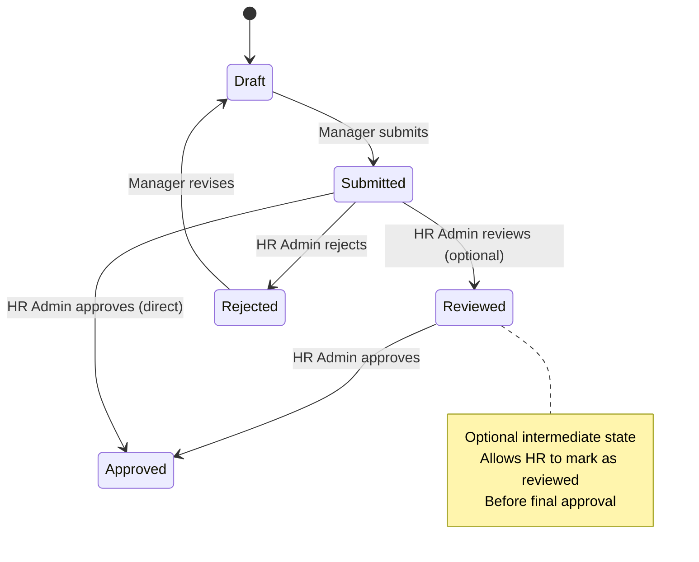

# Evaluation System Overview

The evaluation system in this web application is a sophisticated performance management framework that combines traditional job template-based evaluations with an innovative evidence-based approach. Here's a comprehensive breakdown:

## System Architecture

### Core Components

1. **Job Templates** ([`JobTemplate.php`](classes/JobTemplate.php:1))
   - Define evaluation criteria for different positions
   - Contain four key dimensions:
     - **KPIs** (Key Performance Indicators) - 30% weight
     - **Competencies** (Skills & Knowledge) - 25% weight
     - **Responsibilities** - 25% weight
     - **Company Values** - 20% weight

2. **Evidence-Based Evaluation** ([`Evaluation.php`](classes/Evaluation.php:1))
   - Aggregates evidence from the Growth Evidence Journal
   - Calculates scores using advanced algorithms with confidence factors
   - Provides data-driven insights for performance assessment

3. **Growth Evidence Journal** ([`GrowthEvidenceJournal.php`](classes/GrowthEvidenceJournal.php:1))
   - Collects continuous feedback throughout the evaluation period
   - Categorizes evidence into the same four dimensions as job templates
   - Uses star ratings (1-5) to quantify performance

## Evaluation Workflow

## Detailed Process Flow

### 1. Job Template Configuration
- HR Admin creates job templates at [`/admin/job_templates.php`](public/admin/job_templates.php:1)
- Each template defines evaluation criteria across four dimensions
- Templates are assigned to employees based on their positions

### 2. Evidence Collection Phase
- Managers continuously provide feedback through the Growth Evidence Journal
- Evidence is categorized into: responsibilities, KPIs, competencies, and values
- Each entry includes:
  - Star rating (1-5)
  - Detailed comments
  - Date of observation
  - Dimension classification

### 3. Evaluation Creation
- Evaluations are created at [`/evaluation/create.php`](public/evaluation/create.php:1)
- Requires selecting an employee and evaluation period
- System automatically aggregates evidence for the period
- Creates empty evaluation structure with job template dimensions

### 4. Evidence Aggregation
- System analyzes all evidence entries for the evaluation period
- Calculates enhanced metrics using:
  - **Confidence factors** based on sample size
  - **Trend factors** based on positive/negative ratios
  - **Recency factors** weighting recent entries more heavily
- Generates dimension-specific scores and overall rating

### 5. Evaluation Completion
- Evaluators review evidence-informed scores at [`/evaluation/edit.php`](public/evaluation/edit.php:1)
- Can adjust scores based on context and additional factors
- Add comments, strengths, development areas, and goals
- Submit for review

### 6. Review and Approval
- HR Admin reviews submitted evaluations
- Can approve, reject, or request changes
- Final approval locks the evaluation
- Employees can view their completed evaluations

## Evidence-Based Scoring Algorithm

The system uses a sophisticated scoring mechanism:

## Key Features

### Evidence Integration
- Automatically aggregates evidence from the journal
- Provides evidence-based score suggestions
- Shows confidence levels based on data quantity
- Allows drill-down to view individual evidence entries

### Dual Evaluation Modes
1. **Evidence-Based Mode**: Uses aggregated evidence data
2. **Traditional Mode**: Manual scoring based on job templates
- System seamlessly integrates both approaches
- Provides compatibility with existing evaluations

### Advanced Analytics
- Dimension coverage analysis
- Evidence quality metrics
- Trend analysis over time
- Performance indicators with confidence levels

## User Roles and Permissions

- **HR Admin**: Full access to create templates, manage evaluations, approve final evaluations
- **Manager**: Create evaluations for team members, provide evidence feedback, complete evaluations
- **Employee**: View own evaluations, receive feedback, track performance

## Data Flow

## Benefits of the System

1. **Continuous Feedback**: Moves away from annual reviews to ongoing performance management
2. **Data-Driven Decisions**: Uses actual performance evidence rather than subjective assessments
3. **Transparency**: Employees can see the evidence behind their evaluations
4. **Consistency**: Standardized evaluation criteria across the organization
5. **Development Focus**: Identifies strengths and areas for improvement with specific examples

This evaluation system represents a modern approach to performance management that balances structured evaluation criteria with flexible, evidence-based assessment, providing a more comprehensive and fair evaluation process.

# Evaluation System Analysis with Corrected State Diagram and RACI

After carefully reviewing the code, I've identified several inconsistencies in my previous analysis. Let me provide a corrected version with the actual state transitions and a proper RACI matrix.

## Corrected Evaluation State Diagram

## Key Inconsistencies Identified

1. **Missing "Reviewed" State**: The code references a 'reviewed' status with timestamp functionality, but there's no actual transition to this state in the UI or workflow logic.

2. **Direct Draft→Approved Transition**: There's no intermediate "Reviewed" state as shown in my initial diagram. The flow is Draft → Submitted → Approved.

3. **"Completed" State**: My initial diagram included a "completed" state that doesn't exist in the actual implementation.

4. **Missing "reviewed_at" Implementation**: The code sets a `reviewed_at` timestamp when status changes to 'reviewed', but this status is never actually used.

## Actual State Transitions

| From State | To State | Who Initiates | Code Location |
|------------|----------|---------------|---------------|
| Draft | Submitted | Manager | [`edit.php:195-200`](public/evaluation/edit.php:195) |
| Submitted | Approved | HR Admin | [`edit.php:201-206`](public/evaluation/edit.php:201) |
| Submitted | Rejected | HR Admin | [`edit.php:207-213`](public/evaluation/edit.php:207) |
| Rejected | Draft | System (automatic) | When manager reopens rejected evaluation |

## RACI Matrix

| Activity | HR Admin | Manager | Employee | System |
|----------|----------|---------|----------|---------|
| Create Job Templates | A | C | I | R |
| Assign Templates to Employees | A | I | I | R |
| Create Evaluation (Draft) | C | R | I | A |
| Collect Evidence | C | R | I | A |
| Aggregate Evidence | I | I | I | R |
| Complete Evaluation (Draft) | C | R | I | A |
| Submit Evaluation | A | R | I | C |
| Review Submitted Evaluation | R | I | I | C |
| Approve Evaluation | R | I | A | C |
| Reject Evaluation | R | A | I | C |
| View Final Evaluation | I | A | R | C |

**Legend:**
- **R** = Responsible (does the work)
- **A** = Accountable (owns the outcome)
- **C** = Consulted (provides input)
- **I** = Informed (kept up to date)

## Detailed Workflow with Actors

### 1. Setup Phase
- **HR Admin**: Creates job templates with evaluation criteria
- **System**: Auto-creates evaluations in 'Draft' status when triggered by managers

### 2. Evidence Collection Phase
- **Manager**: Continuously adds evidence entries throughout the period
- **System**: Aggregates evidence and calculates preliminary scores

### 3. Evaluation Completion
- **Manager**: Reviews evidence-based scores, adds comments, and submits evaluation
- **System**: Changes status from 'Draft' to 'Submitted', sets timestamp

### 4. Review and Approval
- **HR Admin**: Reviews submitted evaluation, can approve or reject
- **System**: Changes status to 'Approved' or 'Rejected', sets appropriate timestamps
- **Employee**: Informed when evaluation is approved, can view final results

## Critical Issues in Current Implementation

1. **Unused 'reviewed' Status**: The code has infrastructure for a 'reviewed' state but no UI or workflow to reach it.

2. **No Intermediate Review State**: Managers cannot mark evaluations as "reviewed" before HR approval, which might be useful in larger organizations.

3. **Missing 'Completed' State**: Once approved, evaluations remain in 'approved' state indefinitely rather than moving to a 'completed' state.

4. **Limited Rejection Workflow**: When rejected, evaluations return to draft but there's no formal mechanism to track what changes were made.

## Recommended State Diagram Fix

This corrected analysis shows the actual implementation rather than the theoretical workflow, highlighting where the code and intended workflow may have diverged.