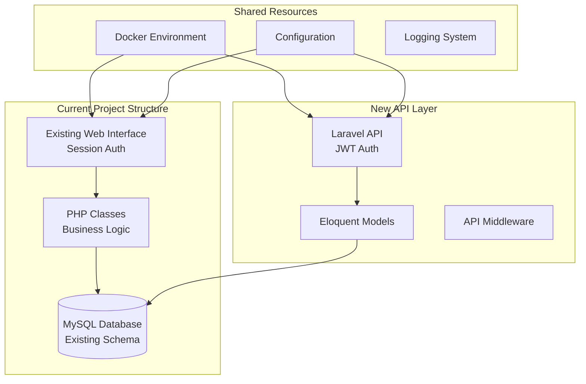

# Phase 1 Technical Specification: Laravel API Foundation Setup
## Employee Evaluation System API Migration

### Document Information
- **Version**: 1.0
- **Date**: June 27, 2025
- **Phase**: 1 - Foundation Setup (Weeks 1-4)
- **Status**: Draft for Review

---

## Table of Contents

1. [Executive Summary](#executive-summary)
2. [Project Structure Design](#project-structure-design)
3. [Database Migration Strategy](#database-migration-strategy)
4. [Authentication Architecture](#authentication-architecture)
5. [API Foundation Architecture](#api-foundation-architecture)
6. [Docker Environment Specification](#docker-environment-specification)
7. [Implementation Timeline](#implementation-timeline)
8. [Technical Requirements](#technical-requirements)
9. [Risk Assessment](#risk-assessment)
10. [Success Criteria](#success-criteria)

---

## Executive Summary

This document provides the comprehensive technical specification for Phase 1 of the API Migration Plan, focusing on establishing a solid Laravel API foundation within the existing project structure. The approach emphasizes backward compatibility, gradual migration, and minimal disruption to current operations.

### Key Objectives
- **Hybrid Architecture**: Implement Laravel API alongside existing PHP application
- **Data Preservation**: Convert existing schema to Laravel migrations without data loss
- **Dual Authentication**: JWT for API endpoints, sessions for existing web interface
- **Docker Integration**: Extend current Docker setup to support Laravel API
- **Foundation Setup**: Establish core API infrastructure for subsequent phases

### Architecture Overview



---

## Project Structure Design

### 1. Directory Structure

The new Laravel API will be integrated into the existing project structure as follows:

```
performance_evaluation_system/
├── api/                           # NEW: Laravel API Application
│   ├── app/
│   │   ├── Http/
│   │   │   ├── Controllers/
│   │   │   │   └── Api/
│   │   │   │       └── V1/
│   │   │   │           ├── AuthController.php
│   │   │   │           ├── UserController.php
│   │   │   │           ├── EmployeeController.php
│   │   │   │           ├── EvaluationController.php
│   │   │   │           ├── JobTemplateController.php
│   │   │   │           ├── KPIController.php
│   │   │   │           ├── CompetencyController.php
│   │   │   │           ├── CompanyValueController.php
│   │   │   │           ├── EvaluationPeriodController.php
│   │   │   │           └── ReportController.php
│   │   │   ├── Middleware/
│   │   │   │   ├── JwtAuthMiddleware.php
│   │   │   │   ├── RoleMiddleware.php
│   │   │   │   ├── ApiVersionMiddleware.php
│   │   │   │   └── CorsMiddleware.php
│   │   │   ├── Requests/
│   │   │   │   ├── Auth/
│   │   │   │   │   ├── LoginRequest.php
│   │   │   │   │   └── RefreshTokenRequest.php
│   │   │   │   ├── User/
│   │   │   │   │   ├── StoreUserRequest.php
│   │   │   │   │   └── UpdateUserRequest.php
│   │   │   │   ├── Employee/
│   │   │   │   │   ├── StoreEmployeeRequest.php
│   │   │   │   │   └── UpdateEmployeeRequest.php
│   │   │   │   └── Evaluation/
│   │   │   │       ├── StoreEvaluationRequest.php
│   │   │   │       ├── UpdateEvaluationRequest.php
│   │   │   │       └── SubmitEvaluationRequest.php
│   │   │   └── Resources/
│   │   │       ├── UserResource.php
│   │   │       ├── UserCollection.php
│   │   │       ├── EmployeeResource.php
│   │   │       ├── EmployeeCollection.php
│   │   │       ├── EvaluationResource.php
│   │   │       ├── EvaluationCollection.php
│   │   │       ├── JobTemplateResource.php
│   │   │       ├── KPIResource.php
│   │   │       ├── CompetencyResource.php
│   │   │       └── CompanyValueResource.php
│   │   ├── Models/
│   │   │   ├── User.php
│   │   │   ├── Employee.php
│   │   │   ├── Evaluation.php
│   │   │   ├── EvaluationPeriod.php
│   │   │   ├── JobPositionTemplate.php
│   │   │   ├── CompanyKPI.php
│   │   │   ├── Competency.php
│   │   │   ├── CompetencyCategory.php
│   │   │   ├── CompanyValue.php
│   │   │   ├── EvaluationKPIResult.php
│   │   │   ├── EvaluationCompetencyResult.php
│   │   │   ├── EvaluationResponsibilityResult.php
│   │   │   ├── EvaluationValueResult.php
│   │   │   └── AuditLog.php
│   │   ├── Services/
│   │   │   ├── AuthService.php
│   │   │   ├── UserService.php
│   │   │   ├── EmployeeService.php
│   │   │   ├── EvaluationService.php
│   │   │   ├── JobTemplateService.php
│   │   │   ├── ReportService.php
│   │   │   └── NotificationService.php
│   │   ├── Repositories/
│   │   │   ├── UserRepository.php
│   │   │   ├── EmployeeRepository.php
│   │   │   ├── EvaluationRepository.php
│   │   │   └── JobTemplateRepository.php
│   │   ├── Events/
│   │   │   ├── UserCreated.php
│   │   │   ├── EmployeeCreated.php
│   │   │   ├── EvaluationCreated.php
│   │   │   ├── EvaluationSubmitted.php
│   │   │   └── EvaluationApproved.php
│   │   ├── Listeners/
│   │   │   ├── SendWelcomeEmail.php
│   │   │   ├── LogUserActivity.php
│   │   │   └── NotifyManager.php
│   │   └── Exceptions/
│   │       ├── AuthenticationException.php
│   │       ├── AuthorizationException.php
│   │       ├── ValidationException.php
│   │       └── BusinessLogicException.php
│   ├── database/
│   │   ├── migrations/
│   │   │   ├── 2025_06_27_000001_create_users_table.php
│   │   │   ├── 2025_06_27_000002_create_employees_table.php
│   │   │   ├── 2025_06_27_000003_create_evaluation_periods_table.php
│   │   │   ├── 2025_06_27_000004_create_evaluations_table.php
│   │   │   ├── 2025_06_27_000005_create_job_position_templates_table.php
│   │   │   ├── 2025_06_27_000006_create_company_kpis_table.php
│   │   │   ├── 2025_06_27_000007_create_competency_categories_table.php
│   │   │   ├── 2025_06_27_000008_create_competencies_table.php
│   │   │   ├── 2025_06_27_000009_create_company_values_table.php
│   │   │   ├── 2025_06_27_000010_create_job_template_kpis_table.php
│   │   │   ├── 2025_06_27_000011_create_job_template_competencies_table.php
│   │   │   ├── 2025_06_27_000012_create_job_template_responsibilities_table.php
│   │   │   ├── 2025_06_27_000013_create_job_template_values_table.php
│   │   │   ├── 2025_06_27_000014_create_evaluation_kpi_results_table.php
│   │   │   ├── 2025_06_27_000015_create_evaluation_competency_results_table.php
│   │   │   ├── 2025_06_27_000016_create_evaluation_responsibility_results_table.php
│   │   │   ├── 2025_06_27_000017_create_evaluation_value_results_table.php
│   │   │   ├── 2025_06_27_000018_create_evaluation_section_weights_table.php
│   │   │   ├── 2025_06_27_000019_create_evaluation_comments_table.php
│   │   │   ├── 2025_06_27_000020_create_audit_log_table.php
│   │   │   ├── 2025_06_27_000021_create_system_settings_table.php
│   │   │   ├── 2025_06_27_000022_create_personal_access_tokens_table.php
│   │   │   └── 2025_06_27_000023_add_api_indexes.php
│   │   ├── seeders/
│   │   │   ├── DatabaseSeeder.php
│   │   │   ├── UserSeeder.php
│   │   │   ├── EmployeeSeeder.php
│   │   │   ├── CompanyKPISeeder.php
│   │   │   ├── CompetencySeeder.php
│   │   │   ├── CompanyValueSeeder.php
│   │   │   └── JobTemplateSeeder.php
│   │   └── factories/
│   │       ├── UserFactory.php
│   │       ├── EmployeeFactory.php
│   │       ├── EvaluationFactory.php
│   │       └── JobTemplateFactory.php
│   ├── routes/
│   │   ├── api.php
│   │   └── web.php
│   ├── tests/
│   │   ├── Feature/
│   │   │   ├── Auth/
│   │   │   │   ├── LoginTest.php
│   │   │   │   └── RefreshTokenTest.php
│   │   │   ├── User/
│   │   │   │   ├── UserManagementTest.php
│   │   │   │   └── UserAuthorizationTest.php
│   │   │   ├── Employee/
│   │   │   │   ├── EmployeeManagementTest.php
│   │   │   │   └── EmployeeHierarchyTest.php
│   │   │   └── Evaluation/
│   │   │       ├── EvaluationCRUDTest.php
│   │   │       ├── EvaluationWorkflowTest.php
│   │   │       └── EvaluationScoringTest.php
│   │   └── Unit/
│   │       ├── Services/
│   │       │   ├── AuthServiceTest.php
│   │       │   ├── EvaluationServiceTest.php
│   │       │   └── UserServiceTest.php
│   │       └── Models/
│   │           ├── UserTest.php
│   │           ├── EmployeeTest.php
│   │           └── EvaluationTest.php
│   ├── config/
│   │   ├── app.php
│   │   ├── database.php
│   │   ├── jwt.php
│   │   ├── cors.php
│   │   ├── api.php
│   │   └── logging.php
│   ├── storage/
│   │   ├── app/
│   │   ├── framework/
│   │   └── logs/
│   ├── bootstrap/
│   ├── public/
│   │   └── index.php
│   ├── .env.example
│   ├── .env
│   ├── artisan
│   ├── composer.json
│   ├── composer.lock
│   └── phpunit.xml
├── classes/                       # EXISTING: Current PHP Classes
│   ├── User.php                   # Keep for backward compatibility
│   ├── Employee.php               # Keep for backward compatibility
│   ├── Evaluation.php             # Keep for backward compatibility
│   ├── JobTemplate.php            # Keep for backward compatibility
│   └── ...                       # Other existing classes
├── public/                        # EXISTING: Current Web Interface
│   ├── dashboard.php              # Keep during transition
│   ├── login.php                  # Keep during transition
│   └── ...                       # Other existing pages
├── docker/                        # MODIFIED: Enhanced Docker Setup
│   ├── api/                       # NEW: Laravel API Container
│   │   ├── Dockerfile
│   │   ├── php.ini
│   │   └── nginx.conf
│   ├── web/                       # EXISTING: Current Web Container
│   │   ├── Dockerfile             # Modified to support both
│   │   ├── apache.conf
│   │   └── php.ini
│   └── scripts/                   # ENHANCED: Deployment Scripts
│       ├── setup-api.sh           # NEW: API setup script
│       ├── migrate-database.sh    # NEW: Migration script
│       └── ...                    # Existing scripts
├── docs/                          # ENHANCED: Documentation
│   ├── API_MIGRATION_PLAN.md      # EXISTING
│   ├── PHASE_1_TECHNICAL_SPECIFICATION.md  # THIS DOCUMENT
│   ├── API_DOCUMENTATION.md       # NEW: API docs
│   └── ...                        # Other docs
├── docker-compose.yml             # MODIFIED: Support both web and API
├── docker-compose.override.yml    # MODIFIED: Development overrides
└── .env.example                   # MODIFIED: Include API variables
```

### 2. Integration Strategy

#### Namespace Separation
- **Existing Classes**: Remain in global namespace for backward compatibility
- **Laravel Models**: Use `App\Models` namespace
- **API Controllers**: Use `App\Http\Controllers\Api\V1` namespace
- **Services**: Use `App\Services` namespace

#### Route Separation
- **Existing Web Routes**: Continue using current routing
- **API Routes**: Use `/api/v1/` prefix for all API endpoints
- **Documentation**: Auto-generated API docs at `/api/documentation`

---

## Database Migration Strategy

### 1. Migration Conversion Plan

#### Phase 1A: Core Tables Migration (Week 1)
Convert existing core tables to Laravel migrations while preserving data:

```php
// Example: 2025_06_27_000001_create_users_table.php
<?php

use Illuminate\Database\Migrations\Migration;
use Illuminate\Database\Schema\Blueprint;
use Illuminate\Support\Facades\Schema;

return new class extends Migration
{
    public function up()
    {
        // Check if table exists (from existing schema)
        if (!Schema::hasTable('users')) {
            Schema::create('users', function (Blueprint $table) {
                $table->id('user_id');
                $table->string('username', 50)->unique();
                $table->string('email', 100)->unique();
                $table->string('password_hash');
                $table->enum('role', ['hr_admin', 'manager', 'employee'])->default('employee');
                $table->boolean('is_active')->default(true);
                $table->timestamp('last_login')->nullable();
                $table->timestamps();
                
                // Indexes
                $table->index('username');
                $table->index('email');
                $table->index('role');
            });
        } else {
            // Table exists, ensure Laravel compatibility
            Schema::table('users', function (Blueprint $table) {
                // Add any missing columns for Laravel compatibility
                if (!Schema::hasColumn('users', 'email_verified_at')) {
                    $table->timestamp('email_verified_at')->nullable()->after('email');
                }
                if (!Schema::hasColumn('users', 'remember_token')) {
                    $table->rememberToken()->after('password_hash');
                }
            });
        }
    }

    public function down()
    {
        // Only drop if this migration created the table
        if (Schema::hasTable('users') && !$this->tableExistedBefore()) {
            Schema::dropIfExists('users');
        }
    }
    
    private function tableExistedBefore(): bool
    {
        // Check if table existed before this migration
        // Implementation depends on your migration tracking
        return true; // Assume existing tables should not be dropped
    }
};
```

#### Phase 1B: Junction Tables Migration (Week 2)
Convert job template relationship tables:

```php
// Example: 2025_06_27_000010_create_job_template_kpis_table.php
return new class extends Migration
{
    public function up()
    {
        if (!Schema::hasTable('job_template_kpis')) {
            Schema::create('job_template_kpis', function (Blueprint $table) {
                $table->id();
                $table->foreignId('job_template_id')->constrained('job_position_templates')->onDelete('cascade');
                $table->foreignId('kpi_id')->constrained('company_kpis')->onDelete('cascade');
                $table->decimal('target_value', 10, 2)->nullable();
                $table->decimal('weight_percentage', 5, 2);
                $table->timestamps();
                
                // Composite unique key
                $table->unique(['job_template_id', 'kpi_id']);
                
                // Indexes
                $table->index('job_template_id');
                $table->index('kpi_id');
            });
        }
    }
};
```

#### Phase 1C: API-Specific Tables (Week 2)
Add Laravel-specific tables for API functionality:

```php
// 2025_06_27_000022_create_personal_access_tokens_table.php
return new class extends Migration
{
    public function up()
    {
        Schema::create('personal_access_tokens', function (Blueprint $table) {
            $table->id();
            $table->morphs('tokenable');
            $table->string('name');
            $table->string('token', 64)->unique();
            $table->text('abilities')->nullable();
            $table->timestamp('last_used_at')->nullable();
            $table->timestamp('expires_at')->nullable();
            $table->timestamps();
            
            $table->index(['tokenable_type', 'tokenable_id']);
        });
    }
};
```

### 2. Data Preservation Strategy

#### Migration Execution Plan
1. **Backup Current Database**: Full backup before any migration
2. **Dry Run Migrations**: Test migrations on copy of production data
3. **Incremental Migration**: Run migrations in small batches
4. **Data Validation**: Verify data integrity after each migration
5. **Rollback Plan**: Prepared rollback scripts for each migration

#### Data Integrity Checks
```php
// Example validation script
class DatabaseIntegrityChecker
{
    public function validateUsersMigration()
    {
        $originalCount = DB::select("SELECT COUNT(*) as count FROM users")[0]->count;
        $newCount = User::count();
        
        if ($originalCount !== $newCount) {
            throw new Exception("User count mismatch: {$originalCount} vs {$newCount}");
        }
        
        // Validate critical fields
        $missingEmails = DB::select("
            SELECT COUNT(*) as count 
            FROM users 
            WHERE email IS NULL OR email = ''
        ")[0]->count;
        
        if ($missingEmails > 0) {
            throw new Exception("Found {$missingEmails} users with missing emails");
        }
    }
}
```

### 3. Model Relationships

#### Eloquent Model Definitions
```php
// app/Models/User.php
<?php

namespace App\Models;

use Illuminate\Foundation\Auth\User as Authenticatable;
use Illuminate\Database\Eloquent\Factories\HasFactory;
use Laravel\Sanctum\HasApiTokens;
use Tymon\JWTAuth\Contracts\JWTSubject;

class User extends Authenticatable implements JWTSubject
{
    use HasApiTokens, HasFactory;

    protected $primaryKey = 'user_id';
    
    protected $fillable = [
        'username',
        'email',
        'password_hash',
        'role',
        'is_active'
    ];

    protected $hidden = [
        'password_hash',
        'remember_token',
    ];

    protected $casts = [
        'is_active' => 'boolean',
        'last_login' => 'datetime',
        'email_verified_at' => 'datetime',
    ];

    // JWT Methods
    public function getJWTIdentifier()
    {
        return $this->getKey();
    }

    public function getJWTCustomClaims()
    {
        return [
            'role' => $this->role,
            'employee_id' => $this->employee?->employee_id,
            'username' => $this->username
        ];
    }

    // Relationships
    public function employee()
    {
        return $this->hasOne(Employee::class, 'user_id', 'user_id');
    }

    public function createdEvaluations()
    {
        return $this->hasMany(Evaluation::class, 'evaluator_id', 'user_id');
    }

    public function auditLogs()
    {
        return $this->hasMany(AuditLog::class, 'user_id', 'user_id');
    }

    // Scopes
    public function scopeActive($query)
    {
        return $query->where('is_active', true);
    }

    public function scopeByRole($query, $role)
    {
        return $query->where('role', $role);
    }
}
```

```php
// app/Models/Employee.php
<?php

namespace App\Models;

use Illuminate\Database\Eloquent\Factories\HasFactory;
use Illuminate\Database\Eloquent\Model;
use Illuminate\Database\Eloquent\SoftDeletes;

class Employee extends Model
{
    use HasFactory;

    protected $primaryKey = 'employee_id';
    
    protected $fillable = [
        'user_id',
        'employee_number',
        'first_name',
        'last_name',
        'position',
        'department',
        'manager_id',
        'job_template_id',
        'hire_date',
        'phone',
        'address',
        'active'
    ];

    protected $casts = [
        'hire_date' => 'date',
        'active' => 'boolean',
    ];

    // Relationships
    public function user()
    {
        return $this->belongsTo(User::class, 'user_id', 'user_id');
    }

    public function manager()
    {
        return $this->belongsTo(Employee::class, 'manager_id', 'employee_id');
    }

    public function directReports()
    {
        return $this->hasMany(Employee::class, 'manager_id', 'employee_id');
    }

    public function jobTemplate()
    {
        return $this->belongsTo(JobPositionTemplate::class, 'job_template_id', 'id');
    }

    public function evaluations()
    {
        return $this->hasMany(Evaluation::class, 'employee_id', 'employee_id');
    }

    public function managedEvaluations()
    {
        return $this->hasMany(Evaluation::class, 'manager_id', 'employee_id');
    }

    // Accessors
    public function getFullNameAttribute()
    {
        return "{$this->first_name} {$this->last_name}";
    }

    // Scopes
    public function scopeActive($query)
    {
        return $query->where('active', true);
    }

    public function scopeByDepartment($query, $department)
    {
        return $query->where('department', $department);
    }

    public function scopeManagers($query)
    {
        return $query->whereHas('directReports');
    }
}
```

---

## Authentication Architecture

### 1. Dual Authentication System

#### JWT Authentication for API
```php
// app/Services/AuthService.php
<?php

namespace App\Services;

use App\Models\User;
use Illuminate\Support\Facades\Hash;
use Tymon\JWTAuth\Facades\JWTAuth;
use App\Exceptions\AuthenticationException;

class AuthService
{
    public function login(string $username, string $password): array
    {
        $user = User::where('username', $username)
                   ->where('is_active', true)
                   ->first();

        if (!$user || !Hash::check($password, $user->password_hash)) {
            throw new AuthenticationException('Invalid credentials');
        }

        $token = JWTAuth::fromUser($user);
        $refreshToken = $this->generateRefreshToken($user);

        return [
            'access_token' => $token,
            'refresh_token' => $refreshToken,
            'token_type' => 'bearer',
            'expires_in' => config('jwt.ttl') * 60,
            'user' => [
                'id' => $user->user_id,
                'username' => $user->username,
                'email' => $user->email,
                'role' => $user->role,
                'employee' => $user->employee ? [
                    'id' => $user->employee->employee_id,
                    'full_name' => $user->employee->full_name,
                    'position' => $user->employee->position,
                    'department' => $user->employee->department
                ] : null
            ]
        ];
    }

    public function refreshToken(string $refreshToken): array
    {
        $user = $this->validateRefreshToken($refreshToken);
        $newToken = JWTAuth::fromUser($user);
        
        return [
            'access_token' => $newToken,
            'token_type' => 'bearer',
            'expires_in' => config('jwt.ttl') * 60
        ];
    }

    public function logout(): bool
    {
        try {
            JWTAuth::invalidate(JWTAuth::getToken());
            return true;
        } catch (\Exception $e) {
            return false;
        }
    }

    private function generateRefreshToken(User $user): string
    {
        return $user->createToken('refresh-token', ['refresh'], now()->addDays(7))->plainTextToken;
    }

    private function validateRefreshToken(string $token): User
    {
        $accessToken = \Laravel\Sanctum\PersonalAccessToken::findToken($token);
        
        if (!$accessToken || !$accessToken->can('refresh') || $accessToken->expires_at < now()) {
            throw new AuthenticationException('Invalid refresh token');
        }

        return $accessToken->tokenable;
    }
}
```

#### Session Authentication Compatibility
```php
// app/Http/Middleware/DualAuthMiddleware.php
<?php

namespace App\Http\Middleware;

use Closure;
use Illuminate\Http\Request;
use Tymon\JWTAuth\Facades\JWTAuth;

class DualAuthMiddleware
{
    public function handle(Request $request, Closure $next)
    {
        // Check for API authentication (JWT)
        if ($request->is('api/*')) {
            return $this->handleApiAuth($request, $next);
        }
        
        // Check for web authentication (Session)
        if ($request->is('public/*') || $request->is('admin/*') || $request->is('employees/*')) {
            return $this->handleWebAuth($request, $next);
        }

        return $next($request);
    }

    private function handleApiAuth(Request $request, Closure $next)
    {
        try {
            $user = JWTAuth::parseToken()->authenticate();
            
            if (!$user) {
                return response()->json([
                    'success' => false,
                    'error' => [
                        'code' => 'TOKEN_INVALID',
                        'message' => 'Token is invalid'
                    ]
                ], 401);
            }

            $request->merge(['auth_user' => $user]);
            return $next($request);
            
        } catch (\Exception $e) {
            return response()->json([
                'success' => false,
                'error' => [
                    'code' => 'TOKEN_REQUIRED',
                    'message' => 'Token is required'
                ]
            ], 401);
        }
    }

    private function handleWebAuth(Request $request, Closure $next)
    {
        // Use existing session authentication
        session_start();
        
        if (!isset($_SESSION['user_id'])) {
            header('Location: /login.php');
            exit;
        }

        return $next($request);
    }
}
```

### 2. Role-Based Access Control

#### Permission System
```php
// app/Http/Middleware/RoleMiddleware.php
<?php

namespace App\Http\Middleware;

use Closure;
use Illuminate\Http\Request;

class RoleMiddleware
{
    private $permissions = [
        'hr_admin' => [
            'users.*',
            'employees.*',
            'evaluations.*',
            'job-templates.*',
            'kpis.*',
            'competencies.*',
            'company-values.*',
            'evaluation-periods.*',
            'reports.*'
        ],
        'manager' => [
            'employees.view',
            'employees.team',
            'evaluations.view',
            'evaluations.create',
            'evaluations.update',
            'evaluations.approve',
            'reports.team'
        ],
        'employee' => [
            'employees.view_own',
            'evaluations.view_own',
            'evaluations.update_own'
        ]
    