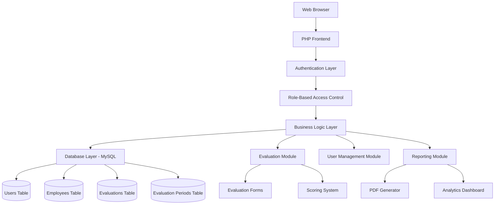
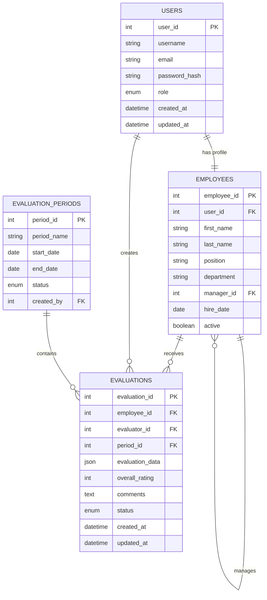

# PHP Performance Evaluation System - Technical Specification

## Project Overview

A comprehensive web-based employee performance evaluation system that digitizes paper-based evaluation processes. The system provides user authentication, role-based access control, flexible evaluation cycles, and automated reporting capabilities.

## System Requirements

### Functional Requirements

#### 1. User Management & Authentication
- **Three-tier role system:**
  - **HR Admin**: Full system access, user management, evaluation oversight
  - **Manager**: Create/edit evaluations for direct reports, view team performance
  - **Employee**: View own evaluations and performance history
- **Secure login system** with session management
- **Password reset functionality**
- **User profile management**

#### 2. Employee Management
- **Employee database** with organizational hierarchy
- **Department and team assignments**
- **Manager-employee relationships**
- **Employee profile information**

#### 3. Evaluation System
- **Digital replica** of current evaluation template with:
  - Expected Results scoring
  - Skills, Knowledge, and Competencies assessment
  - Key Responsibilities evaluation
  - Living Our Values assessment
  - Overall rating system (1-5 scale)
- **Flexible evaluation periods** (monthly, quarterly, annual, custom)
- **Draft saving capability**
- **Evaluation history tracking**

#### 4. Reporting & Analytics
- **PDF generation** matching current template format
- **Performance dashboards** for managers and HR
- **Evaluation status tracking**
- **Performance trends over time**

### Technical Requirements
- **Backend**: PHP 7.4+
- **Database**: MySQL 8.0+
- **Frontend**: HTML5, CSS3, JavaScript
- **PDF Generation**: TCPDF or similar library
- **Security**: Prepared statements, password hashing, session security

## System Architecture

### High-Level Architecture



### Database Schema



### Detailed Database Design

#### Users Table
```sql
CREATE TABLE users (
    user_id INT AUTO_INCREMENT PRIMARY KEY,
    username VARCHAR(50) UNIQUE NOT NULL,
    email VARCHAR(100) UNIQUE NOT NULL,
    password_hash VARCHAR(255) NOT NULL,
    role ENUM('hr_admin', 'manager', 'employee') NOT NULL,
    created_at TIMESTAMP DEFAULT CURRENT_TIMESTAMP,
    updated_at TIMESTAMP DEFAULT CURRENT_TIMESTAMP ON UPDATE CURRENT_TIMESTAMP
);
```

#### Employees Table
```sql
CREATE TABLE employees (
    employee_id INT AUTO_INCREMENT PRIMARY KEY,
    user_id INT UNIQUE,
    first_name VARCHAR(50) NOT NULL,
    last_name VARCHAR(50) NOT NULL,
    position VARCHAR(100),
    department VARCHAR(100),
    manager_id INT,
    hire_date DATE,
    active BOOLEAN DEFAULT TRUE,
    FOREIGN KEY (user_id) REFERENCES users(user_id),
    FOREIGN KEY (manager_id) REFERENCES employees(employee_id)
);
```

#### Evaluation Periods Table
```sql
CREATE TABLE evaluation_periods (
    period_id INT AUTO_INCREMENT PRIMARY KEY,
    period_name VARCHAR(100) NOT NULL,
    start_date DATE NOT NULL,
    end_date DATE NOT NULL,
    status ENUM('active', 'completed', 'draft') DEFAULT 'draft',
    created_by INT,
    created_at TIMESTAMP DEFAULT CURRENT_TIMESTAMP,
    FOREIGN KEY (created_by) REFERENCES users(user_id)
);
```

#### Evaluations Table
```sql
CREATE TABLE evaluations (
    evaluation_id INT AUTO_INCREMENT PRIMARY KEY,
    employee_id INT NOT NULL,
    evaluator_id INT NOT NULL,
    period_id INT NOT NULL,
    evaluation_data JSON,
    overall_rating INT CHECK (overall_rating BETWEEN 1 AND 5),
    comments TEXT,
    status ENUM('draft', 'submitted', 'approved') DEFAULT 'draft',
    created_at TIMESTAMP DEFAULT CURRENT_TIMESTAMP,
    updated_at TIMESTAMP DEFAULT CURRENT_TIMESTAMP ON UPDATE CURRENT_TIMESTAMP,
    FOREIGN KEY (employee_id) REFERENCES employees(employee_id),
    FOREIGN KEY (evaluator_id) REFERENCES users(user_id),
    FOREIGN KEY (period_id) REFERENCES evaluation_periods(period_id)
);
```

## File Structure

```
performance_evaluation_system/
├── config/
│   ├── database.php          # Database configuration
│   └── config.php           # Application configuration
├── includes/
│   ├── auth.php             # Authentication functions
│   ├── functions.php        # Utility functions
│   └── db_connection.php    # Database connection
├── classes/
│   ├── User.php             # User management class
│   ├── Employee.php         # Employee management class
│   ├── Evaluation.php       # Evaluation handling class
│   └── Report.php           # Report generation class
├── public/
│   ├── index.php            # Landing page
│   ├── login.php            # Login page
│   ├── dashboard.php        # Main dashboard
│   ├── evaluation/
│   │   ├── create.php       # Create new evaluation
│   │   ├── edit.php         # Edit existing evaluation
│   │   └── view.php         # View evaluation details
│   ├── admin/
│   │   ├── users.php        # User management
│   │   ├── employees.php    # Employee management
│   │   └── periods.php      # Evaluation period management
│   └── assets/
│       ├── css/
│       │   └── style.css    # Main stylesheet
│       ├── js/
│       │   └── app.js       # JavaScript functionality
│       └── images/          # Image assets
├── templates/
│   ├── header.php           # Common header
│   ├── footer.php           # Common footer
│   └── navigation.php       # Navigation menu
├── reports/
│   └── pdf_generator.php    # PDF report generation
└── sql/
    └── database_setup.sql   # Database initialization script
```

## Core Features Implementation

### 1. Authentication System
- **Login/Logout functionality**
- **Session management** with timeout
- **Password hashing** using PHP's `password_hash()`
- **Role-based access control**

### 2. Evaluation Form System
- **Dynamic form generation** based on evaluation template
- **Real-time validation** and scoring calculation
- **Auto-save functionality** for drafts
- **Progress indicators**

### 3. User Interface Components
- **Responsive design** for mobile and desktop compatibility
- **Dashboard widgets** showing relevant information per role
- **Intuitive navigation** based on user permissions
- **Form validation** with user-friendly error messages

### 4. Security Implementation
- **SQL injection prevention** using prepared statements
- **XSS protection** with input sanitization
- **CSRF protection** for all forms
- **Secure session handling**
- **Input validation** and sanitization

## Evaluation Template Structure

Based on the provided templates, the evaluation form includes:

### 1. Expected Results (Weighted scoring)
- Multiple criteria with individual ratings
- Percentage-based weighting system
- Comments section for each criterion

### 2. Skills, Knowledge, and Competencies
- Technical skills assessment
- Soft skills evaluation
- Competency-based scoring

### 3. Key Responsibilities
- Job-specific responsibility evaluation
- Performance against defined objectives
- Achievement measurement

### 4. Living Our Values
- Company values alignment assessment
- Behavioral indicators
- Cultural fit evaluation

### 5. Overall Rating System
- 1-5 scale rating
- Weighted average calculation
- Final performance categorization

## Development Phases

### Phase 1: Foundation (Week 1-2)
- Database setup and configuration
- User authentication system
- Basic user interface structure
- Role-based access control

### Phase 2: Core Functionality (Week 3-4)
- Employee management system
- Evaluation form creation
- Basic CRUD operations
- Draft saving functionality

### Phase 3: Advanced Features (Week 5-6)
- Evaluation period management
- Reporting system
- PDF generation
- Dashboard implementation

### Phase 4: Enhancement (Week 7-8)
- Advanced analytics
- Email notifications
- Bulk operations
- Performance optimization

### Phase 5: Testing & Deployment (Week 9-10)
- Comprehensive testing
- Security audit
- Documentation completion
- Deployment preparation

## Security Considerations

### Data Protection
- **Sensitive data encryption**
- **Secure password storage**
- **Access logging and audit trails**
- **Regular security updates**

### Access Control
- **Role-based permissions**
- **Session timeout management**
- **Failed login attempt monitoring**
- **Privilege escalation prevention**

### Input Validation
- **Server-side validation** for all inputs
- **SQL injection prevention**
- **XSS attack mitigation**
- **File upload security** (if implemented)

## Performance Considerations

### Database Optimization
- **Proper indexing** on frequently queried columns
- **Query optimization** for complex reports
- **Connection pooling** for high-traffic scenarios
- **Regular maintenance** and cleanup procedures

### Caching Strategy
- **Session caching** for user data
- **Query result caching** for reports
- **Static asset caching** for improved load times

## Deployment Requirements

### Server Requirements
- **PHP 7.4+** with required extensions
- **MySQL 8.0+** or compatible database
- **Web server** (Apache/Nginx)
- **SSL certificate** for secure connections

### Configuration
- **Environment-specific configuration** files
- **Database connection parameters**
- **Email server configuration** (for notifications)
- **Backup and recovery procedures**

## Maintenance and Support

### Regular Maintenance
- **Database backups** (daily/weekly)
- **Security updates** and patches
- **Performance monitoring**
- **Log file management**

### User Support
- **User manual** and documentation
- **Training materials** for administrators
- **Help desk procedures**
- **System monitoring** and alerting

## Future Enhancements

### Potential Features
- **Mobile application** for on-the-go access
- **Integration** with existing HR systems
- **Advanced analytics** and reporting
- **Goal setting** and tracking functionality
- **360-degree feedback** system
- **Performance improvement** planning tools

This specification provides a comprehensive foundation for developing a robust PHP-based performance evaluation system that meets modern web application standards while addressing the specific needs of employee performance management.