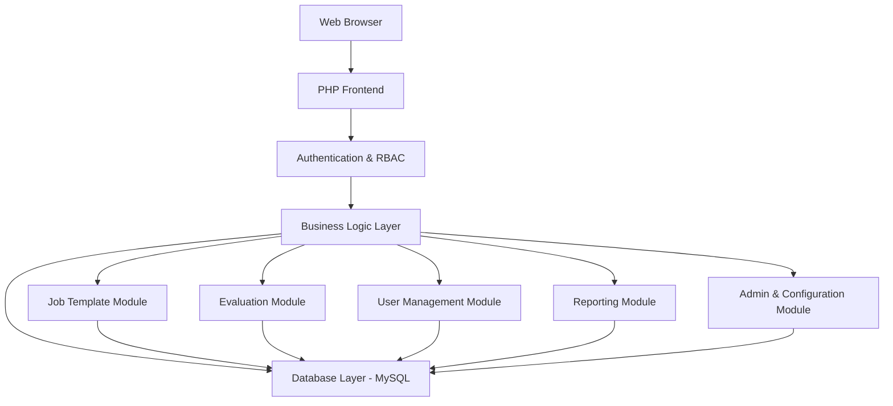

# PHP Performance Evaluation System - Technical Specification

## 1. Project Overview

This document outlines the technical specification for a comprehensive, web-based employee performance evaluation system. The application is designed to replace traditional paper-based evaluation processes with a robust, data-driven platform. It provides user authentication, a flexible role-based access control system, customizable evaluation cycles, and a sophisticated framework for managing performance metrics through job templates.

The system is built on a modular architecture that allows for future expansion and integration with other HR systems. It is designed to be a central hub for all performance-related data, providing valuable insights to employees, managers, and HR administrators.

**Key Innovation: Job Template-Based Evaluations**
The system uses a revolutionary job template approach where evaluations are dynamically generated based on the employee's assigned job template, ensuring role-specific and relevant performance assessments.

## 2. System Requirements

### Functional Requirements

#### 2.1. User Management & Authentication
- **Three-tier role system:**
  - **HR Admin**: Full system access, including user management, system configuration, and oversight of all evaluations.
  - **Manager**: Can create and edit evaluations for their direct reports, view team performance dashboards, and track their team's progress.
  - **Employee**: Can view their own evaluations, track their performance history, and manage their personal profile.
- **Secure login system** with session management and password hashing.
- **Password reset functionality**.
- **User profile management**.

#### 2.2. Employee Management
- **Centralized employee database** with a clear organizational hierarchy.
- **Department and team assignments**.
- **Manager-employee relationships**.
- **Job template assignment** to standardize roles and responsibilities.

#### 2.3. Job Position Templates (Core Innovation)
- **Central repository of job templates**, managed by HR Admins.
- Each template defines a specific role and includes:
  - A list of **key responsibilities** with individual weights.
  - A set of **Key Performance Indicators (KPIs)** with target values and weights.
  - A list of required **competencies** with desired proficiency levels and weights.
  - The **company values** that are most relevant to the role with weights.
- **Dynamic weighting system** for each component to allow for customized scoring.
- **Template versioning** to maintain evaluation consistency over time.

#### 2.4. Performance Metrics Management
- **Company KPIs Catalog:** A central directory of all company-wide KPIs, managed by HR Admins.
- **Competency Catalog:** A comprehensive list of skills and competencies, organized into categories.
- **Company Values:** A defined set of company values that can be used in evaluations.
- **Hierarchical categorization** for better organization and management.

#### 2.5. Dynamic Evaluation System
- **Template-driven evaluation forms** generated based on the employee's assigned job template.
- **Real-time evaluation creation** with progressive saving capabilities.
- **Structured data collection** for KPIs, competencies, responsibilities, and values.
- **Automated scoring** based on the predefined weights and achieved results.
- **Draft saving capability** and a clear workflow (draft, submitted, reviewed, approved).
- **Section-specific feedback** with detailed comments for each evaluation component.

#### 2.6. Reporting & Analytics
- **PDF generation** of evaluation summaries.
- **Performance dashboards** tailored to each user role.
- **Evaluation status tracking** and performance trend analysis.
- **Template-based analytics** for better insights into role-specific performance.
- **Audit trail** for all significant actions within the system.

### Technical Requirements
- **Backend**: PHP 7.4+
- **Database**: MySQL 8.0+
- **Frontend**: HTML5, CSS3, JavaScript (ES6+)
- **Security**: Prepared statements, password hashing, XSS/CSRF protection, and secure session management.

## 3. System Architecture

### High-Level Architecture



### Enhanced Database Schema

```mermaid
erDiagram
    USERS {
        int user_id PK
        string username
        string email
        string password_hash
        enum role
    }

    EMPLOYEES {
        int employee_id PK
        int user_id FK
        string first_name
        string last_name
        int manager_id FK
        int job_template_id FK
    }

    JOB_POSITION_TEMPLATES {
        int id PK
        string position_title
        string department
        text description
        boolean is_active
    }

    COMPANY_KPIS {
        int id PK
        string kpi_name
        string measurement_unit
        string category
        boolean is_active
    }

    COMPETENCIES {
        int id PK
        string competency_name
        string competency_type
        int category_id FK
        boolean is_active
    }

    COMPANY_VALUES {
        int id PK
        string value_name
        text description
        int sort_order
        boolean is_active
    }

    EVALUATION_PERIODS {
        int period_id PK
        string period_name
        date start_date
        date end_date
        enum status
    }

    EVALUATIONS {
        int evaluation_id PK
        int employee_id FK
        int evaluator_id FK
        int period_id FK
        int job_template_id FK
        decimal overall_rating
        enum status
    }

    JOB_TEMPLATE_KPIS {
        int id PK
        int job_template_id FK
        int kpi_id FK
        decimal target_value
        decimal weight_percentage
    }

    JOB_TEMPLATE_COMPETENCIES {
        int id PK
        int job_template_id FK
        int competency_id FK
        enum required_level
        decimal weight_percentage
    }

    JOB_TEMPLATE_RESPONSIBILITIES {
        int id PK
        int job_template_id FK
        text responsibility_text
        int sort_order
        decimal weight_percentage
    }

    JOB_TEMPLATE_VALUES {
        int id PK
        int job_template_id FK
        int value_id FK
        decimal weight_percentage
    }

    EVALUATION_KPI_RESULTS {
        int id PK
        int evaluation_id FK
        int kpi_id FK
        decimal target_value
        decimal achieved_value
        decimal score
        text comments
    }

    EVALUATION_COMPETENCY_RESULTS {
        int id PK
        int evaluation_id FK
        int competency_id FK
        enum required_level
        enum achieved_level
        decimal score
        text comments
    }

    EVALUATION_RESPONSIBILITY_RESULTS {
        int id PK
        int evaluation_id FK
        int responsibility_id FK
        decimal score
        text comments
    }

    EVALUATION_VALUE_RESULTS {
        int id PK
        int evaluation_id FK
        int value_id FK
        decimal score
        text comments
    }

    EVALUATION_SECTION_WEIGHTS {
        int id PK
        int evaluation_id FK
        enum section_type
        decimal weight_percentage
    }

    USERS ||--|{ EMPLOYEES : "has"
    USERS ||--|{ EVALUATIONS : "creates"
    EMPLOYEES ||--o{ EVALUATIONS : "is evaluated in"
    EMPLOYEES ||--o{ EMPLOYEES : "manages"
    JOB_POSITION_TEMPLATES ||--|{ EMPLOYEES : "is assigned"
    JOB_POSITION_TEMPLATES ||--|{ EVALUATIONS : "is based on"
    EVALUATION_PERIODS ||--|{ EVALUATIONS : "occurs in"

    JOB_POSITION_TEMPLATES ||--|{ JOB_TEMPLATE_KPIS : "has"
    COMPANY_KPIS ||--|{ JOB_TEMPLATE_KPIS : "is assigned via"
    JOB_POSITION_TEMPLATES ||--|{ JOB_TEMPLATE_COMPETENCIES : "has"
    COMPETENCIES ||--|{ JOB_TEMPLATE_COMPETENCIES : "is assigned via"
    JOB_POSITION_TEMPLATES ||--|{ JOB_TEMPLATE_RESPONSIBILITIES : "has"
    JOB_POSITION_TEMPLATES ||--|{ JOB_TEMPLATE_VALUES : "has"
    COMPANY_VALUES ||--|{ JOB_TEMPLATE_VALUES : "is assigned via"

    EVALUATIONS ||--|{ EVALUATION_KPI_RESULTS : "has"
    COMPANY_KPIS ||--|{ EVALUATION_KPI_RESULTS : "is measured in"
    EVALUATIONS ||--|{ EVALUATION_COMPETENCY_RESULTS : "has"
    COMPETENCIES ||--|{ EVALUATION_COMPETENCY_RESULTS : "is measured in"
    EVALUATIONS ||--|{ EVALUATION_RESPONSIBILITY_RESULTS : "has"
    JOB_TEMPLATE_RESPONSIBILITIES ||--|{ EVALUATION_RESPONSIBILITY_RESULTS : "is measured in"
    EVALUATIONS ||--|{ EVALUATION_VALUE_RESULTS : "has"
    COMPANY_VALUES ||--|{ EVALUATION_VALUE_RESULTS : "is measured in"
    EVALUATIONS ||--|{ EVALUATION_SECTION_WEIGHTS : "has"
```



## 4. File Structure

```
performance_evaluation_system/
├── config/
│   ├── database.php
│   └── config.php
├── includes/
│   ├── auth.php
│   └── db_connection.php
├── classes/
│   ├── User.php
│   ├── Employee.php
│   ├── Evaluation.php (Enhanced with job template support)
│   ├── EvaluationPeriod.php
│   ├── JobTemplate.php (Core new class)
│   ├── CompanyKPI.php
│   ├── Competency.php
│   └── CompanyValues.php
├── public/
│   ├── index.php
│   ├── login.php
│   ├── dashboard.php
│   ├── evaluation/
│   │   ├── create.php
│   │   ├── edit.php (Completely rewritten for job templates)
│   │   ├── view.php
│   │   └── list.php
│   ├── admin/
│   │   ├── job_templates.php (New comprehensive interface)
│   │   ├── kpis.php
│   │   ├── competencies.php
│   │   ├── values.php
│   │   └── periods.php
│   └── assets/
│       ├── css/
│       └── js/
├── templates/
│   ├── header.php
│   └── footer.php
├── sql/
│   ├── database_setup.sql
│   ├── job_templates_structure.sql
│   └── migrations/
│       ├── 2025_06_22_080000_remove_old_evaluation_fields.sql
│       └── 2025_06_22_081000_create_new_evaluation_system.sql
└── docs/
    ├── PROJECT_SPECIFICATION.md
    ├── ARCHITECTURE_DESIGN.md
    └── EVALUATION_SYSTEM_MIGRATION_PLAN.md
```

## 5. Core Features Implementation

### 5.1. Job Template-Based Evaluations (Revolutionary Approach)

The core innovation of the system is the use of job templates to dynamically generate evaluations. When an evaluation is created, the system:

1. **Retrieves the employee's assigned job template**
2. **Dynamically generates the evaluation form** with the correct:
   - KPIs with target values and weights
   - Competencies with required levels and weights
   - Responsibilities with descriptions and weights
   - Company values with weights
3. **Creates structured evaluation records** for each component
4. **Calculates weighted scores** based on template configuration

### 5.2. Dynamic Scoring and Weighting

Each section of the evaluation has configurable weights that are set in the job template:
- **KPIs Section**: Typically 40% (configurable)
- **Competencies Section**: Typically 25% (configurable)
- **Responsibilities Section**: Typically 25% (configurable)
- **Values Section**: Typically 10% (configurable)

The final score is a weighted average of the scores from each section, providing a nuanced and fair assessment of performance.

### 5.3. Real-Time Evaluation Interface

The new evaluation interface provides:
- **Progressive saving** of individual components
- **Real-time progress tracking** with completion percentage
- **Dynamic score calculation** as evaluations are completed
- **Section-specific feedback** with detailed comments
- **Visual indicators** for completion status and scores

### 5.4. Enhanced Security

- **SQL Injection Prevention:** All database queries are executed using prepared statements.
- **XSS Protection:** All output is properly escaped using `htmlspecialchars()`.
- **CSRF Protection:** Forms are protected with CSRF tokens.
- **Secure Session Handling:** Sessions are managed securely, with timeouts and other best practices.
- **Role-based access control** with granular permissions.

## 6. API and Integration Points

### 6.1. Evaluation Management API

```php
// Core evaluation methods
public function createFromJobTemplate(int $employeeId, int $periodId, int $evaluatorId): int;
public function getJobTemplateEvaluation(int $evaluationId): array;
public function updateKPIResult(int $evaluationId, int $kpiId, array $data): bool;
public function updateCompetencyResult(int $evaluationId, int $competencyId, array $data): bool;
public function updateResponsibilityResult(int $evaluationId, int $responsibilityId, array $data): bool;
public function updateValueResult(int $evaluationId, int $valueId, array $data): bool;
public function calculateTemplateBasedScore(int $evaluationId): float;
```

### 6.2. Job Template Management API

```php
// Job template methods
public function getCompleteJobTemplate(int $templateId): array;
public function addKPIToTemplate(int $templateId, int $kpiId, float $targetValue, float $weight): bool;
public function addCompetencyToTemplate(int $templateId, int $competencyId, string $level, float $weight): bool;
public function addResponsibilityToTemplate(int $templateId, string $text, int $order, float $weight): bool;
public function addValueToTemplate(int $templateId, int $valueId, float $weight): bool;
```

## 7. Performance and Scalability

### 7.1. Database Optimization
- **Proper indexing** on all foreign keys and frequently queried fields
- **Normalized data structure** for better performance and data integrity
- **Efficient queries** with proper JOIN operations
- **Connection pooling** for better resource management

### 7.2. Caching Strategy
- **Template caching** for frequently accessed job templates
- **Session-based caching** for user-specific data
- **Query result caching** for static reference data

### 7.3. Scalability Considerations
- **Modular architecture** allows for horizontal scaling
- **Stateless design** enables load balancing
- **Database replication** support for read scaling
- **API-ready architecture** for future integrations

## 8. Future Enhancements

### 8.1. Advanced Features
- **360-Degree Feedback:** Allow for peer and subordinate feedback in addition to manager evaluations.
- **Goal Setting Integration:** A dedicated module for setting and tracking personal and team goals.
- **Advanced Analytics:** Machine learning-based performance predictions and insights.
- **Mobile Application:** Native mobile apps for on-the-go evaluation management.

### 8.2. Integration Capabilities
- **HRIS Integration:** Connect with other HR systems to synchronize employee data.
- **Single Sign-On (SSO):** Integration with corporate authentication systems.
- **API Gateway:** RESTful API for third-party integrations.
- **Reporting Tools:** Integration with business intelligence platforms.

### 8.3. Advanced Reporting
- **Custom Report Builder:** Allow users to create custom reports and dashboards.
- **Predictive Analytics:** Use historical data to predict future performance trends.
- **Benchmarking:** Compare performance across departments, roles, and time periods.
- **Export Capabilities:** Multiple export formats including PDF, Excel, and CSV.

## 9. Migration and Deployment

### 9.1. Migration Strategy
The system has been designed to completely replace the old JSON-based evaluation system with a modern, template-driven approach. The migration includes:

- **Database schema modernization** with proper normalization
- **Complete rewrite** of evaluation interfaces
- **Enhanced business logic** with template support
- **Improved user experience** with real-time features

### 9.2. Deployment Requirements
- **PHP 7.4+** with required extensions
- **MySQL 8.0+** with proper configuration
- **Web server** (Apache/Nginx) with SSL support
- **Backup and monitoring** systems

## 10. Conclusion

This enhanced Performance Evaluation System represents a significant advancement in HR technology, providing a flexible, scalable, and user-friendly platform for managing employee performance evaluations. The job template-based approach ensures that evaluations are relevant, consistent, and aligned with organizational goals while providing the flexibility to adapt to different roles and requirements.

The system's modular architecture and comprehensive feature set make it suitable for organizations of all sizes, from small businesses to large enterprises, providing a solid foundation for performance management and employee development.
