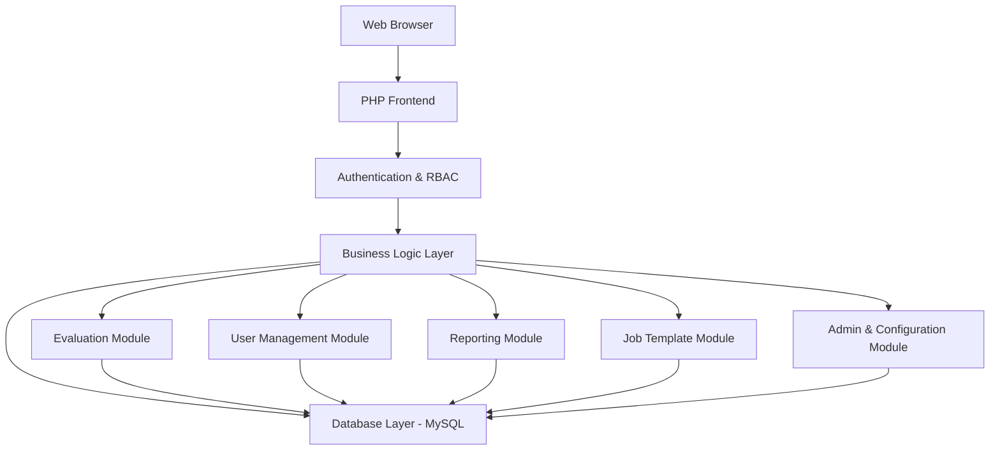
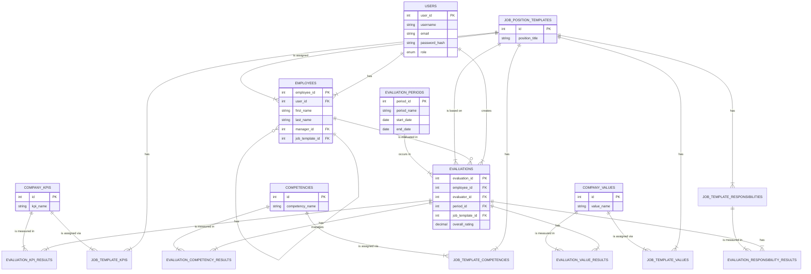

# PHP Performance Evaluation System - Technical Specification

## 1. Project Overview

This document outlines the technical specification for a comprehensive, web-based employee performance evaluation system. The application is designed to replace traditional paper-based evaluation processes with a robust, data-driven platform. It provides user authentication, a flexible role-based access control system, customizable evaluation cycles, and a sophisticated framework for managing performance metrics such as Key Performance Indicators (KPIs), competencies, and company values.

The system is built on a modular architecture that allows for future expansion and integration with other HR systems. It is designed to be a central hub for all performance-related data, providing valuable insights to employees, managers, and HR administrators.

## 2. System Requirements

### Functional Requirements

#### 2.1. User Management & Authentication
- **Three-tier role system:**
  - **HR Admin**: Full system access, including user management, system configuration, and oversight of all evaluations.
  - **Manager**: Can create and edit evaluations for their direct reports, view team performance dashboards, and track their team's progress.
  - **Employee**: Can view their own evaluations, track their performance history, and manage their personal profile.
- **Secure login system** with session management and password hashing.
- **Password reset functionality**.
- **User profile management**.

#### 2.2. Employee Management
- **Centralized employee database** with a clear organizational hierarchy.
- **Department and team assignments**.
- **Manager-employee relationships**.
- **Linkage to `job_position_templates`** to standardize roles and responsibilities.

#### 2.3. Job Position Templates
- **Central repository of job templates**, managed by HR Admins.
- Each template defines a specific role and includes:
  - A list of **key responsibilities**.
  - A set of **Key Performance Indicators (KPIs)** with target values.
  - A list of required **competencies** with desired proficiency levels.
  - The **company values** that are most relevant to the role.
- **Weighting system** for each component to allow for customized scoring.

#### 2.4. Performance Metrics Management
- **Company KPIs Catalog:** A central directory of all company-wide KPIs, managed by HR Admins.
- **Competency Catalog:** A comprehensive list of skills and competencies, organized into categories.
- **Company Values:** A defined set of company values that can be used in evaluations.

#### 2.5. Evaluation System
- **Flexible evaluation periods** (e.g., monthly, quarterly, annual).
- **Dynamic evaluation forms** generated based on the employee's assigned job template.
- **Automated scoring** based on the predefined weights and achieved results.
- **Draft saving capability** and a clear workflow (draft, submitted, reviewed, approved).
- **Detailed feedback** with section-specific comments.

#### 2.6. Reporting & Analytics
- **PDF generation** of evaluation summaries.
- **Performance dashboards** tailored to each user role.
- **Evaluation status tracking** and performance trend analysis.
- **Audit trail** for all significant actions within the system.

### Technical Requirements
- **Backend**: PHP 7.4+
- **Database**: MySQL 8.0+
- **Frontend**: HTML5, CSS3, JavaScript
- **Security**: Prepared statements, password hashing, XSS/CSRF protection, and secure session management.

## 3. System Architecture

### High-Level Architecture



### Detailed Database Schema



## 4. File Structure

```
performance_evaluation_system/
├── config/
│   ├── database.php
│   └── config.php
├── includes/
│   ├── auth.php
│   └── db_connection.php
├── classes/
│   ├── User.php
│   ├── Employee.php
│   ├── Evaluation.php
│   ├── EvaluationPeriod.php
│   ├── JobTemplate.php
│   ├── CompanyKPI.php
│   ├── Competency.php
│   └── CompanyValues.php
├── public/
│   ├── index.php
│   ├── login.php
│   ├── dashboard.php
│   ├── evaluation/
│   ├── admin/
│   │   ├── job_templates.php
│   │   ├── kpis.php
│   │   ├── competencies.php
│   │   ├── values.php
│   │   └── periods.php
│   └── assets/
│       ├── css/
│       └── js/
├── templates/
│   ├── header.php
│   └── footer.php
├── sql/
│   ├── database_setup.sql
│   └── job_templates_structure.sql
└── docs/
    └── PROJECT_SPECIFICATION.md
```

## 5. Core Features Implementation

### 5.1. Job Template-Based Evaluations
The core of the system is the use of job templates to standardize evaluations. When an evaluation is created, the system uses the employee's assigned job template to dynamically generate the evaluation form, complete with the correct responsibilities, KPIs, competencies, and values.

### 5.2. Scoring and Weighting
Each section of the evaluation (KPIs, competencies, etc.) has a predefined weight that is set in the job template. The final score is a weighted average of the scores from each section, providing a nuanced and fair assessment of performance.

### 5.3. Security
- **SQL Injection Prevention:** All database queries are executed using prepared statements.
- **XSS Protection:** All output is properly escaped using `htmlspecialchars()`.
- **CSRF Protection:** Forms are protected with CSRF tokens.
- **Secure Session Handling:** Sessions are managed securely, with timeouts and other best practices.

## 6. Future Enhancements

- **360-Degree Feedback:** Allow for peer and subordinate feedback in addition to manager evaluations.
- **Goal Setting:** A dedicated module for setting and tracking personal and team goals.
- **Integration with HRIS:** Connect with other HR systems to synchronize employee data.
- **Advanced Analytics:** More detailed reporting and data visualization features.
