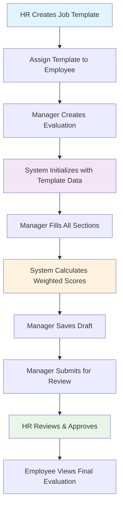
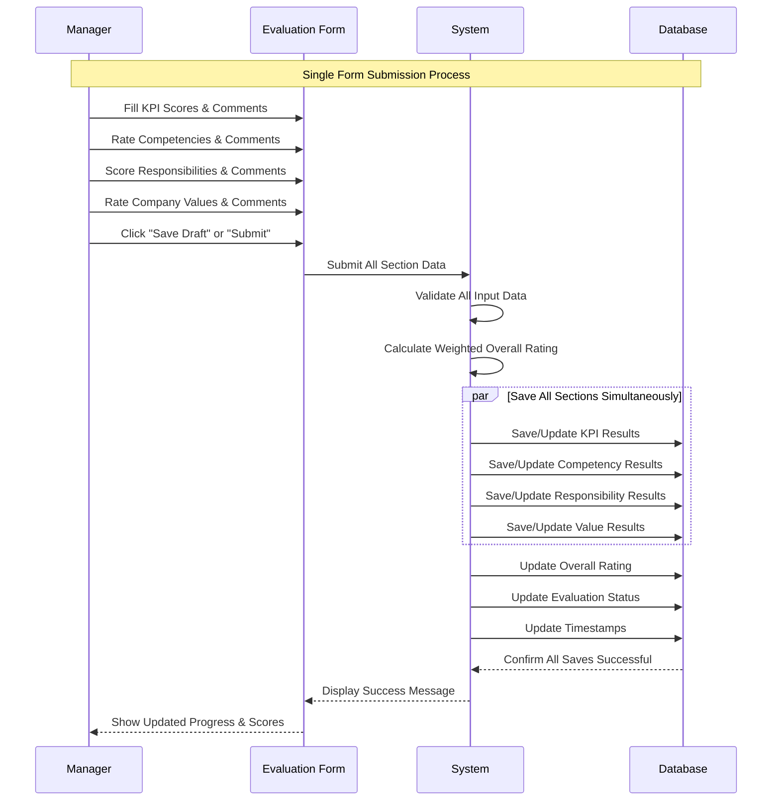
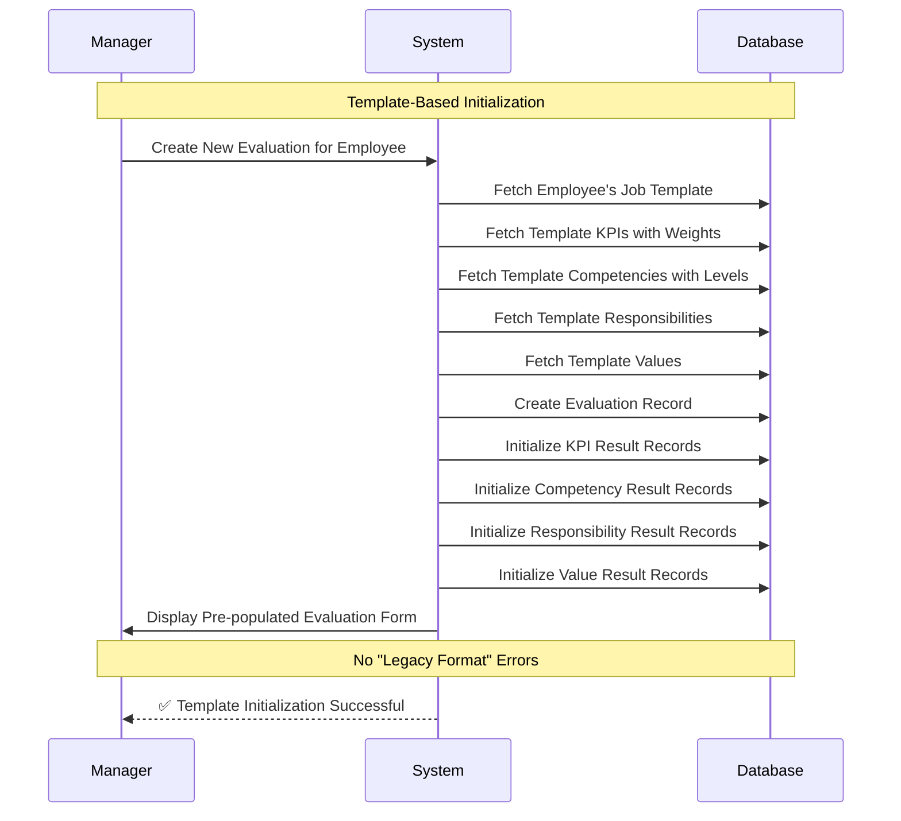
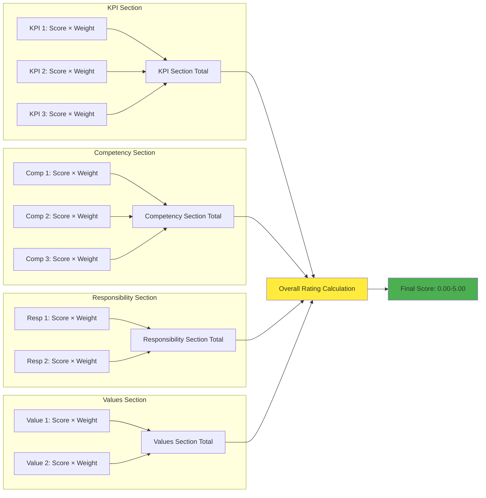

# Updated Database Schema & User Interactions Documentation

## Overview
This document reflects the complete, integrated database schema and user interaction flows after the CMS-style schema integration completed on 2025-06-24.

## Schema Integration Summary

### ✅ **Completed Schema Fixes**
All critical schema fixes have been integrated into the base SQL files for clean CMS-style installations:

1. **Added missing columns to evaluation result tables** in `sql/002_job_templates_structure.sql`
2. **Fixed overly restrictive overall_rating constraint** in `sql/001_database_setup.sql`
3. **Marked temporary fixes as integrated** (`003_add_missing_weight_columns.sql.INTEGRATED`)

---

## Complete Database Schema

### Core Tables with Integrated Fixes

#### Evaluation Result Tables (Updated with Missing Columns)

```sql
-- Evaluation KPI Results (UPDATED)
CREATE TABLE evaluation_kpi_results (
    id INT PRIMARY KEY AUTO_INCREMENT,
    evaluation_id INT,
    kpi_id INT,
    target_value DECIMAL(10,2),
    achieved_value DECIMAL(10,2),
    score DECIMAL(3,2), -- 1-5 scale
    comments TEXT,
    weight_percentage DECIMAL(5,2) DEFAULT 100.00,  -- ✅ ADDED
    updated_at TIMESTAMP DEFAULT CURRENT_TIMESTAMP ON UPDATE CURRENT_TIMESTAMP,  -- ✅ ADDED
    created_at TIMESTAMP DEFAULT CURRENT_TIMESTAMP,
    FOREIGN KEY (evaluation_id) REFERENCES evaluations(evaluation_id) ON DELETE CASCADE,
    FOREIGN KEY (kpi_id) REFERENCES company_kpis(id)
);

-- Evaluation Competency Results (UPDATED)
CREATE TABLE evaluation_competency_results (
    id INT PRIMARY KEY AUTO_INCREMENT,
    evaluation_id INT,
    competency_id INT,
    required_level ENUM('basic', 'intermediate', 'advanced', 'expert'),
    achieved_level ENUM('basic', 'intermediate', 'advanced', 'expert'),
    score DECIMAL(3,2), -- 1-5 scale
    comments TEXT,
    weight_percentage DECIMAL(5,2) DEFAULT 100.00,  -- ✅ ADDED
    updated_at TIMESTAMP DEFAULT CURRENT_TIMESTAMP ON UPDATE CURRENT_TIMESTAMP,  -- ✅ ADDED
    created_at TIMESTAMP DEFAULT CURRENT_TIMESTAMP,
    FOREIGN KEY (evaluation_id) REFERENCES evaluations(evaluation_id) ON DELETE CASCADE,
    FOREIGN KEY (competency_id) REFERENCES competencies(id)
);

-- Evaluation Responsibility Results (UPDATED)
CREATE TABLE evaluation_responsibility_results (
    id INT PRIMARY KEY AUTO_INCREMENT,
    evaluation_id INT,
    responsibility_id INT,
    score DECIMAL(3,2), -- 1-5 scale
    comments TEXT,
    weight_percentage DECIMAL(5,2) DEFAULT 100.00,  -- ✅ ADDED
    updated_at TIMESTAMP DEFAULT CURRENT_TIMESTAMP ON UPDATE CURRENT_TIMESTAMP,  -- ✅ ADDED
    created_at TIMESTAMP DEFAULT CURRENT_TIMESTAMP,
    FOREIGN KEY (evaluation_id) REFERENCES evaluations(evaluation_id) ON DELETE CASCADE,
    FOREIGN KEY (responsibility_id) REFERENCES job_template_responsibilities(id)
);

-- Evaluation Values Results (UPDATED)
CREATE TABLE evaluation_value_results (
    id INT PRIMARY KEY AUTO_INCREMENT,
    evaluation_id INT,
    value_id INT,
    score DECIMAL(3,2), -- 1-5 scale
    comments TEXT,
    weight_percentage DECIMAL(5,2) DEFAULT 100.00,  -- ✅ ADDED
    updated_at TIMESTAMP DEFAULT CURRENT_TIMESTAMP ON UPDATE CURRENT_TIMESTAMP,  -- ✅ ADDED
    created_at TIMESTAMP DEFAULT CURRENT_TIMESTAMP,
    FOREIGN KEY (evaluation_id) REFERENCES evaluations(evaluation_id) ON DELETE CASCADE,
    FOREIGN KEY (value_id) REFERENCES company_values(id)
);
```

#### Fixed Evaluations Table Constraint

```sql
-- Evaluations Table (FIXED CONSTRAINT)
CREATE TABLE evaluations (
    evaluation_id INT AUTO_INCREMENT PRIMARY KEY,
    employee_id INT NOT NULL,
    evaluator_id INT NOT NULL,
    period_id INT NOT NULL,
    job_template_id INT NULL,
    
    -- Overall evaluation (FIXED CONSTRAINT)
    overall_rating DECIMAL(3,2) CHECK (overall_rating IS NULL OR (overall_rating >= 0.00 AND overall_rating <= 5.00)),  -- ✅ FIXED
    overall_comments TEXT,
    development_goals TEXT,
    strengths TEXT,
    
    -- Status and workflow
    status ENUM('draft', 'submitted', 'reviewed', 'approved', 'rejected') DEFAULT 'draft',
    submitted_at TIMESTAMP NULL,
    reviewed_at TIMESTAMP NULL,
    approved_at TIMESTAMP NULL,
    
    created_at TIMESTAMP DEFAULT CURRENT_TIMESTAMP,
    updated_at TIMESTAMP DEFAULT CURRENT_TIMESTAMP ON UPDATE CURRENT_TIMESTAMP,
    
    FOREIGN KEY (employee_id) REFERENCES employees(employee_id) ON DELETE CASCADE,
    FOREIGN KEY (evaluator_id) REFERENCES users(user_id) ON DELETE CASCADE,
    FOREIGN KEY (period_id) REFERENCES evaluation_periods(period_id) ON DELETE CASCADE,
    FOREIGN KEY (job_template_id) REFERENCES job_position_templates(id),
    
    UNIQUE KEY unique_employee_period (employee_id, period_id)
);
```

---

## User Interaction Flows

### 1. Complete Evaluation Lifecycle



### 2. Consolidated Save Process (New Implementation)



### 3. Job Template-Based Evaluation Creation



### 4. Weighted Score Calculation Flow



---

## Key Features After Integration

### ✅ **CMS-Style Installation**
- Single `make up` command creates fully functional system
- No manual schema fixes required
- All evaluation functionality works from initial installation

### ✅ **Consolidated Save Process**
- Single form submission saves all evaluation sections
- No individual "Save KPI", "Save Competency" buttons
- Improved user experience with "Save Draft" and "Submit Evaluation"

### ✅ **Proper Template Initialization**
- No "Legacy Evaluation Format" errors
- Job templates properly initialize evaluation structure
- All result tables have required `weight_percentage` and `updated_at` columns

### ✅ **Flexible Rating System**
- Overall rating constraint allows 0.00-5.00 range and NULL values
- Supports valid low scores without constraint violations
- Proper weighted average calculations

---

## Testing Verification

### Clean Installation Test
```bash
make reset  # Should create fully functional system
```

### Expected Results
- ✅ Job template creation works perfectly
- ✅ Evaluation creation with proper template initialization
- ✅ All scoring systems functional (KPI, competency, responsibility, values)
- ✅ Consolidated save functionality works
- ✅ Overall rating calculations with weighted averages
- ✅ No "Legacy Format" warnings or errors

### Key URLs to Test
- `http://localhost:8080/admin/job_templates.php` - Job template management
- `http://localhost:8080/evaluation/create.php` - New evaluation creation
- `http://localhost:8080/evaluation/edit.php` - Evaluation editing
- `http://localhost:8080/evaluation/view.php` - Evaluation viewing

---

**Status**: ✅ Complete - Ready for CMS-style distribution  
**Date**: 2025-06-24  
**Integration**: All schema fixes integrated into base SQL files