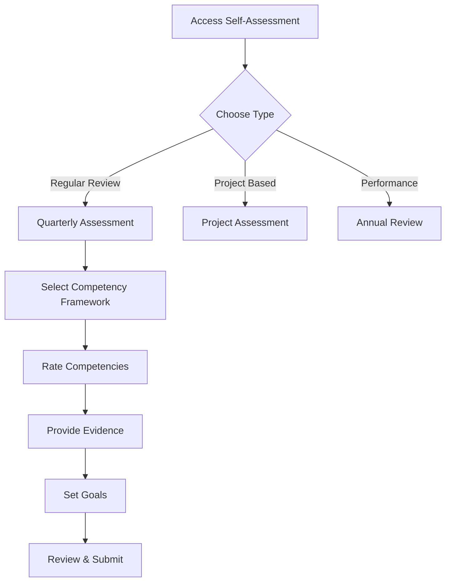

# 360-Degree Feedback System User Guide

## Quick Start Guide

This guide provides step-by-step instructions for using the 360-degree feedback system enhancements. Whether you're an employee seeking growth, a manager leading teams, or an HR administrator configuring the system, this guide will help you navigate through all features efficiently.

## Role-Based Quick Access

### 📋 **Navigation Legend**
- **Dashboard Path**: How to access the feature from your dashboard
- **Direct URL**: For bookmarking and quick access
- **Mobile Compatible**: Features optimized for mobile devices

### 👤 **For Employees**
- **Self-Assessments**: Dashboard → My Performance → Self-Assessment Cards
- **Kudos Giving**: Dashboard → Recognition → Give Kudos  
- **Team OKRs**: Dashboard → My Goals → OKR Dashboard
- **Development Plans**: Dashboard → My Growth → IDP Management
- **Manager Feedback**: Dashboard → Feedback → Upward Feedback

### 👥 **For Managers**
- **Managing Self-Assessments**: Dashboard → Team Performance → Review Self-Assessments
- **Team Kudos**: Dashboard → Team Recognition → Kudos Activity
- **Upward Feedback**: Dashboard → My Leadership → Feedback from Team
- **Team OKRs**: Dashboard → Team Management → OKR Oversight
- **Development Planning**: Dashboard → Employee Development → IDP Review

### 🏢 **For HR Administrators**
- **System Configuration**: Dashboard → Admin → 360-Degree Settings
- **Feature Management**: Dashboard → System → Enhancement Controls
- **Analytics & Reports**: Dashboard → Analytics → 360-Degree Insights
- **Data Management**: Dashboard → Tools → 360-Degree Data Management
- **Training Hub**: Dashboard → Resources → User Training

## Employee Workflow Guide

### 1. Self-Assessment Journey

#### Starting a New Self-Assessment

**Dashboard Access:**
1. Login to your account
2. Navigate to "My Performance" → "Self-Assessment"
3. Click "Start New Assessment"

**Direct URL:** `/public/self-assessment/create`

**Step-by-Step Process:**



**Detailed Actions:**

| Action | Description | Tips |
|--------|-------------|------|
| **Competency Rating** | Rate yourself 1-5 on company competencies | Be honest and use specific examples |
| **Evidence Upload** | Attach documents, images, or links | Focus on measurable achievements |
| **Goal Setting** | Define 3-5 SMART goals | Make them specific, measurable, achievable |
| **Manager Comments** | Add context for your ratings | Helps your manager understand better |

#### Completing Your Assessment

1. **Save Draft**: Progress is automatically saved
2. **Review Complete**: Use the preview feature
3. **Final Submission**: Requires confirmation
4. **Post-Submission**: View your results and comparisons

**Interface Example:**
```
┌─────────────────────────────────────────────────────┐
│ SELF-ASSESSMENT QUARTER 4 2024                     │
├─────────────────────────────────────────────────────┤
│ Competency: Communication                           │
│ • Rating: ⭐⭐⭐⭐☆ (4/5)                          │
│ • Evidence: Led 3 client presentations             │
│ • Improvement: Presentation skills workshop        │
├─────────────────────────────────────────────────────┤
│ Current Progress: 75% Complete                     │
│ Save Draft  | Preview  | Submit                    │
└─────────────────────────────────────────────────────┘
```

### 2. Kudos Recognition System

#### Giving Kudos to Colleagues

**Dashboard Access:** Dashboard → Recognition → Give Kudos

**Direct URL:** `/public/kudos/give`

**Steps to Give Kudos:**

1. **Select Recipient**: Type colleague's name or select from tree
2. **Choose Category**: Select from predefined kudos types
3. **Write Message**: 50-500 characters recommended
4. **Set Visibility**: Public (feed) or Private (direct message)
5. **Preview & Send**: Review before sending

**Kudos Categories:**
- **Team Player**: Exceptional collaboration
- **Innovation**: Creative problem solving
- **Leadership**: Guiding others effectively
- **Above & Beyond**: Going extra mile
- **Customer Focus**: Client excellence

**Example Kudos Message:**
```
"Shoutout to Sarah for her exceptional leadership during the
Q4 product launch! Her clear communication and steady guidance
kept our team focused and delivered amazing results. 🌟"
```

#### Tracking Your Kudos

**My Kudos Dashboard:**
- **Received**: All kudos sent to you
- **Given**: Kudos you've sent to others
- **Points**: Your recognition points balance
- **Leaderboard**: Monthly rankings
- **History**: Complete transaction log

**Analytics Available:**
- Recognition trends over time
- Top givers/receivers
- Category analysis
- Team participation rates

### 3. Goal Management with OKRs

#### Creating Your First OKR

**Dashboard Access:** Dashboard → My Goals → OKR Dashboard

**Direct URL:** `/public/okr/dashboard`

**OKR Structure:**
```
Objective (WHAT): Improve customer satisfaction
├─ Key Result 1: Increase NPS score to 75
├─ Key Result 2: Reduce support tickets by 20%
└─ Key Result 3: Achieve 95% first-call resolution
```

**Creation Process:**

1. **Define Objective**: Clear, ambitious statement
2. **Set 3-5 Key Results**: Measurable milestones
3. **Assign Ownership**: Personal or team OKR
4. **Set Timeline**: Quarter/half-year milestones
5. **Configure Visibility**: Private, team, or public

**Tracking Progress:**
- **Weekly Updates**: Progress percentage and notes
- **Visual Tracking**: Progress bars and charts
- **Alerts**: Notifications for falling behind
- **Check-ins**: Automatic reminders for updates

#### Collaborating on OKRs

**Team OKRs:**
- Shared ownership options
- Contribution tracking
- Peer updates and comments
- Collective progress visualization

**Progress Updates:**
- Quick update widget
- Drag-and-drop ordering
- Inline progress editing
- Comment threads on key results

### 4. Individual Development Plans (IDPs)

#### Building Your Development Journey

**Dashboard Access:** Dashboard → My Growth → IDP Management

**Direct URL:** `/public/idp/dashboard`

**IDP Creation Flow:**

1. **Self-Assessment Review**: Use assessment insights
2. **Manager Discussion**: Align on development needs
3. **Goal Setting**: 3-6 month development objectives
4. **Action Planning**: Specific steps and resources
5. **Timeline Setting**: Realistic milestones
6. **Resource Identification**: Courses, mentoring, projects

**IDP Structure:**
```
Development Goal: Become team leader
├─ Skill Gap: Project management expertise
├─ Action 1: Complete "Leadership Excellence" course
├─ Action 2: Mentor junior team members
├─ Action 3: Lead Q2 team project
└─ Success Metric: Team feedback score >8.5/10
```

#### Managing Development Actions

**Action Types:**
- **Training**: Online courses, workshops
- **Mentoring**: 1-on-1 guidance sessions
- **Project Experience**: Stretch assignments
- **Network Building**: Industry connections
- **Resource Development**: Building guides/tools

**Progress Tracking:**
- **Milestone Checkpoints**: Regular progress reviews
- **Evidence Collection**: Certificates, feedback, results
- **Adjustments**: Modify timeline/actions as needed
- **Achievement Levels**: Exceeding/Meeting/Developing/Needs Improvement

### 5. Providing Upward Feedback

#### Anonymous Manager Feedback

**Dashboard Access:** Dashboard → Feedback → Upward Feedback

**Direct URL:** `/public/upward-feedback/anonymous`

**Feedback Process:**

1. **Invitation Received**: Email when feedback cycle opens
2. **Access Anonymous Portal**: No login required
3. **Rate Manager**: Competency-based assessment
4. **Provide Examples**: Specific situations and outcomes
5. **Submit Anonymously**: Identity protected

**Assessment Areas:**
- **Leadership**: Vision, guidance, direction setting
- **Communication**: Clarity, frequency, transparency
- **Support**: Resource provision, problem resolution
- **Development**: Growth opportunities, mentorship
- **Overall**: General manager effectiveness

**Sample Feedback:**
```
Manager: Michael Chen
Leadership Rating: 4/5
Example: Clear Q3 strategy communication helped team focus
Improvement: More frequent 1-on-1 check-ins would help
```

## Manager Workflow Guide

### 1. Reviewing Team Self-Assessments

#### Accessing My Team's Reviews

**Dashboard Access:** Dashboard → Team Management → Self-Assessment Reviews

**Features Available:**
- **Bulk Review Mode**: Review multiple assessments together
- **Comparison View**: Compare employee vs manager ratings
- **Calibration Tools**: Ensure consistent rating standards
- **Feedback Templates**: Pre-written constructive feedback

#### The Review Process

1. **Assessment Queue**: New assessments highlighted
2. **Detailed Review**: Individual competency analysis
3. **Rating Discrepancies**: Highlighted for attention
4. **Manager Comments**: Add feedback and guidance
5. **Calibration**: Compare across team members
6. **Final Approval**: Publish for employee view

**Review Interface:**
```
┌─ Team Self-Assessment Dashboard ─┐
│ 📊 Sarah Johnson - Q4 2024       │
│ Communication: Self 5, Mgr 4    │
│ Leadership: Self 4, Mgr 5       │
│ □ Approve  □ Request Revision   │
│ □ Add Comments □ Schedule Chat  │
└─────────────────────────────────┘
```

### 2. Monitoring Kudos Activity

#### Team Recognition Landscape

**Dashboard Access:** Dashboard → Team Recognition → Activity Monitor

**Key Features:**
- **Team Participation**: Who's giving/receiving kudos
- **Category Analysis**: Types of recognition in team
- **Recognition Trends**: Monthly activity patterns
- **Outstanding Contributors**: Top receivers in team
- **Encouragement Opportunities**: Low participation alerts

#### Managing Recognition Programs

**Program Configuration:**
- **Monthly Themes**: Focus on specific competencies
- **Team Challenges**: Recognition competitions
- **Achievement Celebrations**: Team milestone celebrations
- **Peer-to-Peer Programs**: Team member initiative support

### 3. OKR Management for Teams

#### Team OKR Overview

**Dashboard Access:** Dashboard → Team Management → OKR Dashboard

**Manager Capabilities:**
- **Team Overview**: Combined OKR dashboard
- **Individual Drill-down**: Employee-specific OKR view
- **Progress Alerts**: Behind-schedule notifications
- **Resource Allocation**: Support needs identification
- **Cross-team Collaboration**: Shared OKR opportunities

#### Supporting OKR Success

**Weekly Check-ins:**
- **Individual Review**: 15-minute progress discussions
- **Blocker Resolution**: Resource/access issue fixes
- **Skill Development**: Training opportunity identification
- **Peer Connection**: Cross-team collaboration facilitation
- **Achievement Celebration**: Milestone recognition

### 4. Development Planning Oversight

#### IDP Review and Support

**Dashboard Access:** Dashboard → Team Development → IDP Management

**Review Process:**
1. **Initial Review**: Draft development plan assessment
2. **Resource Connection**: Link to available training
3. **Mentor Assignment**: Identify suitable internal mentors
4. **Timeline Validation**: Ensure realistic milestones
5. **Progress Monitoring**: Monthly development reviews

#### Development Action Support

**Support Mechanisms:**
- **Budget Allocation**: Training fund authorization
- **Time Scheduling**: Workload adjustment approval
- **Project Assignment**: Stretch project opportunities
- **Mentor Connection**: Internal/external mentor matching
- **Success Story Sharing**: Team development celebration
- **Manager Coaching**: Weekly development guidance sessions

## HR Administrator Guide

### 1. System Configuration

#### Enhancement Feature Toggle

**Configuration Location:** Admin Dashboard → System → 360-Degree Settings

**Available Toggles:**
- **Self-Assessment**: Frequency and framework selection
- **Kudos System**: Category management and point values
- **OKR Management**: Visibility settings and timeframes
- **Upward Feedback**: Cycle configuration and anonymity
- **IDP System**: Template options and approval workflows

#### User Role Mapping

**Permission Matrix:**
| Feature | Employee | Manager | HR Admin |
|---------|----------|---------|----------|
| Self-Assessment Create | ✅ | ✅ | ✅ |
| Self-Assessment Review | ❌ | ✅ (team) | ✅ (all) |
| Kudos Giving | ✅ | ✅ | ✅ |
| Kudos Analytics | ✅ (self) | ✅ (team) | ✅ (all) |
| OKR Creation | ✅ | ✅ | ✅ |
| OKR Oversight | ❌ | ✅ (team) | ✅ (all) |
| Upward Feedback | ✅ | ❌ | ✅ (analytics) |
| IDP Creation | ✅ | ✅ | ✅ |
| IDP Approvals | ❌ | ✅ (team) | ✅ (all) |

### 2. Analytics and Reporting

#### Comprehensive Dashboards

**Main Analytics Hub:** Dashboard → Analytics → 360-Degree Insights

**Available Reports:**
- **Participation Analytics**: Usage across all features
- **Competency Mapping**: Skills assessment results
- **Recognition Trends**: Kudos patterns and impact
- **Development ROI**: IDP effectiveness tracking
- **Manager Performance**: Upward feedback analysis
- **Goal Achievement**: OKR success rates

#### Export Capabilities

**Report Formats:**
- PDF executive summaries
- Excel detailed data dumps
- CSV for external analysis
- PowerPoint presentation slides
- JSON API feeds for BI tools

### 3. Training and Onboarding

#### User Training Programs

**Available Resources:**
- **Interactive Guides**: Web-based training modules
- **Video Tutorials**: Screen-capture walkthroughs
- **Quick Reference Cards**: One-page cheat sheets
- **FAQ Database**: Common question repository
- **Live Webinars**: Monthly feature deep-dives

#### Gradual Rollout Strategy

**Phased Approach:**
1. **Pilot Group**: 10% of users (volunteers)
2. **Early Adopters**: 25% of users (managers)
3. **General Availability**: 60% of users (everyone)
4. **Final Rollout**: Remaining users
5. **Post-launch Support**: 30-day intensive support

#### Communication Templates

**Email Templates:**
- Welcome announcement
- Feature introduction
- Training invitation
- Reminder notifications
- Success celebrations

## Mobile Experience

### Optimized Interface Design

The 360-degree system is fully responsive and optimized for mobile devices. Key features:

**Mobile Navigation:**
- **Bottom Navigation Bar**: Quick access to core features
- **Swipe Gestures**: Effortless browsing and interaction
- **Touch-Friendly Controls**: Optimized buttons and inputs
- **Offline Capability**: Draft-saving functionality

**Feature Highlights:**
- **Quick Kudos**: 30-second recognition messages
- **Voice-to-Text**: Dictate long assessments
- **Photo Evidence**: Attach images directly from camera
- **Push Notifications**: Real-time activity alerts
- **Quick Actions**: Swipe gestures for common tasks

### Cross-Platform Compatibility

**Supported Platforms:**
- **iOS**: Safari, Chrome, Firefox
- **Android**: Chrome, Samsung Browser, Firefox
- **Tablets**: Optimized layouts for larger screens
- **Desktop**: Full-featured responsive interface

## Troubleshooting Common Issues

### Frequently Asked Questions

#### Login and Access Issues

**"I can't access the 360-degree features"**
- **Solution**: Check user role configuration
- **Test**: Go to `/public/health-check.php`
- **Contact**: IT support if issues persist

#### Performance Problems

**"The page is loading slowly"**
- **Mobile**: Switch to desktop mode for complex features
- **Network**: Use high-speed internet for assessments
- **Browser**: Clear cache and update browser version

#### Data Sync Issues

**"My assessment data disappeared"**
- **Auto-save**: Check draft folder via API
- **Network**: Ensure stable connection before submitting
- **Browser**: Allow at least 30 seconds for processing

### Error Codes Reference

| Code | Issue | Resolution |
|------|--------|-----------|
| 401 | Unauthorized | Contact system admin for access |
| 403 | Permission denied | Verify role configuration |
| 404 | Feature not found | Check feature toggle settings |
| 500 | Server error | Try again or contact support |
| 503 | Service unavailable | Check system status page |

### Getting Support

**Support Channels:**
- **In-App Help**: "?" icons on each page
- **Email Support**: 360-support@company.com
- **Live Chat**: Bottom-right corner chat widget
- **Phone**: 1-800-360-HELP (business hours)
- **Knowledge Base**: Comprehensive searchable documentation

## Next Steps and Advanced Usage

### Power User Features

Once comfortable with basic features, explore advanced capabilities:

- **Bulk Operations**: CSV import/export for OKRs
- **Custom Reports**: API integration for advanced analytics
- **Automation**: Zapier integration possibilities
- **Extensions**: Chrome plugin for quick access
- **Mobile Apps**: Native app downloads (iOS/Android)

### Join User Community

**Discussion Forums:**
- **Feature Requests**: Submit enhancement ideas
- **Best Practices**: Share success stories
- **Tips & Tricks**: Learn from experienced users
- **Regional Groups**: Connect with local users
- **Training Events**: Webinar and workshop schedules

---

*This user guide is updated regularly. Last updated: August 2024*