# Critical Authorization and Data Relationship Issue Analysis
## Performance Evaluation System

### Executive Summary

This document outlines a critical authorization and data relationship issue in the evaluation system where evaluation records exist in the database but lack proper manager-employee association, causing a disconnect between the administrative creation process and the manager's access permissions.

### Problem Statement

The evaluation system suffers from a fundamental architectural flaw: **the evaluations table lacks a direct `manager_id` foreign key relationship**, forcing the system to rely on complex, unreliable joins through the employee hierarchy to determine manager access rights.

### Root Cause Analysis

```mermaid
graph TB
    subgraph "Current Broken Architecture"
        A[Admin Creates Evaluation] --> B[Employee Selected]
        B --> C[Evaluation Created WITHOUT manager_id]
        C --> D[Manager Dashboard Query]
        D --> E[Complex JOIN through employees.manager_id]
        E --> F[Authorization Failures]
        F --> G[Evaluations Not Visible to Managers]
    end
    
    subgraph "Data Flow Issues"
        H[evaluations.employee_id] --> I[employees.employee_id]
        I --> J[employees.manager_id]
        J --> K[Complex Query Logic]
        K --> L[Potential Data Inconsistencies]
    end
```



### Detailed Investigation Findings

#### 1. Database Relationship Integrity Issues

**Current Schema Problem:**
- The `evaluations` table lacks a direct `manager_id` foreign key
- Manager access relies on indirect relationships through `employees.manager_id`
- No direct link between evaluation records and responsible managers

**Evidence from Code Analysis:**
```sql
-- Current evaluations table (from sql/001_database_setup.sql)
CREATE TABLE evaluations (
    evaluation_id INT AUTO_INCREMENT PRIMARY KEY,
    employee_id INT NOT NULL,
    evaluator_id INT NOT NULL,  -- This is the user who created it, not necessarily the manager
    period_id INT NOT NULL,
    -- MISSING: manager_id INT -- Direct relationship to responsible manager
    ...
);
```

#### 2. Manager Assignment Logic Flaws

**Current Implementation Issues:**
- Evaluation creation in `classes/Evaluation.php` doesn't populate manager relationship
- The `evaluator_id` field stores who created the evaluation, not who manages the employee
- No validation ensures the evaluator is the employee's actual manager

**Code Evidence:**
```php
// From classes/Evaluation.php line 55-62
$sql = "INSERT INTO evaluations (employee_id, evaluator_id, period_id, job_template_id, status)
        VALUES (?, ?, ?, ?, 'draft')";
$evaluationId = insertRecord($sql, [
    $evaluationData['employee_id'],
    $evaluationData['evaluator_id'],  // This could be HR admin, not manager
    $evaluationData['period_id'],
    $employee['job_template_id']
]);
// MISSING: No manager_id population from employee hierarchy
```

#### 3. Manager Dashboard Query Logic Problems

**Authorization Logic Issues:**
- Manager dashboard relies on `getTeamMembers()` function in `classes/Employee.php`
- Complex joins required to match evaluations to manager's team
- Potential for data inconsistencies and authorization failures

**Code Evidence:**
```php
// From includes/auth.php lines 99-114
if ($userRole === 'manager') {
    require_once __DIR__ . '/../classes/Employee.php';
    $employeeClass = new Employee();
    $teamMembers = $employeeClass->getTeamMembers($_SESSION['employee_id']);
    
    foreach ($teamMembers as $member) {
        if ($member['employee_id'] == $employeeId) {
            return true;  // Complex logic prone to failures
        }
    }
}
```

#### 4. Permission Validation Weaknesses

**Current Authorization Flow:**
1. Manager logs in and accesses dashboard
2. System queries `getTeamMembers()` to find direct reports
3. System queries evaluations and attempts to match via employee_id
4. **FAILURE POINT**: No direct relationship between evaluation and manager

#### 5. Data Consistency Issues

**Hierarchy Endpoint vs Database Mismatch:**
- `public/employees/hierarchy.php` shows organizational structure
- Evaluation records don't reflect this hierarchy directly
- Manager changes in employee records don't update existing evaluations

#### 6. Evaluation Creation Validation Problems

**Workflow Issues:**
- Duplicate evaluation check succeeds (uses employee_id + period_id)
- Manager association validation fails (no direct manager_id relationship)
- Different validation criteria for creation vs. access

### Proposed Solution Architecture

```mermaid
graph TB
    subgraph "Fixed Architecture"
        A[Admin Creates Evaluation] --> B[Employee Selected]
        B --> C[Get Employee.manager_id from DB]
        C --> D[Create Evaluation WITH manager_id]
        D --> E[Manager Dashboard Query]
        E --> F[Direct WHERE manager_id = current_user]
        F --> G[Reliable Authorization]
    end
    
    subgraph "Enhanced Data Flow"
        H[evaluations.manager_id] --> I[Direct FK to employees.employee_id]
        I --> J[Simplified Query Logic]
        J --> K[Guaranteed Data Consistency]
    end
```



### Implementation Plan

#### Phase 1: Database Schema Enhancement

```sql
-- Add manager_id to evaluations table
ALTER TABLE evaluations 
ADD COLUMN manager_id INT,
ADD FOREIGN KEY (manager_id) REFERENCES employees(employee_id) ON DELETE SET NULL,
ADD INDEX idx_evaluations_manager (manager_id);

-- Populate existing evaluations with manager_id
UPDATE evaluations e 
JOIN employees emp ON e.employee_id = emp.employee_id 
SET e.manager_id = emp.manager_id 
WHERE emp.manager_id IS NOT NULL;
```

#### Phase 2: Evaluation Creation Logic Update

**File: `classes/Evaluation.php`**
- Modify `createEvaluation()` method to populate `manager_id`
- Add validation to ensure manager-employee relationship exists
- Update initialization logic to include manager relationship

#### Phase 3: Manager Dashboard Query Optimization

**File: `public/dashboard.php`**
- Simplify manager evaluation queries to use direct `manager_id` relationship
- Remove complex joins through employee hierarchy
- Improve query performance and reliability

#### Phase 4: Authorization Middleware Enhancement

**File: `includes/auth.php`**
- Update `canAccessEvaluation()` to use direct manager relationship
- Strengthen `getAccessibleEmployees()` logic
- Add comprehensive validation for manager permissions

#### Phase 5: Data Consistency Validation

- Add checks for manager-employee relationship integrity
- Implement validation rules for evaluation-manager assignments
- Create data migration scripts for existing evaluations

### Testing Strategy

#### 1. Database Migration Testing
- Verify schema changes don't break existing functionality
- Test foreign key constraints work correctly
- Validate data migration populates manager_id correctly

#### 2. Authorization Testing
- Confirm managers see only their team's evaluations
- Test HR admin retains access to all evaluations
- Verify employees can only see their own evaluations

#### 3. Performance Testing
- Measure query performance improvements with direct relationships
- Test dashboard load times with simplified queries
- Validate index effectiveness

#### 4. Edge Case Testing
- Test evaluations for employees without managers
- Handle manager role changes and transfers
- Test evaluation access during organizational restructuring

### Risk Assessment

#### High Risk
- **Data Migration**: Existing evaluations without proper manager assignments
- **Authorization Bypass**: Potential security gaps during transition

#### Medium Risk
- **Performance Impact**: Database schema changes may affect query performance
- **User Experience**: Temporary access issues during deployment

#### Low Risk
- **Code Complexity**: Well-defined interfaces minimize integration issues

### Success Metrics

1. **Authorization Accuracy**: 100% of managers see only their team's evaluations
2. **Query Performance**: >50% improvement in dashboard load times
3. **Data Integrity**: 0 orphaned evaluations without manager assignments
4. **User Experience**: No reported access issues post-deployment

### Conclusion

The critical authorization issue stems from a fundamental architectural flaw in the database design. By adding a direct `manager_id` foreign key to the evaluations table and updating the associated business logic, we can:

1. Eliminate complex, unreliable authorization queries
2. Ensure data consistency and integrity
3. Improve system performance and reliability
4. Provide a solid foundation for future enhancements

This solution addresses all six investigation areas identified in the original problem statement and provides a robust, scalable approach to evaluation system authorization.