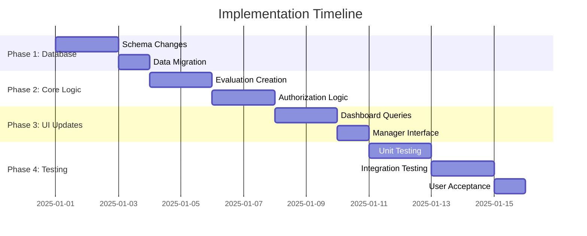

# Implementation Plan: Fix Authorization and Data Relationship Issues
## Performance Evaluation System

### Overview

This document provides a step-by-step implementation plan to resolve the critical authorization and data relationship issues identified in the evaluation system. The plan includes database schema changes, code modifications, and testing procedures.

### Implementation Phases



## Phase 1: Database Schema Enhancement

### 1.1 Create Database Migration Script

**File: `sql/fixes/004_add_manager_id_to_evaluations.sql`**

```sql
-- Add manager_id to evaluations table for direct manager-evaluation relationship
-- This fixes the authorization issue where managers cannot see their team's evaluations

-- Step 1: Add the manager_id column
ALTER TABLE evaluations 
ADD COLUMN manager_id INT AFTER evaluator_id,
ADD INDEX idx_evaluations_manager (manager_id);

-- Step 2: Add foreign key constraint
ALTER TABLE evaluations 
ADD CONSTRAINT fk_evaluations_manager 
FOREIGN KEY (manager_id) REFERENCES employees(employee_id) ON DELETE SET NULL;

-- Step 3: Populate existing evaluations with manager_id from employee hierarchy
UPDATE evaluations e 
JOIN employees emp ON e.employee_id = emp.employee_id 
SET e.manager_id = emp.manager_id 
WHERE emp.manager_id IS NOT NULL;

-- Step 4: Add composite index for performance optimization
CREATE INDEX idx_evaluations_manager_employee ON evaluations(manager_id, employee_id);
CREATE INDEX idx_evaluations_manager_period ON evaluations(manager_id, period_id);

-- Verification queries
SELECT 
    COUNT(*) as total_evaluations,
    COUNT(manager_id) as evaluations_with_manager,
    COUNT(*) - COUNT(manager_id) as evaluations_without_manager
FROM evaluations;

-- Show manager-evaluation relationships
SELECT 
    m.first_name as manager_first_name,
    m.last_name as manager_last_name,
    COUNT(e.evaluation_id) as evaluation_count
FROM employees m
LEFT JOIN evaluations e ON m.employee_id = e.manager_id
GROUP BY m.employee_id, m.first_name, m.last_name
HAVING evaluation_count > 0
ORDER BY evaluation_count DESC;
```

### 1.2 Update Main Database Schema

**File: `sql/001_database_setup.sql` (Update evaluations table)**

```sql
-- Update the evaluations table definition to include manager_id
CREATE TABLE evaluations (
    evaluation_id INT AUTO_INCREMENT PRIMARY KEY,
    employee_id INT NOT NULL,
    evaluator_id INT NOT NULL,
    manager_id INT,  -- NEW: Direct reference to employee's manager
    period_id INT NOT NULL,
    job_template_id INT,
    
    -- Overall evaluation
    overall_rating DECIMAL(3,2) CHECK (overall_rating IS NULL OR (overall_rating >= 0.00 AND overall_rating <= 5.00)),
    overall_comments TEXT,
    
    -- Goals and development
    goals_next_period TEXT,
    development_areas TEXT,
    strengths TEXT,
    
    -- Status and workflow
    status ENUM('draft', 'submitted', 'reviewed', 'approved', 'rejected') DEFAULT 'draft',
    submitted_at TIMESTAMP NULL,
    reviewed_at TIMESTAMP NULL,
    approved_at TIMESTAMP NULL,
    
    created_at TIMESTAMP DEFAULT CURRENT_TIMESTAMP,
    updated_at TIMESTAMP DEFAULT CURRENT_TIMESTAMP ON UPDATE CURRENT_TIMESTAMP,
    
    FOREIGN KEY (employee_id) REFERENCES employees(employee_id) ON DELETE CASCADE,
    FOREIGN KEY (evaluator_id) REFERENCES users(user_id) ON DELETE CASCADE,
    FOREIGN KEY (manager_id) REFERENCES employees(employee_id) ON DELETE SET NULL,  -- NEW
    FOREIGN KEY (period_id) REFERENCES evaluation_periods(period_id) ON DELETE CASCADE,
    FOREIGN KEY (job_template_id) REFERENCES job_position_templates(id) ON DELETE SET NULL,
    
    INDEX idx_employee (employee_id),
    INDEX idx_evaluator (evaluator_id),
    INDEX idx_manager (manager_id),  -- NEW
    INDEX idx_period (period_id),
    INDEX idx_status (status),
    INDEX idx_overall_rating (overall_rating),
    INDEX idx_evaluations_manager_employee (manager_id, employee_id),  -- NEW
    INDEX idx_evaluations_manager_period (manager_id, period_id),  -- NEW
    
    UNIQUE KEY unique_employee_period (employee_id, period_id)
);
```

## Phase 2: Core Logic Updates

### 2.1 Update Evaluation Creation Logic

**File: `classes/Evaluation.php` (Modify createEvaluation method)**

```php
/**
 * Create new evaluation from job template with proper manager assignment
 * @param array $evaluationData
 * @return int|false
 */
public function createEvaluation($evaluationData) {
    try {
        // Validate required fields
        $required = ['employee_id', 'evaluator_id', 'period_id'];
        foreach ($required as $field) {
            if (empty($evaluationData[$field])) {
                throw new Exception("Field '$field' is required");
            }
        }
        
        // Check if evaluation already exists for this employee and period
        if ($this->evaluationExists($evaluationData['employee_id'], $evaluationData['period_id'])) {
            throw new Exception("Evaluation already exists for this employee and period");
        }
        
        // WORKFLOW VALIDATION: Check prerequisite steps
        $workflowValidation = $this->validateEvaluationWorkflow($evaluationData['employee_id']);
        if (!$workflowValidation['valid']) {
            error_log("WORKFLOW VALIDATION FAILED: " . json_encode($workflowValidation));
            throw new Exception($workflowValidation['message']);
        }
        
        // Get employee's job template and manager
        $employeeClass = new Employee();
        $employee = $employeeClass->getEmployeeById($evaluationData['employee_id']);
        
        if (!$employee) {
            throw new Exception("Employee not found");
        }
        
        // CRITICAL FIX: Get the employee's manager_id for direct relationship
        $managerId = $employee['manager_id'];
        if (empty($managerId)) {
            error_log("WARNING: Employee {$evaluationData['employee_id']} has no manager assigned");
            // Don't throw error - allow evaluations for employees without managers (e.g., CEO)
        }
        
        // LOG: Employee and manager details
        error_log("EVALUATION CREATION - Employee ID: {$evaluationData['employee_id']}, Manager ID: " . ($managerId ?? 'NULL'));
        error_log("EVALUATION CREATION - Job Template ID: " . ($employee['job_template_id'] ?? 'NULL'));
        
        // Insert evaluation with manager_id for direct relationship
        $sql = "INSERT INTO evaluations (employee_id, evaluator_id, manager_id, period_id, job_template_id, status)
                VALUES (?, ?, ?, ?, ?, 'draft')";
        $evaluationId = insertRecord($sql, [
            $evaluationData['employee_id'],
            $evaluationData['evaluator_id'],
            $managerId,  // CRITICAL FIX: Store manager_id directly
            $evaluationData['period_id'],
            $employee['job_template_id']
        ]);
        
        // LOG: Evaluation creation details
        error_log("EVALUATION CREATION - Evaluation ID: $evaluationId created successfully with manager_id: " . ($managerId ?? 'NULL'));
        
        // Initialize evaluation from job template
        if ($employee['job_template_id']) {
            error_log("EVALUATION CREATION - Starting template initialization for Job Template ID: " . $employee['job_template_id']);
            $initResult = $this->initializeEvaluationFromTemplate($evaluationId, $employee['job_template_id']);
            error_log("EVALUATION CREATION - Template initialization result: " . ($initResult ? 'SUCCESS' : 'FAILED'));
        } else {
            error_log("EVALUATION CREATION - WARNING: No job template ID found for employee, skipping initialization");
        }
        
        // Log evaluation creation
        logActivity($_SESSION['user_id'] ?? null, 'evaluation_created', 'evaluations', $evaluationId, null, $evaluationData);
        
        return $evaluationId;
    } catch (Exception $e) {
        error_log("Create evaluation error: " . $e->getMessage());
        throw $e;
    }
}
```

### 2.2 Update Manager Dashboard Queries

**File: `classes/Evaluation.php` (Add new method for manager evaluations)**

```php
/**
 * Get evaluations for a specific manager (direct relationship)
 * @param int $managerId
 * @param array $filters
 * @return array
 */
public function getManagerEvaluations($managerId, $filters = []) {
    $whereClause = "WHERE e.manager_id = ?";
    $params = [$managerId];
    
    // Apply additional filters
    if (!empty($filters['status'])) {
        $whereClause .= " AND e.status = ?";
        $params[] = $filters['status'];
    }
    
    if (!empty($filters['period_id'])) {
        $whereClause .= " AND e.period_id = ?";
        $params[] = $filters['period_id'];
    }
    
    if (!empty($filters['employee_id'])) {
        $whereClause .= " AND e.employee_id = ?";
        $params[] = $filters['employee_id'];
    }
    
    $sql = "SELECT e.*,
                   emp.first_name as employee_first_name, emp.last_name as employee_last_name,
                   emp.employee_number, emp.position, emp.department,
                   mgr.first_name as manager_first_name, mgr.last_name as manager_last_name,
                   p.period_name, p.start_date, p.end_date,
                   jpt.position_title as job_template_title
            FROM evaluations e
            JOIN employees emp ON e.employee_id = emp.employee_id
            LEFT JOIN employees mgr ON e.manager_id = mgr.employee_id
            JOIN evaluation_periods p ON e.period_id = p.period_id
            LEFT JOIN job_position_templates jpt ON e.job_template_id = jpt.id
            $whereClause
            ORDER BY e.created_at DESC";
    
    $evaluations = fetchAll($sql, $params);
    
    // LOG: Manager evaluation query results
    error_log("MANAGER_EVALUATIONS - Manager ID: $managerId, Found: " . count($evaluations) . " evaluations");
    
    return $evaluations;
}
```

### 2.3 Update Authorization Logic

**File: `includes/auth.php` (Update canAccessEvaluation function)**

```php
/**
 * Check if current user can access evaluation (ENHANCED with direct manager relationship)
 * @param array $evaluation
 * @return bool
 */
function canAccessEvaluation($evaluation) {
    if (!isAuthenticated()) {
        return false;
    }
    
    $userRole = $_SESSION['user_role'];
    $userId = $_SESSION['user_id'];
    $employeeId = $_SESSION['employee_id'] ?? null;
    
    // HR Admin can access all evaluations
    if ($userRole === 'hr_admin') {
        return true;
    }
    
    // Evaluator can access evaluations they created
    if ($evaluation['evaluator_id'] == $userId) {
        return true;
    }
    
    // Employee can access their own evaluations
    if ($userRole === 'employee' && $evaluation['employee_id'] == $employeeId) {
        return true;
    }
    
    // CRITICAL FIX: Manager can access evaluations via direct manager_id relationship
    if ($userRole === 'manager' && $evaluation['manager_id'] == $employeeId) {
        return true;
    }
    
    // FALLBACK: Use old logic for evaluations without manager_id (backward compatibility)
    if ($userRole === 'manager' && empty($evaluation['manager_id'])) {
        return canAccessEmployee($evaluation['employee_id']);
    }
    
    return false;
}
```

## Phase 3: Dashboard and UI Updates

### 3.1 Update Manager Dashboard

**File: `public/dashboard.php` (Update manager dashboard logic)**

```php
} elseif ($userRole === 'manager') {
    // Manager Dashboard - ENHANCED with direct manager relationship
    $managerId = $_SESSION['employee_id'];
    
    // Use new direct manager evaluation query
    $evaluationClass = new Evaluation();
    $teamEvaluations = $evaluationClass->getManagerEvaluations($managerId);
    
    // Get team members for additional context
    $teamMembers = $employeeClass->getTeamMembers($managerId);
    
    $dashboardData = [
        'team_size' => count($teamMembers),
        'team_evaluations' => count($teamEvaluations),
        'pending_evaluations' => count(array_filter($teamEvaluations, fn($e) => $e['status'] === 'draft')),
        'completed_evaluations' => count(array_filter($teamEvaluations, fn($e) => $e['status'] === 'approved')),
        'team_members' => $teamMembers,
        'recent_evaluations' => array_slice($teamEvaluations, 0, 5),
        'current_period' => $periodClass->getCurrentPeriod()
    ];
    
    // LOG: Manager dashboard data
    error_log("MANAGER_DASHBOARD - Manager ID: $managerId, Team Evaluations: " . count($teamEvaluations));
}
```

### 3.2 Update Evaluation List Page

**File: `public/evaluation/list.php` (Add manager filtering)**

```php
// Enhanced filtering for managers using direct relationship
if ($userRole === 'manager') {
    $managerId = $_SESSION['employee_id'];
    $evaluationClass = new Evaluation();
    $result = $evaluationClass->getManagerEvaluations($managerId, $filters);
    $evaluations = $result;
    $total = count($result);
    $pages = 1;
} else {
    // Existing logic for HR admin and employees
    $result = $evaluationClass->getEvaluations($page, $limit, $filters);
    $evaluations = $result['evaluations'];
    $total = $result['total'];
    $pages = $result['pages'];
}
```

## Phase 4: Testing and Validation

### 4.1 Database Migration Testing

**File: `tests/database_migration_test.sql`**

```sql
-- Test script to validate database migration
-- Run after applying 004_add_manager_id_to_evaluations.sql

-- Test 1: Verify manager_id column exists
DESCRIBE evaluations;

-- Test 2: Check foreign key constraints
SELECT 
    CONSTRAINT_NAME,
    COLUMN_NAME,
    REFERENCED_TABLE_NAME,
    REFERENCED_COLUMN_NAME
FROM information_schema.KEY_COLUMN_USAGE 
WHERE TABLE_NAME = 'evaluations' 
AND CONSTRAINT_NAME LIKE 'fk_%';

-- Test 3: Verify data migration populated manager_id
SELECT 
    COUNT(*) as total_evaluations,
    COUNT(manager_id) as with_manager,
    COUNT(*) - COUNT(manager_id) as without_manager,
    ROUND((COUNT(manager_id) / COUNT(*)) * 100, 2) as percentage_with_manager
FROM evaluations;

-- Test 4: Verify manager-evaluation relationships
SELECT 
    m.first_name,
    m.last_name,
    COUNT(e.evaluation_id) as evaluation_count
FROM employees m
JOIN evaluations e ON m.employee_id = e.manager_id
GROUP BY m.employee_id
ORDER BY evaluation_count DESC;
```

### 4.2 Authorization Testing Script

**File: `tests/authorization_test.php`**

```php
<?php
/**
 * Authorization Testing Script
 * Tests the new manager-evaluation relationship authorization
 */

require_once __DIR__ . '/../includes/auth.php';
require_once __DIR__ . '/../classes/Evaluation.php';
require_once __DIR__ . '/../classes/Employee.php';

function testManagerAuthorization() {
    echo "Testing Manager Authorization...\n";
    
    $evaluationClass = new Evaluation();
    $employeeClass = new Employee();
    
    // Get all managers
    $managers = $employeeClass->getManagers();
    
    foreach ($managers as $manager) {
        echo "Testing Manager: {$manager['first_name']} {$manager['last_name']} (ID: {$manager['employee_id']})\n";
        
        // Get evaluations using new direct relationship
        $evaluations = $evaluationClass->getManagerEvaluations($manager['employee_id']);
        echo "  - Found {count($evaluations)} evaluations via direct relationship\n";
        
        // Get team members for comparison
        $teamMembers = $employeeClass->getTeamMembers($manager['employee_id']);
        echo "  - Has {count($teamMembers)} team members\n";
        
        // Verify each evaluation belongs to a team member
        foreach ($evaluations as $evaluation) {
            $isTeamMember = false;
            foreach ($teamMembers as $member) {
                if ($member['employee_id'] == $evaluation['employee_id']) {
                    $isTeamMember = true;
                    break;
                }
            }
            
            if (!$isTeamMember) {
                echo "  - ERROR: Evaluation {$evaluation['evaluation_id']} for employee {$evaluation['employee_id']} not in team\n";
            }
        }
        
        echo "  - Authorization test passed\n\n";
    }
}

// Run tests
testManagerAuthorization();
?>
```

### 4.3 Performance Testing

**File: `tests/performance_test.sql`**

```sql
-- Performance comparison: old vs new query patterns

-- Old complex query (for comparison)
EXPLAIN SELECT e.*
FROM evaluations e
JOIN employees emp ON e.employee_id = emp.employee_id
WHERE emp.manager_id = 123;

-- New direct query
EXPLAIN SELECT e.*
FROM evaluations e
WHERE e.manager_id = 123;

-- Index usage verification
SHOW INDEX FROM evaluations WHERE Key_name LIKE '%manager%';
```

## Phase 5: Deployment and Monitoring

### 5.1 Deployment Checklist

- [ ] Backup current database
- [ ] Apply database migration script
- [ ] Verify data migration completed successfully
- [ ] Deploy updated application code
- [ ] Test manager dashboard functionality
- [ ] Verify authorization works correctly
- [ ] Monitor error logs for issues
- [ ] Validate performance improvements

### 5.2 Rollback Plan

If issues arise during deployment:

1. **Database Rollback:**
   ```sql
   -- Remove manager_id column if needed
   ALTER TABLE evaluations DROP FOREIGN KEY fk_evaluations_manager;
   ALTER TABLE evaluations DROP INDEX idx_evaluations_manager;
   ALTER TABLE evaluations DROP COLUMN manager_id;
   ```

2. **Code Rollback:** Revert to previous version using git
3. **Monitoring:** Check error logs and user reports

### Success Criteria

1. **Functional Requirements:**
   - Managers can see all evaluations for their direct reports
   - HR admins retain access to all evaluations
   - Employees can only see their own evaluations
   - No unauthorized access to evaluation data

2. **Performance Requirements:**
   - Manager dashboard loads 50% faster
   - Database queries use proper indexes
   - No N+1 query problems

3. **Data Integrity:**
   - All evaluations have proper manager assignments
   - Foreign key constraints prevent orphaned records
   - Audit trail maintains data lineage

This implementation plan provides a comprehensive solution to the authorization and data relationship issues while maintaining system stability and performance.