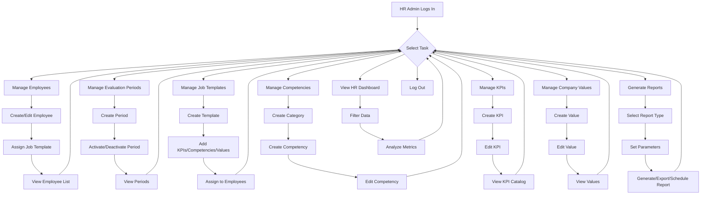

# HR Administrator User Manual - Universal-Development-HR-System

## Table of Contents
1.  Introduction
2.  Getting Started
3.  HR Administrator Dashboard
4.  Employee Management
5.  Evaluation Period Management
6.  Job Template Management
7.  Competency Management
8.  KPI Management
9.  Company Values Management
10. Report Generation and Scheduling
11. System Configuration and Settings
12. Support and Troubleshooting

---

## 1. Introduction
This manual provides a comprehensive guide for Human Resources (HR) Administrators on how to effectively use and manage the Universal-Development-HR-System. The system is designed to streamline performance reviews, track employee growth, and provide data-driven insights for organizational development.

---

## 2. Getting Started

### 2.1 Accessing the System
To access the system, navigate to the provided URL and log in using your HR Administrator credentials.

### 2.2 Navigation
The system features a user-friendly interface with a main navigation menu. As an HR Administrator, you will have access to specific modules relevant to your role, including:
-   Dashboard
-   Employees
-   Evaluations
-   Admin (for system configuration)
-   Reports

---

## 3. HR Administrator Dashboard

The HR Administrator Dashboard provides a high-level overview of organizational performance, evaluation progress, and key metrics.

### 3.1 Accessing the Dashboard
Navigate to [`public/dashboard/hr.php`](public/dashboard/hr.php) or click on the "Dashboard" link in the main navigation after logging in.

### 3.2 Key Features
-   **Organizational Performance Insights**: View overall performance trends, average ratings, and distribution across the organization.
-   **Evaluation Progress Tracking**: Monitor the status of ongoing evaluations, including pending, submitted, and completed evaluations.
-   **Departmental Performance**: Filter data by department to analyze performance trends and identify areas for improvement within specific teams.
-   **Period Filtering**: Select different evaluation periods to view historical data and compare performance over time.
-   **Export Functionality**: Export dashboard data for further analysis or reporting.

### 3.3 How to Use
-   **Filtering Data**: Use the "Department" and "Period" dropdowns to filter the displayed information.
-   **Refreshing Data**: Click the "Refresh" button to update the dashboard with the latest data.
-   **Exporting Data**: Click the "Export Report" button to download the current dashboard view.

---

## 4. Employee Management

This module allows HR Administrators to manage employee records, including creating new employees, editing existing information, and viewing employee details.

### 4.1 Accessing Employee Management
Navigate to [`public/employees/list.php`](public/employees/list.php) or click on the "Employees" link in the main navigation.

### 4.2 Key Features
-   **Create New Employee**: Add new employees to the system.
    -   **Location**: [`public/employees/create.php`](public/employees/create.php)
-   **Edit Employee Details**: Update employee information such as position, department, manager, and job template.
    -   **Location**: [`public/employees/edit.php`](public/employees/edit.php)
-   **View Employee List**: Browse all employees in the system with search and filter options.
    -   **Location**: [`public/employees/list.php`](public/employees/list.php)
-   **View Employee Profile**: Access detailed information for a specific employee.
    -   **Location**: [`public/employees/view.php`](public/employees/view.php)
-   **Employee Hierarchy**: Visualize the organizational structure and reporting lines.
    -   **Location**: [`public/employees/hierarchy.php`](public/employees/hierarchy.php)
-   **Import/Export Employees**: Bulk import new employee data or export existing employee records.
    -   **API Endpoints**: [`public/api/employees/import.php`](public/api/employees/import.php), [`public/api/employees/export.php`](public/api/employees/export.php)
    -   **Sample Import File**: [`docs/import_files (for demo purposes)/employee_import_data.csv`](docs/import_files (for demo purposes)/employee_import_data.csv)

### 4.3 How to Use
-   **Adding an Employee**: Click "Create New Employee," fill in the required fields, and save.
-   **Editing an Employee**: Find the employee in the list, click "Edit," make changes, and save.
-   **Importing Employees**: Use the import tool to upload a CSV file with employee data. Ensure the file format matches the provided template.

---

## 5. Evaluation Period Management

HR Administrators can create, manage, and archive evaluation periods.

### 5.1 Accessing Evaluation Period Management
Navigate to [`public/admin/periods.php`](public/admin/periods.php) or access it via the "Admin" section.

### 5.2 Key Features
-   **Create New Period**: Define new evaluation cycles with start and end dates.
-   **Update Period Status**: Change the status of a period (e.g., from 'draft' to 'active' or 'completed').
-   **View Periods**: See a list of all evaluation periods and their current status.

### 5.3 How to Use
-   **Creating a Period**: Click "Create New Period," enter the period name, description, start date, and end date, then set the initial status.
-   **Updating Status**: Select a period from the list and use the action options to change its status.

---

## 6. Job Template Management

Job templates define the expected KPIs, competencies, responsibilities, and values for different job positions.

### 6.1 Accessing Job Template Management
Navigate to [`public/admin/job_templates.php`](public/admin/job_templates.php) or access it via the "Admin" section.

### 6.2 Key Features
-   **Create Job Template**: Define new job templates for various roles within the organization.
-   **Edit Job Template**: Modify existing job templates, including associated KPIs, competencies, and responsibilities.
-   **View Job Templates**: Browse a list of all defined job templates.

### 6.3 How to Use
-   **Creating a Template**: Click "Create New Job Template," provide a title and description, and then add relevant KPIs, competencies, and responsibilities.
-   **Assigning to Employees**: Job templates can be assigned to employees during employee creation or editing.

---

## 7. Competency Management

Manage the catalog of competencies used in evaluations.

### 7.1 Accessing Competency Management
Navigate to [`public/admin/competencies.php`](public/admin/competencies.php) or access it via the "Admin" section.

### 7.2 Key Features
-   **Create Competency Categories**: Organize competencies into logical categories.
-   **Create Competencies**: Define individual competencies with descriptions.
-   **Edit Competencies/Categories**: Update existing competencies or categories.
-   **Import Competencies**: Bulk import competencies.
    -   **API Endpoint**: [`public/api/import_competencies.php`](public/api/import_competencies.php)

### 7.3 How to Use
-   **Adding a Competency**: Select a category, then click "Create New Competency" and fill in the details.
-   **Managing Soft Skills**: Soft skills are managed via JSON files in [`config/soft_skills/`](config/soft_skills/). These can be updated directly or via specific API endpoints if available.

---

## 8. KPI Management

Manage the Key Performance Indicators (KPIs) used across the organization.

### 8.1 Accessing KPI Management
Navigate to [`public/admin/kpis.php`](public/admin/kpis.php) or access it via the "Admin" section.

### 8.2 Key Features
-   **Create KPIs**: Define new company-wide KPIs with measurement units and target types.
-   **Edit KPIs**: Modify existing KPI details.
-   **View KPIs**: Browse the catalog of all defined KPIs.
-   **Import KPIs**: Bulk import KPIs.
    -   **API Endpoint**: [`public/api/import_kpis.php`](public/api/import_kpis.php)
    -   **Sample Import File**: [`docs/import_files (for demo purposes)/kpi_catalog_starter.csv`](docs/import_files (for demo purposes)/kpi_catalog_starter.csv)

### 8.3 How to Use
-   **Adding a KPI**: Click "Create New KPI," provide the name, description, measurement unit, category, and target type.

---

## 9. Company Values Management

Define and manage the core company values that employees are evaluated against.

### 9.1 Accessing Company Values Management
Navigate to [`public/admin/values.php`](public/admin/values.php) or access it via the "Admin" section.

### 9.2 Key Features
-   **Create Values**: Add new company values.
-   **Edit Values**: Modify existing company values.
-   **View Values**: See a list of all defined company values.

### 9.3 How to Use
-   **Adding a Value**: Click "Create New Value," enter the value name and description.

---

## 10. Report Generation and Scheduling

Generate various performance reports and schedule them for automated delivery.

### 10.1 Accessing Report Builder
Navigate to [`public/reports/builder.php`](public/reports/builder.php) or click on the "Reports" link in the main navigation.

### 10.2 Key Features
-   **Custom Report Builder**: Create tailored reports by selecting parameters such as date ranges, employees, and departments.
-   **Report Types**: Generate evidence summary reports, performance trends, and other analytical reports.
-   **Export Reports**: Export generated reports in various formats (e.g., PDF, Excel).
-   **Schedule Reports**: Set up recurring reports to be automatically generated and sent to specified recipients.

### 10.3 How to Use
-   **Generating a Report**: Select the report type, define parameters, and click "Generate Report."
-   **Exporting a Report**: After generating a report, select the desired format and click "Export."
-   **Scheduling a Report**: Provide report details, recipients, and frequency, then save the schedule.

---

## 11. System Configuration and Settings

This section covers general system settings and configurations that may be managed by HR Administrators.

### 11.1 Database Management
-   **Schema Files**: The database structure is defined in SQL files located in the [`sql/`](sql/) directory. These are typically managed by system administrators during setup and updates.
    -   [`sql/001_database_setup.sql`](sql/001_database_setup.sql)
    -   [`sql/003_phase3_advanced_features.sql`](sql/003_phase3_advanced_features.sql)
    -   Other SQL migration files.

### 11.2 User Roles and Permissions
-   **Authentication Logic**: User authentication and role-based access control are handled by [`includes/auth.php`](includes/auth.php). HR Administrators typically have the 'hr_admin' role, granting them access to all administrative functions.

---

## 12. Support and Troubleshooting
For any issues or questions not covered in this manual, please contact your system administrator or IT support.

---

## 13. HR Administrator Workflow Flowchart

