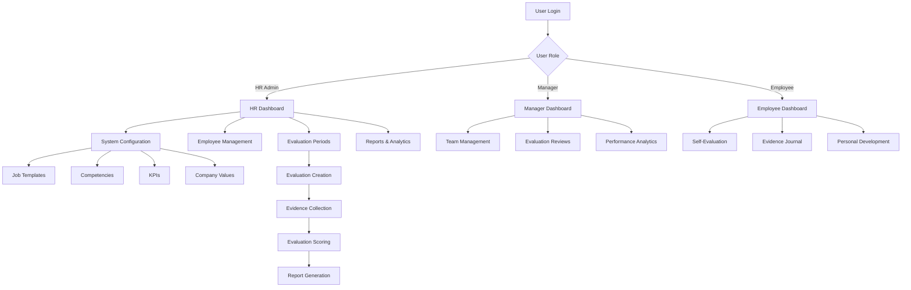

# Universal-Development-HR-System - Code Location Documentation

## Overview
This document provides a comprehensive overview of the Universal-Development-HR-System codebase, including file locations and descriptions for each major component.

## System Architecture
The system is built using PHP with a MySQL database backend, following an MVC-like pattern with separate classes for business logic and public-facing pages for user interfaces.

---

## 1. System Configuration

### Core Configuration Files
- **[`config/config.php`](config/config.php)** - Main configuration file with database settings and global constants
- **[`config/database.php`](config/database.php)** - Database connection and configuration
- **[`config/competency_catalog.php`](config/competency_catalog.php)** - Competency catalog configuration
- **[`config/kpi_catalog.php`](config/kpi_catalog.php)** - KPI catalog configuration

### Soft Skills Configuration
- **[`config/soft_skills/`](config/soft_skills/)** - Directory containing soft skills configuration files:
  - **[`decision_making.json`](config/soft_skills/decision_making.json)** - Decision making skill levels
  - **[`people_manangement.json`](config/soft_skills/people_manangement.json)** - People management skill levels
  - **[`presentation_skills.json`](config/soft_skills/presentation_skills.json)** - Presentation skill levels
  - **[`strategic_thinking.json`](config/soft_skills/strategic_thinking.json)** - Strategic thinking skill levels
  - **[`team_leadership.json`](config/soft_skills/team_leadership.json)** - Team leadership skill levels
  - **[`verbal_communication.json`](config/soft_skills/verbal_communication.json)** - Verbal communication skill levels
  - **[`written_communication.json`](config/soft_skills/written_communication.json)** - Written communication skill levels

---

## 2. Evaluations Module

### Core Evaluation Classes
- **[`classes/Evaluation.php`](classes/Evaluation.php)** - Main evaluation management class with evidence-based evaluation logic
- **[`classes/EvaluationPeriod.php`](classes/EvaluationPeriod.php)** - Evaluation period management
- **[`classes/EvaluationWorkflow.php`](classes/EvaluationWorkflow.php)** - Evaluation workflow management
- **[`classes/SelfAssessmentManager.php`](classes/SelfAssessmentManager.php)** - Self-assessment functionality

### Evaluation Frontend Pages
- **[`public/evaluation/`](public/evaluation/)** - Evaluation module pages:
  - **[`create.php`](public/evaluation/create.php)** - Create new evaluation
  - **[`edit.php`](public/evaluation/edit.php)** - Edit existing evaluation
  - **[`list.php`](public/evaluation/list.php)** - List evaluations
  - **[`manager-review.php`](public/evaluation/manager-review.php)** - Manager review interface
  - **[`self-evaluation.php`](public/evaluation/self-evaluation.php)** - Self-evaluation interface
  - **[`view.php`](public/evaluation/view.php)** - View evaluation details

### Evaluation API Endpoints
- **[`public/api/`](public/api/)** - API endpoints for evaluation operations:
  - **[`dashboard-data.php`](public/api/dashboard-data.php)** - Dashboard data API
  - **[`evidence-details.php`](public/api/evidence-details.php)** - Evidence details API
  - **[`reports.php`](public/api/reports.php)** - Reports generation API

### Evidence Management
- **[`classes/EvidenceManager.php`](classes/EvidenceManager.php)** - Evidence collection and management
- **[`classes/GrowthEvidenceJournal.php`](classes/GrowthEvidenceJournal.php)** - Growth evidence journal management
- **[`public/evidence/`](public/evidence/)** - Evidence management pages:
  - **[`manage.php`](public/evidence/manage.php)** - Manage evidence entries
  - **[`search.php`](public/evidence/search.php)** - Search evidence entries

---

## 3. Employees Module

### Core Employee Classes
- **[`classes/Employee.php`](classes/Employee.php)** - Employee management and operations
- **[`classes/EmployeeImportExport.php`](classes/EmployeeImportExport.php)** - Employee import/export functionality
- **[`classes/User.php`](classes/User.php)** - User authentication and management

### Employee Frontend Pages
- **[`public/employees/`](public/employees/)** - Employee module pages:
  - **[`create.php`](public/employees/create.php)** - Create new employee
  - **[`edit.php`](public/employees/edit.php)** - Edit employee details
  - **[`list.php`](public/employees/list.php)** - List employees
  - **[`view.php`](public/employees/view.php)** - View employee details
  - **[`hierarchy.php`](public/employees/hierarchy.php)** - Employee hierarchy view
  - **[`team.php`](public/employees/team.php)** - Team management
  - **[`give-feedback.php`](public/employees/give-feedback.php)** - Give feedback interface
  - **[`view-feedback.php`](public/employees/view-feedback.php)** - View feedback history

### Employee API Endpoints
- **[`public/api/employees/`](public/api/employees/)** - Employee API endpoints:
  - **[`import.php`](public/api/employees/import.php)** - Import employees
  - **[`export.php`](public/api/employees/export.php)** - Export employees
  - **[`download.php`](public/api/employees/download.php)** - Download employee data
  - **[`template.php`](public/api/employees/template.php)** - Download import template

---

## 4. Reports Module

### Core Report Classes
- **[`classes/ReportGenerator.php`](classes/ReportGenerator.php)** - Report generation and management
- **[`classes/DashboardAnalytics.php`](classes/ReportGenerator.php)** - Dashboard analytics and insights

### Report Frontend Pages
- **[`public/reports/`](public/reports/)** - Report module pages:
  - **[`builder.php`](public/reports/builder.php)** - Custom report builder interface
  - **[`value_statistics.php`](public/reports/value_statistics.php)** - Company values statistics

### Report API Endpoints
- **[`public/api/reports.php`](public/api/reports.php)** - Reports generation API

---

## 5. System Administrator (HR Administrator) Components

### Core Admin Classes
- **[`classes/JobTemplate.php`](classes/JobTemplate.php)** - Job position template management
- **[`classes/Competency.php`](classes/Competency.php)** - Competency catalog management
- **[`classes/CompanyKPI.php`](classes/CompanyKPI.php)** - Company KPI management
- **[`classes/CompanyValues.php`](classes/CompanyValues.php)** - Company values management
- **[`classes/Department.php`](classes/Department.php)** - Department management

### Admin Frontend Pages
- **[`public/admin/`](public/admin/)** - Administrator interface pages:
  - **[`competencies.php`](public/admin/competencies.php)** - Manage competencies
  - **[`departments.php`](public/admin/departments.php)** - Manage departments
  - **[`job_templates.php`](public/admin/job_templates.php)** - Manage job templates
  - **[`kpis.php`](public/admin/kpis.php)** - Manage company KPIs
  - **[`periods.php`](public/admin/periods.php)** - Manage evaluation periods
  - **[`values.php`](public/admin/values.php)** - Manage company values

### Admin API Endpoints
- **[`public/api/`](public/api/)** - Various admin API endpoints:
  - **[`competency.php`](public/api/competency.php)** - Competency management API
  - **[`competency_catalog.php`](public/api/competency_catalog.php)** - Competency catalog API
  - **[`competency_usage.php`](public/api/competency_usage.php)** - Competency usage statistics
  - **[`import_competencies.php`](public/api/import_competencies.php)** - Import competencies
  - **[`job-template.php`](public/api/job-template.php)** - Job template API
  - **[`kpi.php`](public/api/kpi.php)** - KPI management API
  - **[`kpi_catalog.php`](public/api/kpi_catalog.php)** - KPI catalog API
  - **[`kpi_usage.php`](public/api/kpi_usage.php)** - KPI usage statistics
  - **[`import_kpis.php`](public/api/import_kpis.php)** - Import KPIs

---

## 6. Dashboard Components

### Dashboard Classes
- **[`classes/DashboardAnalytics.php`](classes/DashboardAnalytics.php)** - Dashboard analytics and data processing

### Dashboard Frontend Pages
- **[`public/dashboard/`](public/dashboard/)** - Role-based dashboards:
  - **[`hr.php`](public/dashboard/hr.php)** - HR Administrator dashboard
  - **[`manager.php`](public/dashboard/manager.php)** - Manager dashboard
  - **[`employee.php`](public/dashboard/employee.php)** - Employee dashboard

### Dashboard Components
- **[`includes/components/`](includes/components/)** - Reusable dashboard components:
  - **[`dashboard-widgets.php`](includes/components/dashboard-widgets.php)** - Dashboard widget components
  - **[`dashboard-job-template.php`](includes/components/dashboard-job-template.php)** - Job template dashboard components
  - **[`quick-actions.php`](includes/components/quick-actions.php)** - Quick action components

---

## 7. Additional System Features

### 360-Degree Feedback
- **[`public/360-features/`](public/360-features/)** - 360-degree feedback features:
  - **[`index.php`](public/360-features/index.php)** - 360-degree feedback main page

### Achievements System
- **[`classes/AchievementJournal.php`](classes/AchievementJournal.php)** - Achievement journal management
- **[`public/achievements/`](public/achievements/)** - Achievement management pages:
  - **[`create.php`](public/achievements/create.php)** - Create achievement
  - **[`edit.php`](public/achievements/edit.php)** - Edit achievement
  - **[`journal.php`](public/achievements/journal.php)** - Achievement journal
  - **[`view.php`](public/achievements/view.php)** - View achievement details

### Kudos System
- **[`classes/KudosManager.php`](classes/KudosManager.php)** - Kudos/recognition management
- **[`public/kudos/`](public/kudos/)** - Kudos system pages:
  - **[`feed.php`](public/kudos/feed.php)** - Kudos feed
  - **[`give.php`](public/kudos/give.php)** - Give kudos
  - **[`leaderboard.php`](public/kudos/leaderboard.php)** - Kudos leaderboard

### OKR Management
- **[`classes/OKRManager.php`](classes/OKRManager.php)** - Objectives and Key Results management
- **[`public/okr/`](public/okr/)** - OKR management pages:
  - **[`create.php`](public/okr/create.php)** - Create OKR
  - **[`dashboard.php`](public/okr/dashboard.php)** - OKR dashboard

### Self-Assessment
- **[`public/self-assessment/`](public/self-assessment/)** - Self-assessment pages:
  - **[`create.php`](public/self-assessment/create.php)** - Create self-assessment
  - **[`dashboard.php`](public/self-assessment/dashboard.php)** - Self-assessment dashboard
  - **[`view.php`](public/self-assessment/view.php)** - View self-assessment
  - **[`comparison.php`](public/self-assessment/comparison.php)** - Compare assessments

### Upward Feedback
- **[`classes/UpwardFeedbackManager.php`](classes/UpwardFeedbackManager.php)** - Upward feedback management
- **[`public/upward-feedback/`](public/upward-feedback/)** - Upward feedback pages:
  - **[`dashboard.php`](public/upward-feedback/dashboard.php)** - Upward feedback dashboard

### Individual Development Plans
- **[`classes/IDRManager.php`](classes/IDRManager.php)** - Individual Development Plan management
- **[`public/idp/`](public/idp/)** - IDP pages:
  - **[`create.php`](public/idp/create.php)** - Create IDP
  - **[`dashboard.php`](public/idp/dashboard.php)** - IDP dashboard

---

## 8. Authentication and Security

### Authentication
- **[`includes/auth.php`](includes/auth.php)** - Authentication and authorization functions
- **[`classes/NotificationManager.php`](classes/NotificationManager.php)** - Notification system management

### Security Components
- **[`classes/MediaManager.php`](classes/MediaManager.php)** - Media and file upload management

---

## 9. Database Schema

### Database Setup Files
- **[`sql/001_database_setup.sql`](sql/001_database_setup.sql)** - Core database schema
- **[`sql/002_job_templates_structure.sql`](sql/002_job_templates_structure.sql)** - Job templates schema
- **[`sql/003_phase3_advanced_features.sql`](sql/003_phase3_advanced_features.sql)** - Advanced features schema
- **[`sql/004_comprehensive_enhancements.sql`](sql/004_comprehensive_enhancements.sql)** - System enhancements
- **[`sql/005_skills_specification_system.sql`](sql/005_skills_specification_system.sql)** - Skills specification schema

---

## 10. Frontend Assets

### CSS Files
- **[`public/assets/css/`](public/assets/css/)** - Stylesheets:
  - **[`style.css`](public/assets/css/style.css)** - Main stylesheet
  - **[`dashboard-job-template.css`](public/assets/css/dashboard-job-template.css)** - Dashboard job template styles
  - **[`golden-ratio-dashboard.css`](public/assets/css/golden-ratio-dashboard.css)** - Golden ratio dashboard styles
  - **[`modal-fixes.css`](public/assets/css/modal-fixes.css)** - Modal component fixes

### JavaScript Files
- **[`public/assets/js/`](public/assets/js/)** - JavaScript files:
  - **[`app.js`](public/assets/js/app.js)** - Main application JavaScript
  - **[`dashboard-employee.js`](public/assets/js/dashboard-employee.js)** - Employee dashboard JavaScript
  - **[`dashboard-hr.js`](public/assets/js/dashboard-hr.js)** - HR dashboard JavaScript
  - **[`dashboard-manager.js`](public/assets/js/dashboard-manager.js)** - Manager dashboard JavaScript
  - **[`dashboard-job-template.js`](public/assets/js/dashboard-job-template.js)** - Job template dashboard JavaScript

### Skills CSS and JS
- **[`public/css/`](public/css/)** - Additional stylesheets:
  - **[`soft-skills.css`](public/css/soft-skills.css)** - Soft skills styles
  - **[`technical-skills.css`](public/css/technical-skills.css)** - Technical skills styles
  - **[`unified-skills.css`](public/css/unified-skills.css)** - Unified skills styles

- **[`public/js/`](public/js/)** - Additional JavaScript:
  - **[`soft-skills.js`](public/js/soft-skills.js)** - Soft skills JavaScript
  - **[`technical-skills.js`](public/js/technical-skills.js)** - Technical skills JavaScript
  - **[`unified-skills.js`](public/js/unified-skills.js)** - Unified skills JavaScript

---

## 11. System Utilities

### Docker Configuration
- **[`docker-compose.yml`](docker-compose.yml)** - Docker compose configuration
- **[`docker-compose.override.yml`](docker-compose.override.yml)** - Docker compose overrides
- **[`docker/`](docker/)** - Docker configuration files:
  - **[`web/Dockerfile`](docker/web/Dockerfile)** - Web server Dockerfile
  - **[`web/php.ini`](docker/web/php.ini)** - PHP configuration
  - **[`web/apache.conf`](docker/web/apache.conf)** - Apache configuration
  - **[`scripts/`](docker/scripts/)** - Docker utility scripts

### System Documentation
- **[`README.md`](README.md)** - Main system documentation
- **[`README_DOCKER.md`](README_DOCKER.md)** - Docker setup documentation
- **[`AGENTS.md`](AGENTS.md)** - System agents documentation

### Makefile
- **[`Makefile`](Makefile)** - System build and deployment commands

---

## 12. Data Management

### Import/Export Data
- **[`docs/import_files (for demo purposes)/`](docs/import_files (for demo purposes)/)** - Sample import files:
  - **[`employee_import_data.csv`](docs/import_files (for demo purposes)/employee_import_data.csv)** - Employee import template
  - **[`kpi_catalog_starter.csv`](docs/import_files (for demo purposes)/kpi_catalog_starter.csv)** - KPI catalog starter

### File Uploads
- **[`uploads/`](uploads/)** - User uploaded files directory

---

## System Flow Diagram

---

## Key Features Summary

### Evidence-Based Evaluation System
- Continuous evidence collection throughout evaluation periods
- Automated evidence aggregation and scoring
- Multi-dimensional performance assessment (KPIs, Competencies, Responsibilities, Values)
- Confidence-based scoring with trend analysis

### 360-Degree Feedback
- Multi-source feedback collection
- Anonymous feedback options
- Comprehensive feedback analytics

### Development Tools
- Individual Development Plans (IDP)
- Achievement tracking and journaling
- Kudos and recognition system
- OKR management

### Analytics and Reporting
- Real-time dashboards for all user roles
- Custom report builder
- Performance trend analysis
- Export capabilities

### Administrative Features
- Job template management
- Competency catalog management
- Company KPI configuration
- Evaluation period management
- Employee import/export functionality

---

## Conclusion

This Universal-Development-HR-System is a comprehensive, evidence-based platform that supports continuous performance management across organizations. The modular architecture allows for easy customization and extension of features to meet specific organizational needs.

The system follows best practices for security, scalability, and maintainability, with clear separation of concerns between business logic, data access, and presentation layers.